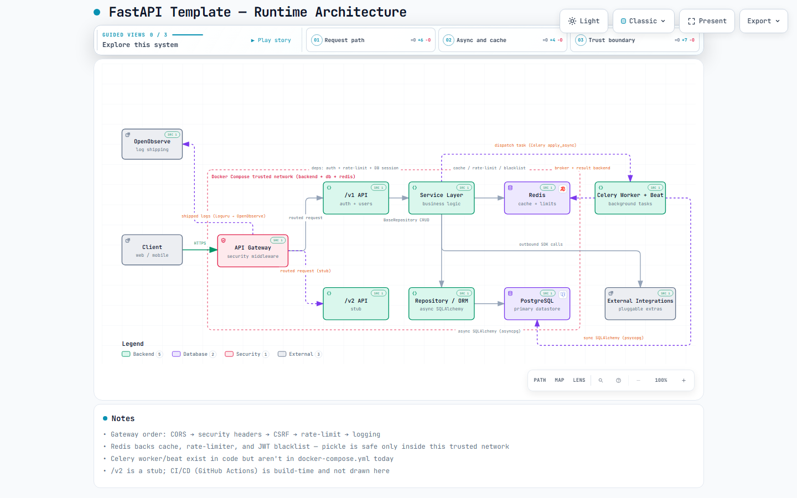

# FastAPI Template

[](https://github.com/eslam5464/Fastapi-Template/actions/workflows/ci.yml)
[](https://github.com/eslam5464/Fastapi-Template/actions/workflows/codeql.yml)
[](https://github.com/eslam5464/Fastapi-Template/tree/python-coverage-comment-action-data)
[](LICENSE)

A production-ready FastAPI project template with modern best practices, async support, JWT authentication, and PostgreSQL integration.

## ✨ Features

- **🚀 FastAPI** - Modern, fast web framework for building APIs, with versioned routers (`/v1`, `/v2`)
- **📊 PostgreSQL** - Async database integration with SQLAlchemy 2.0 and Alembic migrations
- **🔐 JWT Authentication** - Secure token-based authentication with token blacklisting
- **🏗️ Clean Architecture** - Repository pattern, dependency injection, and enforced module boundaries (tach)
- **🔒 Security** - CSRF, rate limiting, and security headers middleware
- **🐳 Docker Compose** - Backend, Postgres, and Redis ready to run
- **🧪 CI & Testing** - Pytest with coverage gating, plus lint/type/security checks in GitHub Actions

Plus optional integrations for caching, background jobs, cloud storage, Firebase, Apple Pay, and email delivery. For the full list of integrations and services, see **[docs/features.md](docs/features.md)**.

## 🚀 Quick Start

### Prerequisites

- [Python 3.14+](https://www.python.org/downloads/)
- [PostgreSQL](https://www.postgresql.org/download/)
- [uv](https://docs.astral.sh/uv/)

### Installation

1. **Clone the repository**

   ```bash
   git clone <your-repo-url>
   cd FastApi-Template
   ```

2. **Install dependencies**

   Create a virtual environment

   ```bash
   python -m venv .venv
   ```

   Activate the virtual environment

   ```bash
   # On Linux / macOS
   source .venv/bin/activate
   # On Windows (PowerShell)
   .venv\Scripts\Activate.ps1
   ```

   Install dependencies

   ```bash
   # Install dependencies
   uv sync --all-groups

   # Install optional integrations as needed
   uv sync --all-groups --all-extras

   # Install pre-commit hooks
   pre-commit install
   ```

   **Note:** If you are facing SSL issues on Windows, use:

   ```bash
   uv sync --all-groups --native-tls
   uv sync --native-tls --all-extras
   ```

3. **Set up environment variables**

   ```bash
   cp .env.example .env
   # Edit .env with your configuration
   ```

4. **Configure database**

   ```bash
      # Create database
      createdb fastapi_template

      # Run migrations
      alembic upgrade head
   ```

5. **Start the development server**

   ```bash
      python main.py
   ```

The API will be available at `http://localhost:8799` with interactive documentation at:

- `http://localhost:8799/v1/docs`
- `http://localhost:8799/v2/docs`

<!-- TEMPLATE_SECTION_START -->
## 🧬 Using This as a Template

This repository doubles as a [Copier](https://copier.readthedocs.io/) template — generate a brand-new FastAPI project from it, with your own name, author info, and settings, without cloning and hand-editing:

```bash
# Run copier directly with uvx - no install/PATH setup needed
uvx copier copy gh:eslam5464/Fastapi-Template <new-project-dir> --trust
```

**Alternative:** if you'd rather have `copier` installed permanently (e.g. for `copier update` later), use `uv tool install copier` instead. On Windows, that installs into a user tools directory that's often **not yet on PATH** in your *current* terminal session — if you see `'copier' is not recognized as an internal or external command` right after installing, either open a **new** terminal window, or run `uv tool update-shell` and then restart the terminal. The `uvx` command above sidesteps the PATH issue entirely since it doesn't need `copier` installed anywhere persistent.

You'll be prompted for a project name, description, author name/email, GitHub username, Python version, and whether to include Apple Pay support. Everything identity-specific — the `pyproject.toml` name, Docker container names, the Postgres schema, `README.md`, `LICENSE`, `CODEOWNERS` — is filled in automatically; see [docs/features.md](docs/features.md) for what ships by default versus what's opt-in.

`--trust` is required because generation runs a small post-processing script (`scripts/generate/post_gen.py`) that substitutes your answers into the copied files, removes unused Apple Pay files when you opt out, regenerates `uv.lock`, and runs `git init` for you.

This repo itself stays fully runnable the whole time — the template mechanics live entirely in `copier.yml` and `scripts/generate/post_gen.py`, which run *after* copying and edit the same real files you already build, test, and run directly. There are no separate `.jinja` template files to keep in sync.
<!-- TEMPLATE_SECTION_END -->

## 🤖 Claude Code Skill

This repo ships a [Claude Code](https://claude.com/claude-code) skill at
[`.claude/skills/fastapi-template-architect/`](.claude/skills/fastapi-template-architect/)
that packages this whole architecture — layering rules, SQLAlchemy patterns, auth/
security conventions, testing gotchas, CI/tooling config, and the Copier generation
mechanics above — as something Claude can actually use, not just read about. It has two
jobs:

- **Scaffold a brand-new project** with this architecture by driving the real Copier
  template (not re-typing boilerplate from memory, so it can't drift from what's
  actually here).
- **Extend or review** an existing instance of this architecture — this repo, or any
  project generated from it — adding new endpoints/services/models consistently with
  what's already there, or auditing a diff/codebase against the documented rules and
  anti-patterns catalog before you merge it. Reviews always list what's wrong and why,
  and what's suggested instead, and leave applying any fix up to you.

**Working in this repo, or in a project generated from it?** Nothing to do — Claude Code
auto-discovers it from `.claude/skills/`.

**Want it available in your own other projects too?** Copy (or symlink, so it stays
current when you pull this repo again) the skill directory into your personal skills
folder:

```bash
# macOS/Linux
cp -r .claude/skills/fastapi-template-architect ~/.claude/skills/
```

```powershell
# Windows (PowerShell) - a junction instead of a copy keeps it in sync automatically
New-Item -ItemType Junction -Path "$env:USERPROFILE\.claude\skills\fastapi-template-architect" -Target "$PWD\.claude\skills\fastapi-template-architect"
```

See the skill's own [SKILL.md](.claude/skills/fastapi-template-architect/SKILL.md) for
the full detail on both modes.

## 📖 Documentation

Detailed documentation is available in the [docs/](docs/) folder:

- **[LLM Index](docs/llms.txt)** - Canonical documentation entrypoint for AI and quick doc navigation
- **[Claude Code Skill](.claude/skills/fastapi-template-architect/SKILL.md)** - Scaffold or extend/review projects with this architecture directly from Claude
- **[Features](docs/features.md)** - Full list of integrations and services, with setup notes
- **[Architecture Overview](docs/architecture/overview.md)** - Current system design and versioned routing model
- **[Backend Architecture Guide](docs/backend-architecture.md)** - Layered architecture deep dive
- **[API Reference](docs/api/reference.md)** - Versioned endpoint and auth reference
- **[Getting Started](docs/guides/getting-started.md)** - Setup and first run
- **[Development Guide](docs/guides/development.md)** - Local workflow and quality commands
- **[Contributing](docs/guides/contributing.md)** - Contribution and PR standards
- **[Versioning](docs/guides/versioning.md)** - SemVer rules and how to bump the release version
- **[Deployment Guide](docs/guides/deployment.md)** - Production deployment checklist
- **[Strategy Vision](docs/strategy/vision.md)** - Product and technical direction
- **[Roadmap](docs/strategy/roadmap.md)** - Milestones and priorities
- **[Changelog](docs/changelog/CHANGELOG.md)** - Release history

## 🏛️ Architecture

<picture>
  <source media="(prefers-color-scheme: dark)" srcset="docs/architecture/fastapi-template.architecture.visual-check.1440x900.dark.png">
  
</picture>

*Screenshot of the interactive diagram — client → API Gateway → versioned API → Service Layer → Repository/ORM → PostgreSQL, with Redis-backed caching/rate-limiting/token-blacklisting and an optional Celery worker for background jobs, all inside the Docker Compose trusted network.*

See **[Architecture Overview](docs/architecture/overview.md)** for the full write-up. The interactive version lives at [`docs/architecture/fastapi-template.architecture.html`](docs/architecture/fastapi-template.architecture.html) — download it and open it locally for guided views, theme toggling, and per-node source links (GitHub renders `.html` files as source, not a live page, so the link above won't run it in-browser).

## 🏗️ Project Structure

```text
├── app/
│   ├── api/                 # API routes and endpoints
│   │   ├── v1/             # API version 1
│   │   │   ├── endpoints/  # Individual endpoint modules
│   │   │   └── deps/       # Dependencies (auth, database)
│   │   └── v2/             # API version 2
│   ├── core/               # Core functionality
│   │   ├── auth.py         # Authentication utilities
│   │   ├── config.py       # Configuration management
│   │   ├── db.py           # Database connection
│   │   └── exceptions.py   # Custom exceptions
│   ├── models/             # SQLAlchemy models
│   ├── schemas/            # Pydantic schemas
│   ├── repos/              # Repository pattern implementations
│   ├── services/           # Business logic and external services
│   ├── middleware/         # Custom middleware
│   └── alembic/            # Database migrations
├── docs/                   # Detailed documentation
├── scripts/                # Utility scripts
└── logs/                   # Application logs (Generated at runtime)
```

## 🔐 Authentication

The template includes a complete JWT-based authentication system:

- User registration and login
- Access and refresh tokens
- Password hashing with Argon2 (via pwdlib)
- Token blacklisting for secure logout
- Protected routes with dependency injection

### Example Usage

```python
from app.api.v1.deps.auth import get_current_user

@router.get("/protected")
async def protected_route(current_user: User = Depends(get_current_user)):
    return {"message": f"Hello {current_user.username}!"}
```

## 🛠️ Development

### Code Quality

The project includes several tools for maintaining code quality:

- **Black** - Code formatting
- **Pre-commit hooks** - Automated checks before commits
- **Loguru** - Structured logging
- **Environment validation** - Pydantic settings

### Testing

The project maintains comprehensive test coverage with **~90% code coverage** across all modules:

```bash
# Run all tests with verbose output and detailed reporting
uv run pytest -v

# Run tests with coverage report
uv run pytest tests/ --cov=app --cov-report=term --cov-report=html

# View detailed HTML coverage report
# Open htmlcov/index.html in your browser
```

**Coverage Scope:**

- ✅ Unit, service, and integration tests
- 📊 Terminal and HTML coverage reports
- 🎯 Tests cover API endpoints, authentication, database operations, services, middleware, and utilities

### Security Analysis

Run security analysis using Bandit:

```bash
uv run bandit -r app -f json -o bandit_results.json
```

### Running Tests

```bash
uv run pytest -v
```

### Background Jobs & Task Queue

The project uses Celery for background job processing with Redis as the message broker.

#### Start Celery Worker

```bash
# Linux/macOS
./scripts/celery_worker.sh

# Windows
.\scripts\celery_worker.bat

# Or directly
celery -A app.services.task_queue worker --loglevel=info --pool=solo
```

#### Start Celery Beat (Scheduler)

```bash
# Linux/macOS
./scripts/celery_beat.sh

# Windows
.\scripts\celery_beat.bat

# Or directly
celery -A app.services.task_queue beat --loglevel=info
```

**Available Tasks:**

- `seed_fake_users` - Generates fake users for testing (runs every 10 seconds when `ENABLE_DATA_SEEDING=true`)

### Database Migrations

Use the scripts provided (Recommended):

```bash
# Run database migrations for linux/macOS
./scripts/alembic.sh

# Run database migrations for windows
.\scripts\alembic.bat
```

Or use Alembic commands directly:

```bash
# Create a new migration
alembic revision --autogenerate -m "Description"

# Apply migrations
alembic upgrade head

# Rollback migrations
alembic downgrade -1
```

## 🌍 Environment Configuration

The application supports multiple environments:

- **local** - Development with debug features
- **dev** - Development server
- **stg** - Pre-production testing (Staging)
- **prd** - Production deployment

Configure via environment variables or `.env` file:

```env
# Database
POSTGRES_HOST=localhost
POSTGRES_PORT=5432
POSTGRES_USER=postgres
POSTGRES_PASSWORD=your-postgres-password
POSTGRES_DB=postgres
POSTGRES_DB_SCHEMA=fastapi_template

# Security
SECRET_KEY=your-secret-key
ACCESS_TOKEN_EXPIRE_SECONDS=2582000
REFRESH_TOKEN_EXPIRE_SECONDS=2592000

# Server
BACKEND_HOST=localhost
BACKEND_PORT=8799
CURRENT_ENVIRONMENT=local

# Redis (for caching and rate limiting)
REDIS_HOST=localhost
REDIS_PORT=6379
REDIS_PASS=your-redis-password

# Rate Limiting
RATE_LIMIT_ENABLED=true
RATE_LIMIT_DEFAULT=100
RATE_LIMIT_WINDOW=60

# Celery & Background Tasks
ENABLE_DATA_SEEDING=false
SEEDING_USER_COUNT=100

# Email Providers
resend_api_key=your_resend_api_key_here
brevo_api_key=your_brevo_api_key_here
```

## 📦 Dependencies

Core dependencies (FastAPI, SQLAlchemy, Alembic, Pydantic, Uvicorn) are always installed. Optional integrations (Redis, Celery, Firebase, GCS, BackBlaze, Apple Pay, email providers) are opt-in extras — install only what you need:

```bash
uv sync --extra email
uv sync --extra cloud-service
uv sync --extra cache
uv sync --extra task-queue
uv sync --extra apple-services
```

See **[docs/features.md](docs/features.md)** for what each extra provides and how to configure it.

## 🤝 Contributing

1. Fork the repository
2. Create a feature branch (`git checkout -b feature/amazing-feature`)
3. Commit your changes (`git commit -m 'Add amazing feature'`)
4. Push to the branch (`git push origin feature/amazing-feature`)
5. Open a Pull Request

## 📄 License

This project is licensed under the MIT License - see the [LICENSE](LICENSE) file for details.

## 🙏 Acknowledgments

- [FastAPI](https://fastapi.tiangolo.com/) - The amazing web framework
- [SQLAlchemy](https://sqlalchemy.org/) - The Python SQL toolkit
- [Pydantic](https://pydantic-docs.helpmanual.io/) - Data validation library
- [Fastapi Template by tiangolo](https://github.com/tiangolo/fastapi-template) - A FastAPI project template
- [Fastapi best practices](https://github.com/zhanymkanov/fastapi-best-practices) - Inspiration for best practices
- [Fastapi Tips](https://github.com/Kludex/fastapi-tips) - Useful tips and tricks from FastAPI Expert
- [Fastapi structure](https://github.com/rannysweis/fast-api-docker-poetry) - Project structure inspiration
