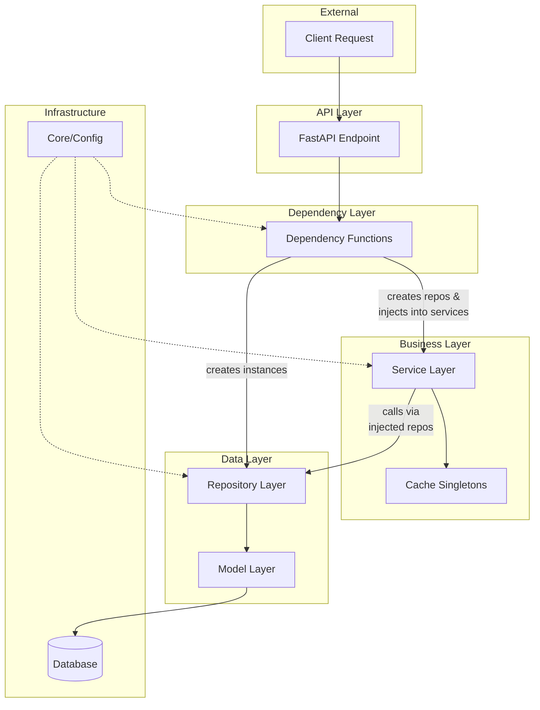
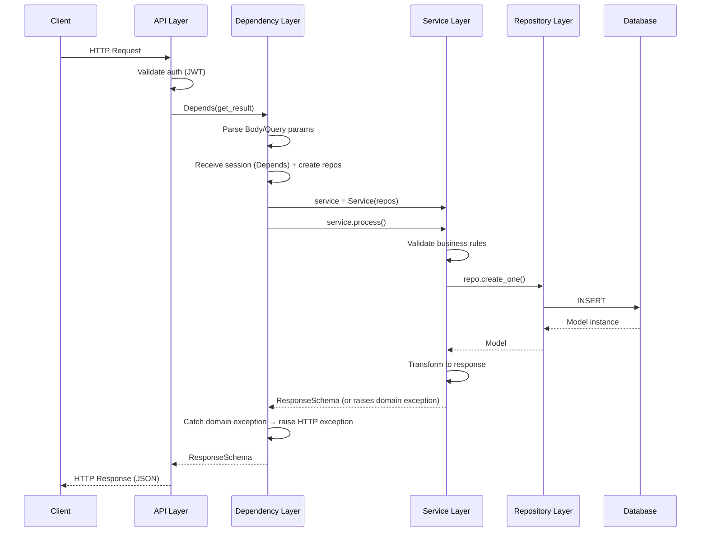
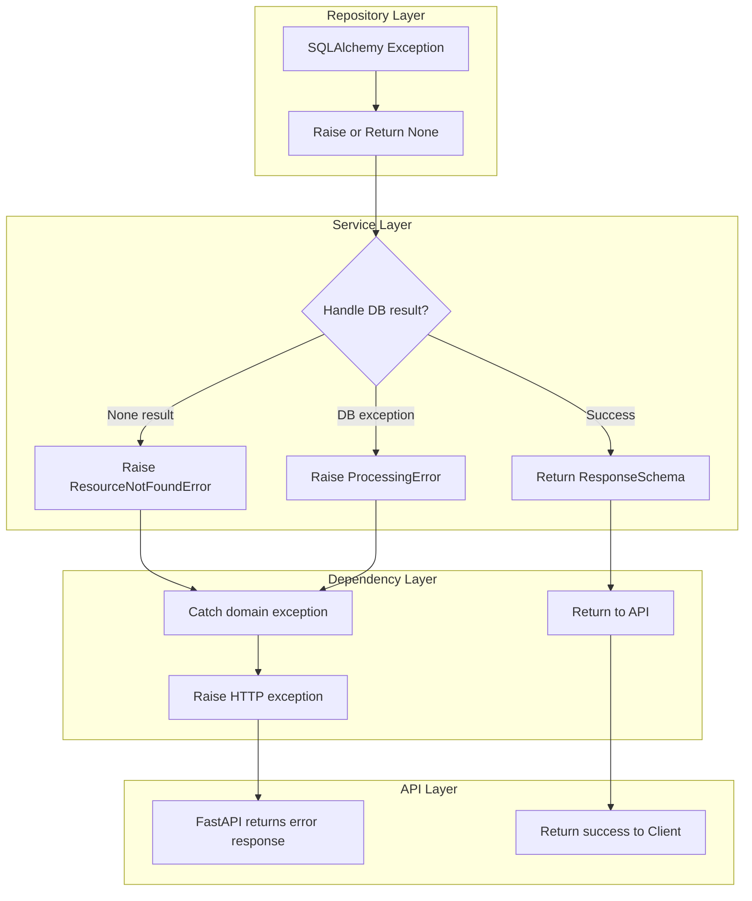
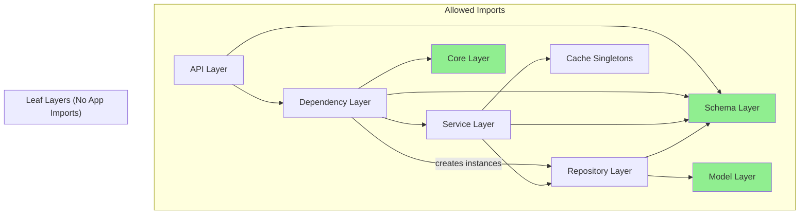
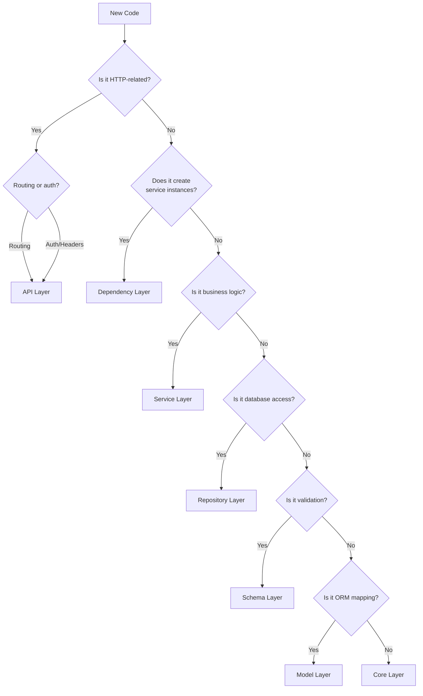
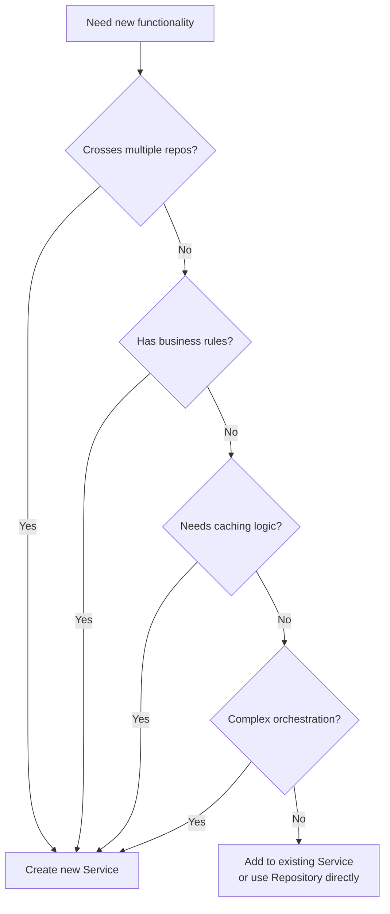
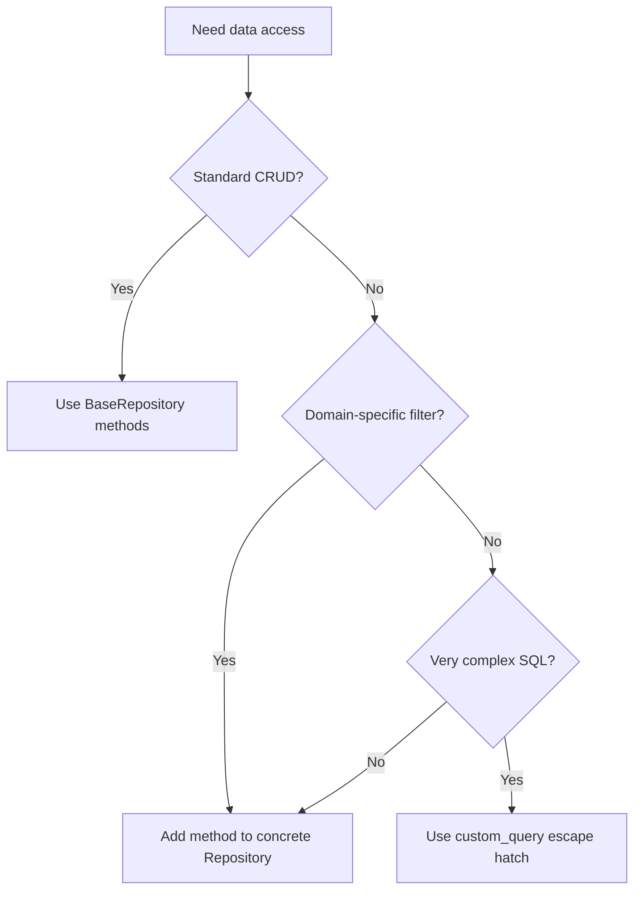
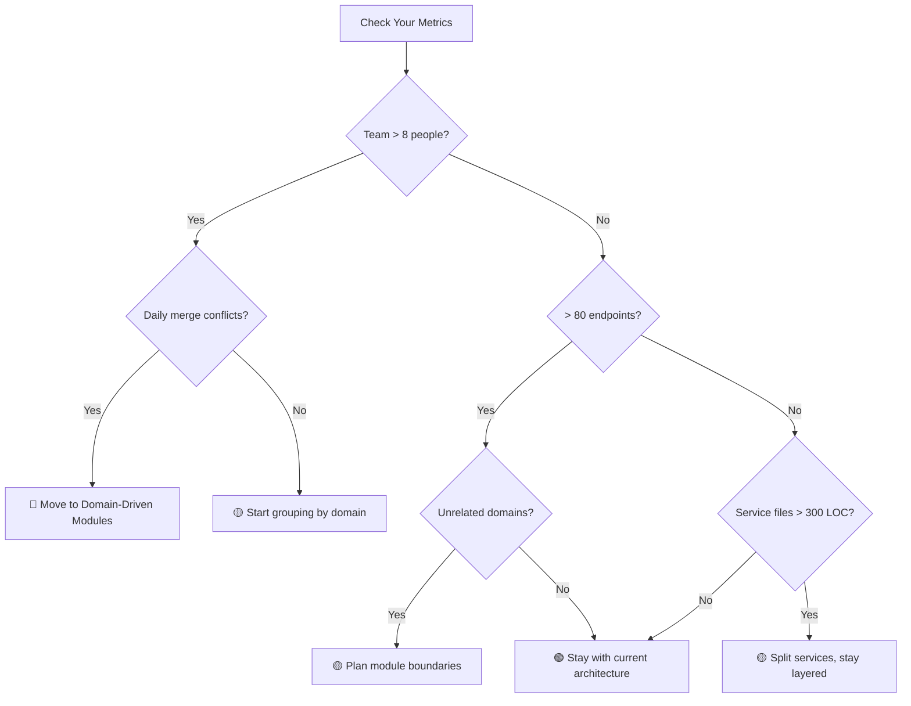

# 🏗️ FastAPI Layered Architecture Guide

A comprehensive, reusable guide for building maintainable FastAPI applications using layered architecture patterns. This document is **framework-specific** (FastAPI, SQLAlchemy, Pydantic) but **domain-agnostic** — copy it to any FastAPI project.

---

## 📋 Table of Contents

1. [Overview](#-overview)
2. [Architecture Applicability](#-architecture-applicability)
3. [Layer Reference](#-layer-reference)
   - [API Layer](#31-api-layer-endpoints)
   - [Dependency Layer](#32-dependency-layer-deps)
   - [Service Layer](#33-service-layer)
   - [Repository Layer](#34-repository-layer)
   - [Schema Layer](#35-schema-layer)
   - [Model Layer](#36-model-layer)
   - [Core Layer](#37-core-layer)
4. [Data Flow](#-data-flow)
5. [Dependency Direction Rules](#-dependency-direction-rules)
6. [Testing Strategy](#-testing-strategy)
7. [Anti-patterns Catalog](#-anti-patterns-catalog)
8. [Decision Trees](#-decision-trees)
9. [Patterns Catalog](#-patterns-catalog)
10. [Scalability Limits & When to Outgrow](#-scalability-limits--when-to-outgrow)
11. [Summary](#-summary)

---

## 🎯 Overview

### Architecture Diagram



### Core Principles

| Principle | Description |
|-----------|-------------|
| **Separation of Concerns** | Each layer has a single, well-defined responsibility |
| **Dependency Inversion** | Higher layers depend on abstractions, not implementations |
| **Unidirectional Flow** | Data flows down through layers; responses bubble up |
| **Testability** | Each layer can be tested in isolation with mocks |
| **Reusability** | Lower layers are reusable across multiple higher-layer consumers |

### Quick Reference Table

| Layer | Location | Responsibility | Depends On |
|-------|----------|----------------|------------|
| **API** | `app/api/` | HTTP routing, authentication, response codes | Deps, Schemas |
| **Deps** | `app/api/*/deps/` | Dependency injection, session management, repo creation, exception translation | Services, Repos, Schemas, Core |
| **Service** | `app/services/` | Business logic, domain rules, domain exceptions; receives repos via injection | Repos, Schemas, Cache |
| **Repository** | `app/repos/` | Data access, CRUD with `auto_commit` support | Models, Schemas |
| **Schema** | `app/schemas/` | Validation, serialization, API contracts | None (leaf) |
| **Model** | `app/models/` | Database table mapping (ORM) | None (leaf) |
| **Core** | `app/core/` | Configuration, exceptions (HTTP + domain), database setup | None (leaf) |

---

## 🎯 Architecture Applicability

This architecture is a **modular monolith** using layered separation. It is designed for **small-to-medium** FastAPI projects with teams of **1–15 developers**.

### When This Architecture Fits

| Metric | Sweet Spot | Upper Limit |
|--------|-----------|-------------|
| Team size | 1–8 developers | 15 developers |
| Endpoints | 10–80 | ~150 |
| Services | 3–15 | ~30 |
| Repositories | 5–20 | ~40 |
| Models | 5–30 | ~60 |
| Databases | 1 | 2–3 |

### When This Architecture Does NOT Fit

| Signal | Alternative |
|--------|-------------|
| 15+ developers with daily merge conflicts | Domain-driven modules (`app/domains/`) |
| 150+ endpoints across unrelated domains | API gateway + microservices |
| Event-heavy workflows (notifications, queues, sagas) | Event-driven architecture with message bus |
| Multiple teams owning separate databases | Microservices with independent data stores |
| Sub-millisecond latency requirements | Specialized frameworks (gRPC, async workers) |

> **Rule of thumb**: If you hit 3+ signals from the "Does NOT Fit" table, start planning migration. See [Scalability Limits](#-scalability-limits--when-to-outgrow) for detailed thresholds.

### Key Design Decisions

| Decision | Choice | Rationale |
|----------|--------|-----------|
| Service dependencies | **Repository injection** | Explicit deps, easy testing, no session leaking into services |
| Error handling | **Domain exceptions** | Pythonic, forces handling, clear exception hierarchy |
| Transaction control | **`auto_commit` parameter** | Flexible per-operation; deps layer can coordinate multi-step transactions |
| Session ownership | **Deps layer only** | Sessions injected via `Depends(get_db)`, never reach services — clean separation |

---

## 📚 Layer Reference

### 3.1 API Layer (Endpoints)

**Location**: `app/api/`

#### Responsibility

The API layer handles **HTTP concerns only**: routing, authentication, status codes, and response formatting. It should be a **thin controller** that delegates all business logic to dependencies or services.

#### ✅ What Belongs Here

- Route definitions (`@router.get`, `@router.post`, etc.)
- Authentication/authorization decorators
- Response status code manipulation
- OpenAPI documentation (summary, description, responses)
- Request/response type hints

#### ❌ What Does NOT Belong Here

- Business logic or validation rules
- Database queries or session management
- Data transformation logic
- Error handling beyond HTTP status codes
- Direct repository or service instantiation

#### Full Code Example

```python
from typing import Annotated

from fastapi import APIRouter, Depends, Response, status

from app.api.v1.deps.resource import get_resource_result
from app.schemas.resource import (
    ResourceRequest,
    ResourceResponse,
    ResourceErrorResponse,
)

router = APIRouter(tags=["Resources"], prefix="/resources")


@router.post(
    "/process",
    response_model=ResourceResponse,
    summary="Process a resource",
    description="""
    Processes the given resource with the specified parameters.

    Returns 206 Partial Content if some items failed processing.
    """,
    responses={
        status.HTTP_400_BAD_REQUEST: {"model": ResourceErrorResponse},
        status.HTTP_206_PARTIAL_CONTENT: {"model": ResourceResponse},
    },
)
async def process_resource(
    response: Response,
    result: Annotated[ResourceResponse, Depends(get_resource_result)],
) -> ResourceResponse:
    """
    Thin controller - all logic lives in the dependency.
    Only handles HTTP response code manipulation.
    """
    if result.has_errors:
        response.status_code = status.HTTP_206_PARTIAL_CONTENT
    return result
```

#### Key Characteristics

- Endpoints are **thin controllers** (1-5 lines of logic)
- Business logic is **delegated** to dependency functions
- Response models are **explicitly declared** for OpenAPI
- Error responses are **documented** in the `responses` parameter
- Status code manipulation is the **only logic** allowed

---

### 3.2 Dependency Layer (Deps)

**Location**: `app/api/*/deps/`

#### Responsibility

The dependency layer is a **factory and orchestration layer**. It creates repository and service instances, manages database sessions, translates domain exceptions to HTTP exceptions, and coordinates multiple service calls. It acts as the **glue** between HTTP and business logic.

> **Critical rule**: The database session **never leaves this layer**. Services receive repositories, not sessions.

#### ✅ What Belongs Here

- Creating repository instances and injecting them into services
- Receiving database sessions via `Depends(get_db)` and creating repos
- Orchestrating multiple service calls
- Catching domain exceptions and converting to HTTP exceptions
- Query/body parameter extraction with validation
- Coordinating multi-step transactions (`auto_commit=False` + explicit `session.commit()`)

#### ❌ What Does NOT Belong Here

- Complex business logic (move to services)
- Direct database queries (use repositories)
- Data transformation beyond basic mapping
- Validation rules (use schemas)
- Passing raw sessions to services

#### Full Code Example

```python
from typing import Annotated

from fastapi import Body, Depends, Query
from sqlalchemy.ext.asyncio import AsyncSession

from app.core.db import get_db
from app.core.exceptions import (
    AppException,
    BadRequestException,
    NotFoundException,
)
from app.schemas.resource import (
    ResourceRequest,
    ResourceResponse,
    ProcessingOption,
)
from app.repos.resource_repository import ResourceRepository
from app.repos.audit_repository import AuditRepository
from app.services.resource_service import ResourceService


async def get_resource_result(
    request: Annotated[ResourceRequest, Body(...)],
    option: Annotated[
        ProcessingOption,
        Query(default=ProcessingOption.DEFAULT, description="Processing mode"),
    ],
    session: Annotated[AsyncSession, Depends(get_db)],
) -> ResourceResponse:
    """
    Dependency function that orchestrates service calls.
    Session injected via Depends(get_db) — repos created here, never in services.
    """
    # Session stays here — services never see it
    resource_repo = ResourceRepository(session)
    audit_repo = AuditRepository(session)
    service = ResourceService(resource_repo, audit_repo)

    try:
        return await service.process(request, option)
    except ResourceNotFoundError as e:
        raise NotFoundException(detail=str(e))
    except ValidationError as e:
        raise BadRequestException(detail=str(e))
    except AppException as e:
        raise BadRequestException(detail=e.message)


async def get_resource_atomic(
    request: Annotated[ResourceRequest, Body(...)],
    session: Annotated[AsyncSession, Depends(get_db)],
) -> ResourceResponse:
    """
    Example: multi-step atomic operation using auto_commit=False.
    Deps layer controls the transaction boundary.
    Session injected via Depends(get_db) — deps layer commits explicitly.
    """
    resource_repo = ResourceRepository(session)
    audit_repo = AuditRepository(session)
    service = ResourceService(resource_repo, audit_repo)

    try:
        # Service uses auto_commit=False for atomic multi-step operations
        result = await service.process_batch(
            request, auto_commit=False
        )
        # Deps layer owns the commit
        await session.commit()
        return result
    except AppException as e:
        await session.rollback()
        raise BadRequestException(detail=e.message)
    except Exception:
        await session.rollback()
        raise
```

> **When to use `SessionLocal()` directly**: Use manual session creation only in contexts where FastAPI's dependency injection is **unavailable** — lifespan/startup events, Celery tasks, background workers, and CLI scripts. For all request-handling deps, always use `Depends(get_db)`.

#### Key Characteristics

- **Factory pattern**: Creates repo instances and injects into services
- **Session injection**: Receives session via `Depends(get_db)` — session never reaches services
- **Exception translation**: Catches domain exceptions, raises HTTP exceptions
- **Transaction coordination**: Uses `auto_commit=False` + explicit `commit()` for atomic operations
- **Thin logic**: Complex rules go in services

---

### 3.3 Service Layer

**Location**: `app/services/`

#### Responsibility

The service layer contains **all business logic and domain rules**. It orchestrates repository calls, performs validation, transforms data, and implements the core functionality of your application. Services receive **repository instances** as constructor parameters — they never see or hold database sessions.

#### ✅ What Belongs Here

- Business logic and domain rules
- Orchestrating multiple repository calls
- Data validation and transformation
- Cache integration and lookups
- Complex calculations and algorithms
- Raising domain exceptions for business rule violations

#### ❌ What Does NOT Belong Here

- HTTP concerns (status codes, headers)
- Creating database sessions (deps layer owns sessions)
- Creating repository instances (receive as constructor parameter)
- Direct SQL queries (use repositories)
- Request/response formatting (use schemas)
- Holding session references

#### Full Code Example

```python
from app.core.exceptions import (
    AppException,
    ResourceNotFoundError,
    ValidationError,
    ProcessingError,
)
from app.repos.resource_repository import ResourceRepository
from app.repos.audit_repository import AuditRepository
from app.schemas.resource import (
    ResourceItem,
    ResourceResponse,
    ProcessingOption,
    CreateResourceSchema,
)
from app.services.cache.resource_cache import resource_cache


class ResourceService:
    """
    Service layer: contains all business logic.
    Receives repository instances as constructor parameters.
    Never sees or holds database sessions.
    """

    def __init__(
        self,
        resource_repo: ResourceRepository,
        audit_repo: AuditRepository,
    ):
        self.resource_repo = resource_repo
        self.audit_repo = audit_repo

    async def process(
        self,
        item: ResourceItem,
        option: ProcessingOption,
    ) -> ResourceResponse:
        """
        Process a resource item with full business logic.
        Raises domain exceptions on failure — deps layer catches and translates.
        """
        # Step 1: Validate against cache
        self._validate_item(item)

        # Step 2: Apply business rules
        processed = self._apply_rules(item, option)

        # Step 3: Persist via repository
        create_schema = CreateResourceSchema(
            name=processed.name,
            value=processed.value,
            metadata=processed.metadata,
        )
        created = await self.resource_repo.create_one(create_schema)

        # Step 4: Record audit trail
        await self.audit_repo.log_action(
            action="PROCESS",
            resource_id=created.id,
            details={"option": option.value},
        )

        # Step 5: Return response schema
        return ResourceResponse.model_validate(created)

    async def get_resource(self, resource_id: int) -> ResourceResponse:
        """Retrieve a single resource by ID."""
        model = await self.resource_repo.get_by_id(resource_id)
        if model is None:
            raise ResourceNotFoundError(f"Resource {resource_id} not found")
        return ResourceResponse.model_validate(model)

    def _validate_item(self, item: ResourceItem) -> None:
        """
        Pure validation logic using cache lookup.
        Raises ValidationError on failure.
        """
        cached = resource_cache.get(item.category)
        if not cached:
            raise ValidationError(f"Unknown category: {item.category}")
        if item.value < cached.min_value or item.value > cached.max_value:
            raise ValidationError("Value out of allowed range")

    def _apply_rules(
        self, item: ResourceItem, option: ProcessingOption
    ) -> ProcessedItem:
        """Pure function: applies business rules to transform data."""
        multiplier = 1.0 if option == ProcessingOption.DEFAULT else 1.5
        return ProcessedItem(
            name=item.name.upper(),
            value=item.value * multiplier,
            metadata={"original_value": item.value, "option": option.value},
        )
```

#### Key Characteristics

- **Receives repositories**: Repos injected via constructor — no session awareness
- **Raises domain exceptions**: `ValidationError`, `ResourceNotFoundError`, etc. — never returns error result types
- **Pure functions**: For validation and transformation logic
- **Clear steps**: Processing flows are explicit and documented
- **Repository integration**: Uses injected repos for all data access
- **Cache integration**: Uses singleton caches for metadata lookups
- **Threshold**: If a service constructor takes **>5 repositories**, it’s doing too much — split into smaller services

---

### 3.4 Repository Layer

**Location**: `app/repos/`

#### Responsibility

The repository layer provides a **clean abstraction over database access**. It handles all CRUD operations, query building, and result mapping. Repositories work with SQLAlchemy models and Pydantic schemas for type safety.

All mutation methods accept an `auto_commit` parameter (default `True`). Pass `auto_commit=False` when the **deps layer** needs to coordinate multiple repo calls in a single transaction — the deps layer is then responsible for calling `session.commit()`.

> ⚠️ **WARNING**: If you pass `auto_commit=False`, you **MUST** commit in the calling deps function. Failure to do so = **silent data loss**.

#### ✅ What Belongs Here

- CRUD operations (create, read, update, delete)
- Query building with SQLAlchemy
- Pagination, filtering, sorting
- Complex queries specific to the domain
- Conditional commit via `auto_commit` parameter
- Raw SQL for complex queries (escape hatch)

#### ❌ What Does NOT Belong Here

- Business logic or validation rules
- HTTP concerns
- Schema validation (handled by Pydantic)
- Cross-entity orchestration (use services)

#### Full Code Example

```python
import uuid
from typing import Any, Generic, Sequence, Type, TypeVar

from pydantic import BaseModel
from sqlalchemy import delete, insert, select, text, update
from sqlalchemy.engine import Result
from sqlalchemy.ext.asyncio import AsyncSession

from app.models.base import Base

Model = TypeVar("Model", bound=Base)
CreateSchema = TypeVar("CreateSchema", bound=BaseModel)
UpdateSchema = TypeVar("UpdateSchema", bound=BaseModel)


class BaseRepository(Generic[Model, CreateSchema, UpdateSchema]):
    """
    Generic repository providing standard CRUD operations.
    Extend this class for domain-specific query methods.
    """

    def __init__(self, session: AsyncSession, model: Type[Model]):
        self.session = session
        self.model = model

    def _validate_column_exists(self, column_name: str) -> None:
        """Validate that a column exists on the model."""
        if not hasattr(self.model, column_name):
            raise ValueError(
                f"Column '{column_name}' does not exist on model '{self.model.__name__}'"
            )

    async def create_one(self, schema: CreateSchema, auto_commit: bool = True) -> Model:
        """Create a single record and return the created model."""
        stmt = (
            insert(self.model)
            .values(**schema.model_dump(exclude_none=True))
            .returning(self.model)
        )
        result = await self.session.execute(stmt)
        if auto_commit:
            await self.session.commit()
        return result.scalar_one()

    async def create_bulk(
        self, schemas: Sequence[CreateSchema], auto_commit: bool = True
    ) -> list[Model]:
        """Create multiple records in a single transaction."""
        if not schemas:
            return []
        values = [schema.model_dump(exclude_none=True) for schema in schemas]
        stmt = insert(self.model).values(values).returning(self.model)
        result = await self.session.execute(stmt)
        if auto_commit:
            await self.session.commit()
        return list(result.scalars().all())

    async def get_by_id(
        self,
        obj_id: int | uuid.UUID,
        id_column_name: str = "id",
    ) -> Model | None:
        """Retrieve a single record by ID."""
        self._validate_column_exists(id_column_name)
        stmt = select(self.model).where(
            getattr(self.model, id_column_name) == obj_id
        )
        result = await self.session.execute(stmt)
        return result.scalar_one_or_none()

    async def get_multi(
        self,
        skip: int = 0,
        limit: int = 100,
    ) -> list[Model]:
        """Retrieve multiple records with pagination."""
        stmt = select(self.model).offset(skip).limit(limit)
        result = await self.session.execute(stmt)
        return list(result.scalars().all())

    async def update_by_id(
        self,
        obj_id: int | uuid.UUID,
        schema: UpdateSchema,
        id_column_name: str = "id",
        auto_commit: bool = True,
    ) -> Model | None:
        """Update a record by ID and return the updated model."""
        self._validate_column_exists(id_column_name)
        stmt = (
            update(self.model)
            .where(getattr(self.model, id_column_name) == obj_id)
            .values(**schema.model_dump(exclude_none=True))
            .returning(self.model)
        )
        result = await self.session.execute(stmt)
        if auto_commit:
            await self.session.commit()
        return result.scalar_one_or_none()

    async def delete_by_id(
        self,
        obj_id: int | uuid.UUID,
        id_column_name: str = "id",
        auto_commit: bool = True,
    ) -> bool:
        """Delete a record by ID. Returns True if deleted."""
        self._validate_column_exists(id_column_name)
        stmt = delete(self.model).where(
            getattr(self.model, id_column_name) == obj_id
        )
        result = await self.session.execute(stmt)
        if auto_commit:
            await self.session.commit()
        return result.rowcount > 0

    async def custom_query(self, query: str) -> Result[Any]:
        """Execute raw SQL for complex queries."""
        return await self.session.execute(text(query))


# Example: Domain-specific repository extending base
class ResourceRepository(BaseRepository[ResourceModel, CreateResourceSchema, UpdateResourceSchema]):
    """Domain-specific repository with custom query methods."""

    def __init__(self, session: AsyncSession):
        super().__init__(session, ResourceModel)

    async def get_by_category(
        self,
        category: str,
        skip: int = 0,
        limit: int = 100,
    ) -> list[ResourceModel]:
        """Get resources filtered by category."""
        stmt = (
            select(self.model)
            .where(self.model.category == category)
            .offset(skip)
            .limit(limit)
            .order_by(self.model.created_at.desc())
        )
        result = await self.session.execute(stmt)
        return list(result.scalars().all())

    async def get_by_time_range(
        self,
        start_time: int,
        end_time: int,
    ) -> list[ResourceModel]:
        """Get resources within a time range."""
        stmt = (
            select(self.model)
            .where(self.model.timestamp.between(start_time, end_time))
            .order_by(self.model.timestamp.asc())
        )
        result = await self.session.execute(stmt)
        return list(result.scalars().all())
```

#### Key Characteristics

- **Generic base class**: Reusable CRUD with type parameters
- **`auto_commit` parameter**: Default `True` for standalone operations; pass `False` when deps layer coordinates transactions
- **Column validation**: Prevents runtime errors on dynamic queries
- **Domain-specific extensions**: Custom methods in concrete repositories
- **Escape hatch**: `custom_query()` for complex SQL when needed

---

### 3.5 Schema Layer

**Location**: `app/schemas/`

#### Responsibility

The schema layer defines **API contracts, validation rules, and serialization logic**. Using Pydantic v2, schemas validate incoming requests, serialize outgoing responses, and document the API through OpenAPI generation.

#### ✅ What Belongs Here

- Request/response model definitions
- Field validation with constraints
- Custom validators (`@field_validator`, `@model_validator`)
- Discriminated unions for polymorphic types
- Enum definitions for constrained values
- Serialization configuration (`model_config`)

#### ❌ What Does NOT Belong Here

- Business logic
- Database queries
- External API calls
- Side effects of any kind

#### Full Code Example

```python
from datetime import datetime
from enum import StrEnum
from typing import Annotated, Literal, Union

from pydantic import (
    BaseModel,
    ConfigDict,
    Field,
    field_validator,
    model_validator,
)


# =============================================================================
# Base Schemas with Common Configuration
# =============================================================================

class BaseSchema(BaseModel):
    """Base schema with standard configuration."""

    model_config = ConfigDict(
        from_attributes=True,  # Enable ORM mode
        extra="forbid",  # Reject unknown fields
        str_strip_whitespace=True,  # Strip whitespace from strings
    )


class BaseCreateSchema(BaseModel):
    """Base schema for create operations."""

    model_config = ConfigDict(
        validate_assignment=True,
        use_enum_values=True,
    )


class BaseUpdateSchema(BaseModel):
    """Base schema for update operations (all fields optional)."""

    model_config = ConfigDict(
        validate_assignment=True,
        use_enum_values=True,
    )


# =============================================================================
# Enums for Constrained Values
# =============================================================================

class StatusEnum(StrEnum):
    """Status values for resources."""

    PENDING = "pending"
    ACTIVE = "active"
    COMPLETED = "completed"
    FAILED = "failed"


class ProcessingOption(StrEnum):
    """Processing mode options."""

    DEFAULT = "default"
    FAST = "fast"
    THOROUGH = "thorough"


# =============================================================================
# Discriminated Unions for Polymorphic Types
# =============================================================================

class FilterTypeA(BaseSchema):
    """Filter by exact value match."""

    type: Literal["exact"] = "exact"
    value: str = Field(..., min_length=1)


class FilterTypeB(BaseSchema):
    """Filter by range."""

    type: Literal["range"] = "range"
    min_value: float | None = None
    max_value: float | None = None

    @model_validator(mode="after")
    def validate_range(self):
        """At least one bound must be specified."""
        if self.min_value is None and self.max_value is None:
            raise ValueError("At least one of min_value or max_value is required")
        if (
            self.min_value is not None
            and self.max_value is not None
            and self.min_value > self.max_value
        ):
            raise ValueError("min_value must be less than or equal to max_value")
        return self


# Pydantic v2 discriminated union - REQUIRED: Field(discriminator="type")
FilterType = Annotated[
    Union[FilterTypeA, FilterTypeB],
    Field(discriminator="type"),
]


# =============================================================================
# Request/Response Schemas with Validation
# =============================================================================

class ResourceRequest(BaseSchema):
    """Request schema for resource processing."""

    name: str = Field(
        ...,
        min_length=1,
        max_length=255,
        description="Resource name",
        json_schema_extra={"example": "my-resource"},
    )
    value: float = Field(..., ge=0, le=1000000, description="Resource value")
    category: str = Field(..., min_length=1, max_length=50)
    tags: list[str] = Field(default_factory=list, max_length=10)
    filter: FilterType | None = Field(default=None, description="Optional filter")

    # Alias for camelCase API convention
    created_at: datetime | None = Field(default=None, alias="createdAt")

    @field_validator("tags")
    @classmethod
    def validate_tags(cls, v: list[str]) -> list[str]:
        """Ensure tags are unique and lowercase."""
        return list(set(tag.lower().strip() for tag in v if tag.strip()))

    @field_validator("name")
    @classmethod
    def validate_name(cls, v: str) -> str:
        """Ensure name contains only valid characters."""
        if not v.replace("-", "").replace("_", "").isalnum():
            raise ValueError("Name must contain only alphanumeric characters, hyphens, and underscores")
        return v.lower()


class ResourceResponse(BaseSchema):
    """Response schema for resource operations."""

    id: int
    name: str
    value: float
    status: StatusEnum
    created_at: datetime = Field(alias="createdAt")
    updated_at: datetime | None = Field(default=None, alias="updatedAt")


# =============================================================================
# Mutual Exclusivity Pattern
# =============================================================================

class InputSource(BaseSchema):
    """
    Input source with mutually exclusive options.
    Either provide a reference OR direct data, not both.
    """

    reference_id: str | None = Field(default=None, alias="referenceId")
    direct_data: list[float] | None = Field(default=None, alias="directData")

    @model_validator(mode="after")
    def validate_mutual_exclusivity(self):
        """Exactly one of reference_id or direct_data must be provided."""
        has_reference = self.reference_id is not None
        has_direct = self.direct_data is not None

        if has_reference and has_direct:
            raise ValueError("Cannot specify both referenceId and directData")
        if not has_reference and not has_direct:
            raise ValueError("Must specify either referenceId or directData")
        return self
```

#### Key Characteristics

- **Base schemas**: Inherit common configuration
- **Field constraints**: Use `Field()` for validation (min, max, pattern)
- **`@field_validator`**: For single-field validation
- **`@model_validator`**: For cross-field validation
- **Discriminated unions**: Use `Field(discriminator="type")` for polymorphism
- **Aliases**: Use `alias` for camelCase API convention
- **StrEnum**: For type-safe string enumerations

---

### 3.6 Model Layer

**Location**: `app/models/`

#### Responsibility

The model layer defines **SQLAlchemy ORM models** that map to database tables. Models define table structure, relationships, and provide utility methods for serialization.

#### ✅ What Belongs Here

- SQLAlchemy table definitions
- Column definitions with types and constraints
- Relationships between tables
- Indexes and unique constraints
- Utility methods (`to_dict()`, `__repr__`)

#### ❌ What Does NOT Belong Here

- Business logic
- Validation rules (use schemas)
- Query methods (use repositories)
- API concerns

#### Full Code Example

```python
from datetime import datetime
from typing import Any

from sqlalchemy import (
    BigInteger,
    DateTime,
    Float,
    Index,
    Integer,
    MetaData,
    String,
    Text,
    inspect,
)
from sqlalchemy.orm import DeclarativeBase, Mapped, mapped_column, relationship


class Base(DeclarativeBase):
    """Base class for all SQLAlchemy models."""

    metadata = MetaData()

    def to_dict(
        self,
        exclude_keys: list[str] | None = None,
        exclude_none: bool = False,
    ) -> dict[str, Any]:
        """
        Convert model to dictionary for serialization.

        Args:
            exclude_keys: List of column names to exclude
            exclude_none: If True, exclude columns with None values

        Returns:
            Dictionary representation of the model
        """
        exclude_keys = exclude_keys or []
        result = {}

        for column in inspect(self).mapper.column_attrs:
            if column.key in exclude_keys:
                continue
            value = getattr(self, column.key)
            if exclude_none and value is None:
                continue
            result[column.key] = value

        return result

    def __repr__(self) -> str:
        """String representation for debugging."""
        class_name = self.__class__.__name__
        attrs = ", ".join(
            f"{k}={v!r}"
            for k, v in self.to_dict(exclude_none=True).items()
        )
        return f"{class_name}({attrs})"


class ResourceModel(Base):
    """Resource entity model."""

    __tablename__ = "resources"
    __table_args__ = (
        Index("ix_resources_category", "category"),
        Index("ix_resources_created_at", "created_at"),
        {"schema": "app_data"},  # Optional: specify schema
    )

    id: Mapped[int] = mapped_column(BigInteger, primary_key=True, autoincrement=True)
    name: Mapped[str] = mapped_column(String(255), nullable=False, unique=True)
    value: Mapped[float] = mapped_column(Float, nullable=False)
    category: Mapped[str] = mapped_column(String(50), nullable=False)
    description: Mapped[str | None] = mapped_column(Text, nullable=True)
    status: Mapped[str] = mapped_column(String(20), nullable=False, default="pending")
    created_at: Mapped[datetime] = mapped_column(
        DateTime(timezone=True),
        nullable=False,
        default=datetime.utcnow,
    )
    updated_at: Mapped[datetime | None] = mapped_column(
        DateTime(timezone=True),
        nullable=True,
        onupdate=datetime.utcnow,
    )

    # Relationship example
    audit_logs: Mapped[list["AuditLogModel"]] = relationship(
        "AuditLogModel",
        back_populates="resource",
        lazy="selectin",
    )


class AuditLogModel(Base):
    """Audit log for tracking resource changes."""

    __tablename__ = "audit_logs"
    __table_args__ = {"schema": "app_data"}

    id: Mapped[int] = mapped_column(BigInteger, primary_key=True, autoincrement=True)
    resource_id: Mapped[int] = mapped_column(
        BigInteger,
        ForeignKey("app_data.resources.id"),
        nullable=False,
    )
    action: Mapped[str] = mapped_column(String(50), nullable=False)
    details: Mapped[dict | None] = mapped_column(JSON, nullable=True)
    created_at: Mapped[datetime] = mapped_column(
        DateTime(timezone=True),
        nullable=False,
        default=datetime.utcnow,
    )

    # Back-reference
    resource: Mapped["ResourceModel"] = relationship(
        "ResourceModel",
        back_populates="audit_logs",
    )
```

#### Key Characteristics

- **Declarative base**: All models inherit from `Base`
- **Type annotations**: Use `Mapped[T]` for all columns
- **Indexes**: Define in `__table_args__` for query performance
- **Relationships**: Define with `relationship()` for ORM navigation
- **Utility methods**: `to_dict()` for serialization, `__repr__` for debugging
- **Schema support**: Use `__table_args__ = {"schema": "..."}` for multi-schema databases

---

### 3.7 Core Layer

**Location**: `app/core/`

#### Responsibility

The core layer contains **cross-cutting concerns**: configuration management, exception definitions, database connection setup, and shared utilities. This layer has no dependencies on other application layers.

#### ✅ What Belongs Here

- Application settings (`Settings` class)
- Exception hierarchy
- Database engine and session factory
- Security utilities
- Logging configuration
- Constants and enums used across layers

#### ❌ What Does NOT Belong Here

- Business logic
- API endpoints
- Domain-specific code
- External service integrations (use services)

#### Full Code Example

```python
# =============================================================================
# app/core/config.py - Configuration Management
# =============================================================================

from functools import lru_cache

from pydantic import Field, computed_field
from pydantic_settings import BaseSettings, SettingsConfigDict


class Settings(BaseSettings):
    """Application settings loaded from environment variables."""

    model_config = SettingsConfigDict(
        env_file=".env",
        env_file_encoding="utf-8",
        case_sensitive=False,
        extra="ignore",
    )

    # Application
    app_name: str = "FastAPI Application"
    debug: bool = False
    current_environment: str = "local"

    # Database
    postgres_host: str = "localhost"
    postgres_port: int = 5432
    postgres_user: str = "postgres"
    postgres_password: str = "postgres"
    postgres_db: str = "app_db"

    # Connection pool
    sqlalchemy_pool_size: int = Field(default=15, ge=1, le=100)
    sqlalchemy_max_overflow: int = Field(default=35, ge=0, le=100)
    sqlalchemy_pool_timeout: int = Field(default=30, ge=1)
    sqlalchemy_pool_recycle: int = Field(default=3600, ge=60)
    sqlalchemy_pool_pre_ping: bool = True

    # Security
    secret_key: str = "change-me-in-production"
    access_token_expire_minutes: int = 30

    # CORS
    cors_origins: str = "http://localhost:3000"

    @computed_field
    @property
    def db_url(self) -> str:
        """Construct PostgreSQL connection URL."""
        return (
            f"postgresql+asyncpg://{self.postgres_user}:{self.postgres_password}"
            f"@{self.postgres_host}:{self.postgres_port}/{self.postgres_db}"
        )

    @computed_field
    @property
    def cors_origins_list(self) -> list[str]:
        """Parse CORS origins from comma-separated string."""
        return [origin.strip() for origin in self.cors_origins.split(",")]


@lru_cache
def get_settings() -> Settings:
    """Cached settings instance."""
    return Settings()


settings = get_settings()


# =============================================================================
# app/core/exceptions.py - Exception Hierarchy
# =============================================================================

from typing import Any

from fastapi import status
from fastapi.exceptions import HTTPException as FastAPIHTTPException


class AppException(Exception):
    """Base exception for application errors."""

    def __init__(self, message: str, details: Any = None):
        self.message = message
        self.details = details
        super().__init__(message)


# ---------------------------------------------------------------------------
# Domain Exceptions (raised by Services, caught by Deps)
# ---------------------------------------------------------------------------

class ValidationError(AppException):
    """Business rule validation failure."""
    pass


class ResourceNotFoundError(AppException):
    """Requested resource does not exist."""
    pass


class ProcessingError(AppException):
    """Error during business logic processing."""
    pass


class DuplicateResourceError(AppException):
    """Attempted to create a resource that already exists."""
    pass


# ---------------------------------------------------------------------------
# HTTP Exceptions (raised by Deps, handled by FastAPI)
# ---------------------------------------------------------------------------

class HTTPException(FastAPIHTTPException):
    """Base HTTP exception with standard interface."""

    def __init__(
        self,
        status_code: int,
        detail: Any = None,
        headers: dict[str, str] | None = None,
    ):
        super().__init__(status_code=status_code, detail=detail, headers=headers)


class BadRequestException(HTTPException):
    """400 Bad Request."""

    def __init__(self, detail: Any = None, headers: dict[str, str] | None = None):
        super().__init__(
            status_code=status.HTTP_400_BAD_REQUEST,
            detail=detail,
            headers=headers,
        )


class NotFoundException(HTTPException):
    """404 Not Found."""

    def __init__(self, detail: Any = None, headers: dict[str, str] | None = None):
        super().__init__(
            status_code=status.HTTP_404_NOT_FOUND,
            detail=detail,
            headers=headers,
        )


class UnauthorizedException(HTTPException):
    """401 Unauthorized."""

    def __init__(self, detail: Any = "Not authenticated", headers: dict[str, str] | None = None):
        super().__init__(
            status_code=status.HTTP_401_UNAUTHORIZED,
            detail=detail,
            headers=headers or {"WWW-Authenticate": "Bearer"},
        )


class ForbiddenException(HTTPException):
    """403 Forbidden."""

    def __init__(self, detail: Any = "Not authorized", headers: dict[str, str] | None = None):
        super().__init__(
            status_code=status.HTTP_403_FORBIDDEN,
            detail=detail,
            headers=headers,
        )


# =============================================================================
# app/core/db.py - Database Setup
# =============================================================================

from sqlalchemy.ext.asyncio import AsyncSession, async_sessionmaker, create_async_engine

from app.core.config import settings

# Create async engine with connection pooling
engine = create_async_engine(
    settings.db_url,
    pool_size=settings.sqlalchemy_pool_size,
    max_overflow=settings.sqlalchemy_max_overflow,
    pool_timeout=settings.sqlalchemy_pool_timeout,
    pool_recycle=settings.sqlalchemy_pool_recycle,
    pool_pre_ping=settings.sqlalchemy_pool_pre_ping,
    echo=settings.debug,  # Log SQL in debug mode
)

# Session factory
SessionLocal = async_sessionmaker(
    engine,
    class_=AsyncSession,
    expire_on_commit=False,
    autoflush=False,
)


async def get_db() -> AsyncSession:
    """
    Dependency for getting database session.
    Use with FastAPI's Depends().
    """
    async with SessionLocal() as session:
        try:
            yield session
        except Exception:
            await session.rollback()
            raise
```

#### Key Characteristics

- **Settings**: Use `pydantic-settings` for type-safe configuration
- **Computed properties**: Derive values from base settings
- **Exception hierarchy**: Domain exceptions (`AppException` → `ValidationError`, `ResourceNotFoundError`, etc.) for services; HTTP exceptions (`HTTPException` → `BadRequestException`, `NotFoundException`, etc.) for deps
- **Database factory**: Async session with proper pool settings
- **Caching**: Use `@lru_cache` for singleton settings
- **No business logic**: Pure infrastructure code

---

## 🔄 Data Flow

### Request Lifecycle



### Type Contracts Between Layers

| From | To | Type |
|------|-----|------|
| Client → API | Request body | Pydantic schema (validated automatically) |
| API → Deps | Depends result | Response schema |
| Deps → Service | Constructor | Repository instances (injected) |
| Deps → Service | Method params | Schemas + primitives |
| Service → Repo | CRUD operations | Create/Update schemas |
| Repo → Service | Query results | SQLAlchemy Models |
| Service → Deps | Return value | Response schemas |
| Service → Deps | Error path | Domain exceptions (`AppException` subclasses) |
| Deps → API | Error path | HTTP exceptions (`HTTPException` subclasses) |
| API → Client | Response body | Pydantic schema (serialized automatically) |
| API → Client | Response body | Pydantic schema (serialized automatically) |

### Error Propagation Flow



**Error Handling Rules**:

1. **Repository**: Raises SQLAlchemy exceptions or returns `None`
2. **Service**: Catches DB exceptions and raises domain exceptions (`ValidationError`, `ResourceNotFoundError`, `ProcessingError`)
3. **Dependency**: Catches domain exceptions and raises HTTP exceptions (`BadRequestException`, `NotFoundException`)
4. **API**: FastAPI automatically handles `HTTPException` and returns the appropriate status code

---

## 📐 Dependency Direction Rules

### Import Rules Diagram



### Import Rules Table

| Layer | Can Import | Cannot Import |
|-------|------------|---------------|
| **API** | Deps, Schemas | Services, Repos, Models, Core |
| **Deps** | Services, Repos, Schemas, Core | API, Models |
| **Service** | Repos, Schemas, Core, Cache | API, Deps, Models |
| **Repository** | Models, Schemas | API, Deps, Services |
| **Schema** | Core (enums only) | All other layers |
| **Model** | Core (Base only) | All other layers |
| **Core** | None | All other layers |

### Avoiding Circular Dependencies

**Rule**: Lower layers MUST NOT import from higher layers.

```python
# ❌ WRONG: Repository importing from Service
# app/repos/resource_repo.py
from app.services.resource_service import ResourceService  # Circular!

# ✅ CORRECT: Service imports from Repository
# app/services/resource_service.py
from app.repos.resource_repo import ResourceRepository  # OK
```

**Solution for shared types**: Move to Schema layer (leaf layer)

```python
# ✅ CORRECT: Shared types in schemas
# app/schemas/common.py
class ResourceStatus(StrEnum):
    ACTIVE = "active"
    INACTIVE = "inactive"

# Both service and repo can import from schemas
from app.schemas.common import ResourceStatus
```

---

## 🧪 Testing Strategy

### Test Pyramid

```
          ╱╲
         ╱  ╲       E2E Tests (TestClient)
        ╱────╲      - Full request lifecycle
       ╱      ╲     - Few, slow, high confidence
      ╱────────╲
     ╱          ╲   Integration Tests (Real DB)
    ╱────────────╲  - Repository + Database
   ╱              ╲ - Service + Repository
  ╱────────────────╲
 ╱                  ╲  Unit Tests (Mocked)
╱────────────────────╲ - Service logic (mock repos)
                        - Schema validation
                        - Many, fast, focused
```

### Testing by Layer

#### Unit Testing Services (Mock Repositories)

> With repository injection, testing is straightforward: create mock repos, inject them into the service constructor. No internal patching needed — all dependencies are explicit.

```python
import pytest
from unittest.mock import AsyncMock

from app.core.exceptions import ValidationError, ResourceNotFoundError
from app.services.resource_service import ResourceService
from app.schemas.resource import ResourceItem, ProcessingOption


@pytest.fixture
def mock_resource_repo():
    """Mock resource repository."""
    return AsyncMock()


@pytest.fixture
def mock_audit_repo():
    """Mock audit repository."""
    return AsyncMock()


@pytest.fixture
def service(mock_resource_repo, mock_audit_repo):
    """Service with injected mock repositories."""
    return ResourceService(mock_resource_repo, mock_audit_repo)


@pytest.mark.asyncio
async def test_process_resource_success(service, mock_resource_repo):
    """Test successful resource processing."""
    # Arrange
    item = ResourceItem(id="1", name="test", value=100, category="valid")

    # Mock repo return value — set BEFORE calling service (clean injection)
    mock_resource_repo.create_one.return_value = ResourceModel(
        id=1, name="TEST", value=100
    )

    # Act
    result = await service.process(item, ProcessingOption.DEFAULT)

    # Assert
    assert result.id == 1
    mock_resource_repo.create_one.assert_called_once()


@pytest.mark.asyncio
async def test_process_resource_validation_error(service):
    """Test validation failure raises domain exception."""
    # Arrange
    item = ResourceItem(id="1", name="test", value=100, category="invalid")

    # Act & Assert — domain exception, not error result
    with pytest.raises(ValidationError, match="Unknown category"):
        await service.process(item, ProcessingOption.DEFAULT)


@pytest.mark.asyncio
async def test_get_resource_not_found(service, mock_resource_repo):
    """Test missing resource raises ResourceNotFoundError."""
    # Arrange
    mock_resource_repo.get_by_id.return_value = None

    # Act & Assert
    with pytest.raises(ResourceNotFoundError, match="not found"):
        await service.get_resource(resource_id=999)
```

#### Integration Testing Repositories (Test Database)

```python
import pytest
from sqlalchemy.ext.asyncio import AsyncSession

from app.repos.resource_repository import ResourceRepository
from app.schemas.resource import CreateResourceSchema


@pytest.fixture
async def repo(async_session: AsyncSession):
    """Repository with real test database session."""
    return ResourceRepository(async_session)


@pytest.mark.asyncio
async def test_create_and_retrieve(repo):
    """Test creating and retrieving a resource."""
    # Arrange
    create_schema = CreateResourceSchema(
        name="test-resource",
        value=100.0,
        category="testing",
    )

    # Act
    created = await repo.create_one(create_schema)
    retrieved = await repo.get_by_id(created.id)

    # Assert
    assert retrieved is not None
    assert retrieved.name == "test-resource"
    assert retrieved.value == 100.0


@pytest.mark.asyncio
async def test_get_by_category(repo):
    """Test filtering by category."""
    # Arrange - create test data
    for i in range(5):
        await repo.create_one(
            CreateResourceSchema(name=f"test-{i}", value=i, category="cat-a")
        )
    await repo.create_one(
        CreateResourceSchema(name="other", value=99, category="cat-b")
    )

    # Act
    results = await repo.get_by_category("cat-a")

    # Assert
    assert len(results) == 5
    assert all(r.category == "cat-a" for r in results)
```

#### E2E Testing Endpoints (TestClient)

```python
import pytest
from httpx import AsyncClient
from fastapi import FastAPI

from app.main import app


@pytest.fixture
async def client():
    """Async test client."""
    async with AsyncClient(app=app, base_url="http://test") as ac:
        yield ac


@pytest.mark.asyncio
async def test_process_resource_endpoint(client: AsyncClient):
    """Test full request lifecycle."""
    # Arrange
    payload = {
        "name": "test-resource",
        "value": 100,
        "category": "testing",
    }

    # Act
    response = await client.post("/api/v1/resources/process", json=payload)

    # Assert
    assert response.status_code == 200
    data = response.json()
    assert "id" in data
    assert data["name"] == "test-resource"


@pytest.mark.asyncio
async def test_process_resource_validation_error(client: AsyncClient):
    """Test validation error returns 422."""
    # Arrange - missing required field
    payload = {"name": "test"}

    # Act
    response = await client.post("/api/v1/resources/process", json=payload)

    # Assert
    assert response.status_code == 422
```

#### Dependency Override Pattern

```python
from fastapi.testclient import TestClient
from app.main import app
from app.api.v1.deps.resource import get_resource_service


def override_get_resource_service():
    """Return mock service for testing."""
    mock_service = MagicMock()
    mock_service.process = AsyncMock(return_value=ResourceResponse(...))
    return mock_service


# Override dependency
app.dependency_overrides[get_resource_service] = override_get_resource_service

# Run tests
client = TestClient(app)
response = client.post("/api/v1/resources/process", json={...})

# Clean up
app.dependency_overrides.clear()
```

#### Session Override Pattern (Integration Tests)

```python
from sqlalchemy.ext.asyncio import AsyncSession, async_sessionmaker, create_async_engine
from app.core.db import get_db
from app.main import app

# Test database engine
test_engine = create_async_engine("sqlite+aiosqlite:///./test.db")
TestSessionLocal = async_sessionmaker(
    test_engine, class_=AsyncSession, expire_on_commit=False,
)


async def override_get_db():
    """Provide test database session."""
    async with TestSessionLocal() as session:
        try:
            yield session
        except Exception:
            await session.rollback()
            raise


# Override get_db for all tests
app.dependency_overrides[get_db] = override_get_db
```

> **Note**: Override `get_db` (not `SessionLocal`) because deps receive sessions via `Depends(get_db)`. This swaps the session for all deps without changing any business logic.

---

## ⚠️ Anti-patterns Catalog

### 1. Business Logic in Endpoints

```python
# ❌ WRONG: Complex logic in endpoint
@router.post("/process")
async def process_resource(
    request: ResourceRequest,
    session: AsyncSession = Depends(get_db),
):
    # Validation logic in endpoint
    if request.value < 0 or request.value > 1000:
        raise HTTPException(400, "Invalid value")

    # Business calculation in endpoint
    adjusted_value = request.value * 1.5 if request.priority == "high" else request.value

    # Database query in endpoint
    stmt = insert(ResourceModel).values(name=request.name, value=adjusted_value)
    await session.execute(stmt)
    await session.commit()

    return {"status": "created"}


# ✅ CORRECT: Thin endpoint, logic in service
@router.post("/process")
async def process_resource(
    result: ResourceResponse = Depends(get_resource_result),
):
    return result  # All logic in dependency/service
```

### 2. Database Calls from Services (Skipping Repository)

```python
# ❌ WRONG: Service directly uses session
class ResourceService:
    def __init__(self, session: AsyncSession):
        self.session = session  # Holds session — violation!

    async def process(self, item: ResourceItem):
        # Direct SQL in service — bypasses repository
        stmt = select(ResourceModel).where(ResourceModel.id == item.id)
        result = await self.session.execute(stmt)
        return result.scalar_one_or_none()


# ✅ CORRECT: Service receives repository, never sees session
class ResourceService:
    def __init__(self, resource_repo: ResourceRepository):
        self.resource_repo = resource_repo  # Repo injected by deps

    async def process(self, item: ResourceItem):
        # Uses repository abstraction
        return await self.resource_repo.get_by_id(item.id)
```

### 3. Mixing Exception Layers

```python
# ❌ WRONG: Service raises HTTP exception directly
class ResourceService:
    async def get_resource(self, resource_id: int):
        model = await self.resource_repo.get_by_id(resource_id)
        if model is None:
            raise HTTPException(404, "Not found")  # HTTP concern in service!
        return model


# ❌ WRONG: Deps ignores domain exceptions (lets them crash)
async def get_resource_result(
    resource_id: int,
    session: AsyncSession = Depends(get_db),
):
    repo = ResourceRepository(session)
    service = ResourceService(repo)
    return await service.get_resource(resource_id)
    # If service raises ResourceNotFoundError, it crashes with 500!


# ✅ CORRECT: Service raises domain exception → Deps catches → raises HTTP exception
class ResourceService:
    async def get_resource(self, resource_id: int) -> ResourceResponse:
        model = await self.resource_repo.get_by_id(resource_id)
        if model is None:
            raise ResourceNotFoundError(f"Resource {resource_id} not found")
        return ResourceResponse.model_validate(model)


async def get_resource_result(
    resource_id: int,
    session: AsyncSession = Depends(get_db),
) -> ResourceResponse:
    repo = ResourceRepository(session)
    service = ResourceService(repo)
    try:
        return await service.get_resource(resource_id)
    except ResourceNotFoundError as e:
        raise NotFoundException(detail=str(e))
    except AppException as e:
        raise BadRequestException(detail=e.message)
```

### 4. Tight Coupling Between Layers

```python
# ❌ WRONG: Service returns SQLAlchemy model to API
class ResourceService:
    async def get_resource(self, id: int) -> ResourceModel:  # Returns ORM model
        return await self.repo.get_by_id(id)

# API must know about ORM model - coupling!
@router.get("/{id}")
async def get_resource(resource: ResourceModel = Depends(get_resource)):
    return {"id": resource.id, "name": resource.name}


# ✅ CORRECT: Service returns schema
class ResourceService:
    async def get_resource(self, id: int) -> ResourceResponse | None:
        model = await self.repo.get_by_id(id)
        if model is None:
            return None
        return ResourceResponse.model_validate(model)  # Convert to schema

@router.get("/{id}", response_model=ResourceResponse)
async def get_resource(resource: ResourceResponse = Depends(get_resource)):
    return resource  # Already a schema
```

### 5. Circular Imports

```python
# ❌ WRONG: Service imports from API layer
# app/services/resource_service.py
from app.api.v1.deps.resource import get_db  # Circular!


# ✅ CORRECT: Service receives repos as constructor parameter
# app/services/resource_service.py
class ResourceService:
    def __init__(self, resource_repo: ResourceRepository):  # Injected by deps
        self.resource_repo = resource_repo
```

### 6. Missing Input Validation

```python
# ❌ WRONG: No validation, trusting raw input
@router.post("/process")
async def process_resource(request: dict):  # Raw dict, no validation
    name = request.get("name", "")
    value = request.get("value", 0)
    # No type checking, no constraints...


# ✅ CORRECT: Pydantic schema validates automatically
@router.post("/process")
async def process_resource(request: ResourceRequest):  # Pydantic validates
    # request.name is guaranteed to be str, non-empty
    # request.value is guaranteed to be float, within range
    pass
```

### 7. Creating Repositories Inside Services

```python
# ❌ WRONG: Service creates its own repos — hides dependencies, hard to test
class ResourceService:
    def __init__(self, session: AsyncSession):
        self.session = session
        self.resource_repo = ResourceRepository(session)  # Created internally
        self.audit_repo = AuditRepository(session)        # Created internally

    async def process(self, item: ResourceItem):
        return await self.resource_repo.get_by_id(item.id)


# ✅ CORRECT: Repos injected by deps layer — explicit, testable
class ResourceService:
    def __init__(
        self,
        resource_repo: ResourceRepository,
        audit_repo: AuditRepository,
    ):
        self.resource_repo = resource_repo  # Injected
        self.audit_repo = audit_repo        # Injected

    async def process(self, item: ResourceItem):
        return await self.resource_repo.get_by_id(item.id)
```

### 8. Injecting Too Many Repositories

> **Threshold**: If a service constructor takes **>5 repositories**, it's doing too much — split into smaller, focused services.

```python
# ❌ WRONG: God service with too many dependencies
class OrderService:
    def __init__(
        self,
        order_repo: OrderRepository,
        product_repo: ProductRepository,
        user_repo: UserRepository,
        payment_repo: PaymentRepository,
        shipping_repo: ShippingRepository,
        notification_repo: NotificationRepository,  # 6th repo — red flag!
        audit_repo: AuditRepository,                # 7th — split this service
    ):
        pass  # This service is doing too much


# ✅ CORRECT: Split into focused services
class OrderService:
    def __init__(
        self,
        order_repo: OrderRepository,
        product_repo: ProductRepository,
    ):
        pass  # Handles order creation and queries


class PaymentService:
    def __init__(
        self,
        payment_repo: PaymentRepository,
        order_repo: OrderRepository,
    ):
        pass  # Handles payment processing


class ShippingService:
    def __init__(
        self,
        shipping_repo: ShippingRepository,
        order_repo: OrderRepository,
    ):
        pass  # Handles shipping logistics
```

### 9. Forgetting to Commit with `auto_commit=False`

```python
# ❌ WRONG: auto_commit=False but no commit — SILENT DATA LOSS
async def create_order_with_audit(
    request: OrderRequest,
    session: AsyncSession = Depends(get_db),
):
    order_repo = OrderRepository(session)
    audit_repo = AuditRepository(session)
    service = OrderService(order_repo, audit_repo)

    await service.create_order(request, auto_commit=False)
    await service.log_audit("ORDER_CREATED", auto_commit=False)
    # ⚠️ No commit! Data is lost when session closes!
    return {"status": "created"}  # Lies — nothing was saved


# ✅ CORRECT: Explicit commit after all operations
async def create_order_with_audit(
    request: OrderRequest,
    session: AsyncSession = Depends(get_db),
):
    order_repo = OrderRepository(session)
    audit_repo = AuditRepository(session)
    service = OrderService(order_repo, audit_repo)

    try:
        await service.create_order(request, auto_commit=False)
        await service.log_audit("ORDER_CREATED", auto_commit=False)
        await session.commit()  # ✅ Atomic commit for both operations
    except Exception:
        await session.rollback()
        raise
```

### 10. Letting Domain Exceptions Leak to API Layer

```python
# ❌ WRONG: Endpoint catches domain exception directly
@router.get("/{id}")
async def get_resource(resource_id: int, session: AsyncSession = Depends(get_db)):
    repo = ResourceRepository(session)
    service = ResourceService(repo)
    try:
        return await service.get_resource(resource_id)
    except ResourceNotFoundError:  # Domain exception in API layer!
        raise HTTPException(404, "Not found")


# ✅ CORRECT: Deps layer handles domain → HTTP translation
# Endpoint stays clean:
@router.get("/{id}", response_model=ResourceResponse)
async def get_resource(
    result: ResourceResponse = Depends(get_resource_dep),
):
    return result  # Thin controller


# Deps layer catches and translates:
async def get_resource_dep(
    resource_id: int,
    session: AsyncSession = Depends(get_db),
) -> ResourceResponse:
    repo = ResourceRepository(session)
    service = ResourceService(repo)
    try:
        return await service.get_resource(resource_id)
    except ResourceNotFoundError as e:
        raise NotFoundException(detail=str(e))
```

---

## 🌳 Decision Trees

### Where Does This Code Belong?



### When to Create a New Service?



### Repository Method vs Custom Query?



---

## 🧩 Patterns Catalog

### Factory Pattern (Aggregate Factories)

Create instances based on runtime parameters:

```python
# app/services/factories/processor_factory.py
from enum import StrEnum

class ProcessorType(StrEnum):
    FAST = "fast"
    THOROUGH = "thorough"
    BALANCED = "balanced"


class ProcessorFactory:
    """Factory for creating processor instances based on type."""

    _processors: dict[ProcessorType, type] = {
        ProcessorType.FAST: FastProcessor,
        ProcessorType.THOROUGH: ThoroughProcessor,
        ProcessorType.BALANCED: BalancedProcessor,
    }

    @classmethod
    def create(cls, processor_type: ProcessorType, config: ProcessorConfig) -> BaseProcessor:
        """Create processor instance for the given type."""
        processor_class = cls._processors.get(processor_type)
        if processor_class is None:
            raise ValueError(f"Unknown processor type: {processor_type}")
        return processor_class(config)


# Usage in service
class ResourceService:
    async def process(self, item: ResourceItem, processor_type: ProcessorType):
        processor = ProcessorFactory.create(processor_type, self.config)
        return await processor.process(item)
```

### Singleton Cache Pattern

Thread-safe singleton caches initialized at startup:

```python
# app/services/cache/base.py
from threading import RLock
from typing import Generic, TypeVar

K = TypeVar("K")
V = TypeVar("V")


class BaseSafeCache(Generic[K, V]):
    """Thread-safe singleton cache with lazy initialization."""

    _instance: "BaseSafeCache | None" = None
    _lock = RLock()

    def __new__(cls):
        with cls._lock:
            if cls._instance is None:
                cls._instance = super().__new__(cls)
                cls._instance._data = {}
                cls._instance._initialized = False
            return cls._instance

    def initialize(self, data: dict[K, V]) -> None:
        """Initialize cache with data. Call once at startup."""
        with self._lock:
            self._data = data.copy()
            self._initialized = True

    def get(self, key: K) -> V | None:
        """Thread-safe get."""
        with self._lock:
            return self._data.get(key)

    def set(self, key: K, value: V) -> None:
        """Thread-safe set."""
        with self._lock:
            self._data[key] = value

    @property
    def is_initialized(self) -> bool:
        return self._initialized


# app/services/cache/resource_cache.py
class ResourceCache(BaseSafeCache[str, ResourceMetadata]):
    """Singleton cache for resource metadata."""
    pass


# Global instance
resource_cache = ResourceCache()


# app/main.py - Initialize at startup
@asynccontextmanager
async def lifespan(app: FastAPI):
    # Lifespan runs outside request context — use SessionLocal() directly
    async with SessionLocal() as session:
        repo = MetadataRepository(session)
        metadata = await repo.get_all()
        resource_cache.initialize({m.key: m for m in metadata})

    yield  # Application runs

    # Cleanup on shutdown
    pass
```

### Builder Pattern (Complex Query/SQL Building)

Build complex objects step-by-step:

```python
# app/services/query_builder.py
class QueryBuilder:
    """Builder for constructing complex SQL queries."""

    def __init__(self, base_table: str):
        self._select_columns: list[str] = []
        self._where_clauses: list[str] = []
        self._joins: list[str] = []
        self._order_by: list[str] = []
        self._base_table = base_table
        self._params: dict[str, Any] = {}

    def select(self, *columns: str) -> "QueryBuilder":
        """Add columns to SELECT clause."""
        self._select_columns.extend(columns)
        return self

    def where(self, clause: str, **params: Any) -> "QueryBuilder":
        """Add WHERE condition with parameters."""
        self._where_clauses.append(clause)
        self._params.update(params)
        return self

    def join(self, table: str, on: str) -> "QueryBuilder":
        """Add JOIN clause."""
        self._joins.append(f"JOIN {table} ON {on}")
        return self

    def order_by(self, *columns: str) -> "QueryBuilder":
        """Add ORDER BY clause."""
        self._order_by.extend(columns)
        return self

    def build(self) -> tuple[str, dict[str, Any]]:
        """Build final SQL query and parameters."""
        columns = ", ".join(self._select_columns) or "*"
        sql = f"SELECT {columns} FROM {self._base_table}"

        if self._joins:
            sql += " " + " ".join(self._joins)

        if self._where_clauses:
            sql += " WHERE " + " AND ".join(self._where_clauses)

        if self._order_by:
            sql += " ORDER BY " + ", ".join(self._order_by)

        return sql, self._params


# Usage
query, params = (
    QueryBuilder("resources")
    .select("id", "name", "value")
    .where("category = :category", category="testing")
    .where("value > :min_value", min_value=100)
    .order_by("created_at DESC")
    .build()
)
```

### Strategy Pattern (Interchangeable Algorithms)

Define a family of algorithms and make them interchangeable:

```python
# app/services/strategies/aggregation.py
from abc import ABC, abstractmethod
from enum import StrEnum


class AggregationType(StrEnum):
    SUM = "sum"
    AVG = "avg"
    MIN = "min"
    MAX = "max"


class AggregationStrategy(ABC):
    """Abstract base for aggregation strategies."""

    @abstractmethod
    def aggregate(self, values: list[float]) -> float:
        """Aggregate a list of values into a single result."""
        pass

    @abstractmethod
    def get_sql_function(self) -> str:
        """Return SQL aggregate function name."""
        pass


class SumStrategy(AggregationStrategy):
    def aggregate(self, values: list[float]) -> float:
        return sum(values)

    def get_sql_function(self) -> str:
        return "SUM"


class AvgStrategy(AggregationStrategy):
    def aggregate(self, values: list[float]) -> float:
        return sum(values) / len(values) if values else 0

    def get_sql_function(self) -> str:
        return "AVG"


class MinStrategy(AggregationStrategy):
    def aggregate(self, values: list[float]) -> float:
        return min(values) if values else 0

    def get_sql_function(self) -> str:
        return "MIN"


class MaxStrategy(AggregationStrategy):
    def aggregate(self, values: list[float]) -> float:
        return max(values) if values else 0

    def get_sql_function(self) -> str:
        return "MAX"


# Strategy registry
STRATEGIES: dict[AggregationType, AggregationStrategy] = {
    AggregationType.SUM: SumStrategy(),
    AggregationType.AVG: AvgStrategy(),
    AggregationType.MIN: MinStrategy(),
    AggregationType.MAX: MaxStrategy(),
}


# Usage in service
class AggregationService:
    def aggregate_values(
        self,
        values: list[float],
        agg_type: AggregationType,
    ) -> float:
        strategy = STRATEGIES.get(agg_type)
        if strategy is None:
            raise ValueError(f"Unknown aggregation type: {agg_type}")
        return strategy.aggregate(values)

    def build_aggregate_sql(
        self,
        column: str,
        agg_type: AggregationType,
    ) -> str:
        strategy = STRATEGIES.get(agg_type)
        return f"{strategy.get_sql_function()}({column})"
```

---

## 📊 Scalability Limits & When to Outgrow

This architecture is designed as a **stepping stone**, not a permanent destination for large projects. Use the thresholds below to gauge when it's time to evolve.

### Traffic Light Thresholds

| Metric | 🟢 Green (This Architecture) | 🟡 Yellow (Refactor Soon) | 🔴 Red (New Architecture) |
|--------|------------------------------|--------------------------|--------------------------|
| **Team size** | 1–8 developers | 9–15 developers | 15+ developers |
| **Endpoints** | 10–80 | 80–150 | 150+ |
| **Services** | 3–15 | 15–30 | 30+ |
| **Repositories** | 5–20 | 20–40 | 40+ |
| **Models** | 5–30 | 30–60 | 60+ |
| **Repos per service** | 1–3 | 4–5 | >5 |
| **Single service file** | <200 LOC | 200–400 LOC | >400 LOC |
| **Deps function length** | <30 LOC | 30–50 LOC | >50 LOC |
| **Response time (p95)** | <200ms | 200–500ms | >500ms |
| **DB connections** | <50 | 50–100 | 100+ |
| **Test suite runtime** | <5 min | 5–15 min | >15 min |
| **Deploy frequency** | Weekly+ | Monthly | Quarterly |

### Warning Signs You're Outgrowing This Architecture

- **Daily merge conflicts** in the same service file across team members
- **3+ services** need the exact same combination of repositories — consider a shared Unit of Work
- **A single service file** exceeds ~300 lines — split into sub-services
- **Deps layer functions** exceed ~50 lines — extract orchestration logic to a service
- **Test setup** requires mocking >5 repositories — the service is too large
- **New developers** take more than 1 week to understand the codebase structure
- **Cross-domain calls** are happening (e.g., `OrderService` calling `NotificationService` calling `UserService` in a chain)

### What Comes Next

| Signal | Next Architecture | Key Change |
|--------|------------------|------------|
| 15+ developers with merge conflicts | **Domain-driven modules** | `app/services/` → `app/domains/user/service.py`, `app/domains/billing/service.py` |
| 150+ endpoints across unrelated domains | **API gateway + microservices** | Split into independent deployable services |
| Multiple teams owning separate databases | **Microservices** with independent data stores | Each team owns their entire stack |
| Complex multi-step transactions across services | **Unit of Work pattern** | Coordinate commits across multiple repos in a single wrapper |
| Event-heavy workflows (notifications, queues) | **Event-driven architecture** | Add message bus (Celery, Redis Streams, Kafka) |

### Migration Path: Layer-First → Domain-First

If you hit the Yellow/Red thresholds, follow this incremental migration:

**Step 1: Group by domain** (can be done file-by-file, no big-bang refactor)

```
# Before (layer-first):
app/services/user_service.py
app/services/billing_service.py
app/repos/user_repo.py
app/repos/billing_repo.py

# After (domain-first):
app/domains/user/service.py
app/domains/user/repo.py
app/domains/user/schemas.py
app/domains/billing/service.py
app/domains/billing/repo.py
app/domains/billing/schemas.py
```

**Step 2: Introduce abstract repository interfaces** (optional, for very large projects)

```python
# app/domains/user/interfaces.py
from abc import ABC, abstractmethod

class IUserRepository(ABC):
    @abstractmethod
    async def get_by_id(self, user_id: int) -> UserModel | None: ...

# app/domains/user/service.py
class UserService:
    def __init__(self, user_repo: IUserRepository):  # Depends on interface
        self.user_repo = user_repo
```

**Step 3: Add module-level dependency containers** (for 15+ developers)

```python
# app/domains/user/container.py
class UserContainer:
    """Wires up all dependencies for the user domain."""

    def __init__(self, session: AsyncSession):
        self.user_repo = UserRepository(session)
        self.audit_repo = AuditRepository(session)
        self.user_service = UserService(self.user_repo, self.audit_repo)
```

### Decision Tree: Is It Time to Evolve?



---

## 📝 Summary

This guide provides a complete reference for building maintainable FastAPI applications using layered architecture. Key takeaways:

1. **Each layer has ONE responsibility** — don't mix concerns
2. **Dependencies flow DOWN** — higher layers import from lower layers, never the reverse
3. **Thin controllers** — Endpoints delegate to dependencies/services
4. **Services receive repos** — Repositories are injected via constructor; sessions stay in the deps layer
5. **Domain exceptions flow up** — Services raise domain exceptions, deps translate to HTTP exceptions
6. **Repositories abstract data** — All database access goes through repositories with `auto_commit` support
7. **Schemas validate** — Pydantic handles all input/output validation
8. **Test each layer appropriately** — Unit tests for services (mock repos), integration for repos (real DB), E2E for endpoints
9. **Know your limits** — This architecture serves 1–15 developers and up to ~150 endpoints; beyond that, evolve to domain-driven modules

Copy this document to any FastAPI project as a foundation for consistent, maintainable architecture.
