# 🏗️ FastAPI Layered Architecture Guide

A comprehensive, reusable guide for building maintainable FastAPI applications using layered architecture patterns. This document is **framework-specific** (FastAPI, SQLAlchemy, Pydantic) but **domain-agnostic** — copy it to any FastAPI project.

---

## 📋 Table of Contents

1. [Overview](#-overview)
2. [Architecture Applicability](#-architecture-applicability)
3. [Layer Reference](#-layer-reference)
   - [API Layer](#31-api-layer-endpoints)
   - [Dependency Layer](#32-dependency-layer-deps)
   - [Service Layer](#33-service-layer)
   - [Repository Layer](#34-repository-layer)
   - [Schema Layer](#35-schema-layer)
   - [Model Layer](#36-model-layer)
        - [Relationship Configuration Matrix](#relationship-configuration-matrix)
        - [Nullability and Typing Alignment](#nullability-and-typing-alignment)
        - [Bidirectional Consistency Rules](#bidirectional-consistency-rules)
        - [Loader Strategy Deep Dive](#loader-strategy-deep-dive)
        - [N+1 Detection and Prevention](#n1-detection-and-prevention)
        - [Cascade and ON DELETE Alignment](#cascade-and-on-delete-alignment)
        - [Many-to-Many Deletion Semantics](#many-to-many-deletion-semantics)
        - [Relationship Topology Diagram](#relationship-topology-diagram)
        - [Relationship Sources and Adaptation Notes](#relationship-sources-and-adaptation-notes)
   - [Core Layer](#37-core-layer)
   - [Middleware Layer](#38-middleware-layer)
4. [Data Flow](#-data-flow)
5. [Observability Baseline](#-observability-baseline)
6. [API Governance](#-api-governance)
7. [Authorization Model](#-authorization-model-owner-checks-first)
8. [Dependency Direction Rules](#-dependency-direction-rules)
9. [Testing Strategy](#-testing-strategy)
10. Anti-patterns Catalog
11. [Decision Trees](#-decision-trees)
12. [Patterns Catalog](#-patterns-catalog)
13. [Scalability Limits & When to Outgrow](#-scalability-limits--when-to-outgrow)
14. [Repository Profile Appendix](#-repository-profile-appendix-fastapi-template)
15. [Summary](#-summary)
16. [Pytest Implementation Appendix](#-pytest-implementation-appendix-unit-integration-end-to-end)

---

## 🎯 Overview

### Architecture Diagram

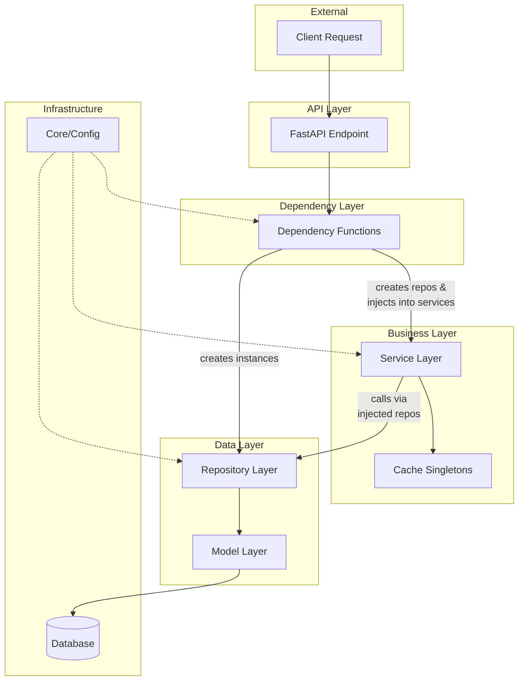
```mermaid
flowchart TB
    subgraph "External"
        Client[Client Request]
    end

    subgraph "API Layer"
        Endpoint[FastAPI Endpoint]
    end

    subgraph "Dependency Layer"
        Deps[Dependency Functions]
    end

    subgraph "Business Layer"
        Service[Service Layer]
        Cache[Cache Singletons]
    end

    subgraph "Data Layer"
        Repo[Repository Layer]
        Model[Model Layer]
    end

    subgraph "Infrastructure"
        DB[(Database)]
        Core[Core/Config]
    end

    Client --> Endpoint
    Endpoint --> Deps
    Deps -->|creates repos &<br/>injects into services| Service
    Deps -->|creates instances| Repo
    Service --> Cache
    Service -->|calls via<br/>injected repos| Repo
    Repo --> Model
    Model --> DB
    Core -.-> Deps
    Core -.-> Service
    Core -.-> Repo
```

### Core Principles

| Principle | Description |
|-----------|-------------|
| **Separation of Concerns** | Each layer has a single, well-defined responsibility |
| **Dependency Inversion** | Higher layers depend on abstractions, not implementations |
| **Unidirectional Flow** | Data flows down through layers; responses bubble up |
| **Testability** | Each layer can be tested in isolation with mocks |
| **Reusability** | Lower layers are reusable across multiple higher-layer consumers |

### Project Versioning Snapshot

- Root application exposes operational routes only (for example `/health`).
- Global docs routes are disabled on root (`/docs`, `/redoc`, `/openapi.json`).
- Versioned mounted apps own API docs and OpenAPI contracts: `/v1/docs`, `/v1/redoc`, `/v1/openapi.json`.
- Versioned mounted apps also expose: `/v2/docs`, `/v2/redoc`, `/v2/openapi.json`.
- API endpoint paths follow mounted prefixes (`/v1/...`, `/v2/...`).

### Normative Rules (MUST / SHOULD / MAY)

- **MUST**: Database session ownership remains in the Deps layer during request handling.
- **MUST**: Services raise domain exceptions only (never HTTP exceptions).
- **MUST**: Service input/output contracts are defined as `TypedDict` in `app/services/types/`.
- **MUST**: Multi-step atomic operations are coordinated in the Deps layer.
- **MUST**: Core transport exceptions are HTTP-aware; domain exceptions live outside core (for example `app/services/exceptions/` or `app/domains/<domain>/exceptions.py`) except explicitly documented compatibility shims.
- **MUST**: API is the canonical owner of domain-to-HTTP exception translation.
- **MUST**: If deps performs reusable pre-validation translation (for example auth token validation used across endpoints), the resulting HTTP contract must still be documented and enforced at API boundary.
- **MUST**: API has the final `except Exception` with `logger.exception(...)` for traceback visibility.
- **MUST**: ORM models use SQLAlchemy Declarative typed mapping only (`DeclarativeBase`, `Mapped[...]`, `mapped_column`, `relationship`).
- **MUST**: Many-to-many relationships are modeled with an Association Object class in this guide's default policy.
- **SHOULD**: API translates domain exceptions to HTTP exceptions using service method docstrings as exception contracts.
- **SHOULD**: Endpoints remain thin controllers (target: 1-5 lines of logic).
- **SHOULD**: Repository mutation methods expose `auto_commit` for transaction orchestration.
- **SHOULD**: Write endpoints use idempotency keys and optimistic concurrency controls (for example `version` columns or ETags).
- **SHOULD**: Services keep external dependencies minimal for easier Python/runtime migration.
- **MAY**: Services use Pydantic models for complex internal validation, then return `TypedDict` contracts.
- **MAY**: Schema and Model layers import Core only for shared primitives (e.g., enums, base classes).

### Exception Taxonomy

| Exception Type | Recommended Location | Raised By | Translated By | Notes |
|----------------|----------------------|-----------|---------------|-------|
| **Domain Exceptions** | `app/services/exceptions/` or `app/domains/<domain>/exceptions.py` | Service layer | API layer (canonical), optionally deps for reusable pre-validation adapters | Express business-rule failures (never HTTP-aware) |
| **HTTP Exceptions** | `app/core/exceptions/http_exceptions.py` (+ shared base in `app/core/exceptions/base.py`) | API layer (or deps adapters) | FastAPI | Final transport-level representation |
| **Infrastructure Exceptions** | `app/services/exceptions/` (or provider-specific modules) | Infra services/repos | Service or API | Wrap SDK/DB errors into domain-safe exceptions |

### Mandatory Docstring Standard (Google)

All new or modified public callables in this architecture MUST follow the Google Python docstring guide, except API endpoint functions:

- <https://google.github.io/styleguide/pyguide.html#381-docstrings>

API endpoint functions SHOULD NOT define function docstrings. Endpoint documentation MUST live in router metadata (`summary`, `description`, `responses`).

Compatibility note: existing endpoints may still contain short docstrings during migration; prefer router metadata as the long-term source of truth.

For all non-endpoint docstrings, `Args` entries MUST use this format:

- `arg_name (Type): description`

#### Required Coverage by Layer

| Layer Artifact | Required Sections |
|----------------|-------------------|
| API endpoint function | No function docstring; document via router `summary`, `description`, `responses` |
| Dependency function | Summary, Args, Returns, Note |
| Service method | Summary, Args, Returns, Raises, Example |
| Repository method | Summary, Args, Returns, Raises, Performance/Warning (when relevant) |
| Schema validator | Summary, Args, Returns, Raises |
| Domain/HTTP exception class | Summary, Args, Note |

#### Template: Service Method

```python
async def process(self, item: ResourceInput, option: ProcessingOption) -> ResourceOutput:
    """Process a resource using domain rules and persistence orchestration.

    Args:
        item (ResourceInput): TypedDict-style service input contract.
        option (ProcessingOption): Processing mode that affects rule application.

    Returns:
        ResourceOutput: TypedDict-style service output contract.

    Raises:
        ValidationError: If domain rules are violated.
        ProcessingError: If persistence fails after validation.

    Example:
        >>> output = await service.process(item, ProcessingOption.DEFAULT)
    """
```

#### Template: API Endpoint Documentation (Router Metadata)

```python
@router.post(
    "/resources",
    response_model=ResourceResponse,
    summary="Create a resource",
    description="Create a resource using validated request data.",
    responses={
        status.HTTP_400_BAD_REQUEST: {"model": responses.BadRequestResponse},
        status.HTTP_404_NOT_FOUND: {"model": responses.NotFoundResponse},
        status.HTTP_500_INTERNAL_SERVER_ERROR: {"model": responses.InternalServerErrorResponse},
    },
)
async def create_resource(request: ResourceRequest, service: ResourceService) -> ResourceResponse:
    # No endpoint function docstring: documentation is defined in router metadata.
    ...
```

### Exception Contract Matrix (Canonical)

This is the canonical mapping. Keep endpoint-level response docs consistent with this table.

| Domain Exception | HTTP Exception | Status | Response Model |
|------------------|----------------|--------|----------------|
| `ValidationError` | `BadRequestException` | 400 | `BadRequestResponse` |
| `ResourceNotFoundError` | `NotFoundException` | 404 | `NotFoundResponse` |
| `AppException` | `BadRequestException` | 400 | `BadRequestResponse` |
| Unexpected `Exception` | Re-raise after `logger.exception(...)` | 500 | `InternalServerErrorResponse` |

### Quick Reference Table

| Layer | Location | Responsibility | Depends On |
|-------|----------|----------------|------------|
| **API** | `app/api/` | HTTP routing, domain-to-HTTP translation, final exception logging | Deps, Schemas |
| **Deps** | `app/api/*/deps/` with service factories in `deps/services.py` | Dependency injection, session management, service/repo wiring, atomic transaction orchestration | Services, Repos, Schemas, Core |
| **Service** | `app/services/` | Business logic, domain rules, domain exceptions; returns `TypedDict` contracts | Repos, `app/services/types`, Cache |
| **Service Types** | `app/services/types/` | `TypedDict` input/output contracts for service boundaries | `typing` (and optional Pydantic for validation helpers) |
| **Repository** | `app/repos/` | Data access, CRUD with `auto_commit` support | Models, Schemas |
| **Schema** | `app/schemas/` | Validation, serialization, API contracts | Core (shared primitives only) |
| **Model** | `app/models/` | Database table mapping (ORM) | Core (shared primitives only) |
| **Core** | `app/core/` | Configuration, HTTP exceptions, database setup | None (lowest layer) |

---

## 🎯 Architecture Applicability

This architecture is a **modular monolith** using layered separation. It is designed for **small-to-medium** FastAPI projects with teams of **1–15 developers**.

### When This Architecture Fits

| Metric | Sweet Spot | Upper Limit |
|--------|-----------|-------------|
| Team size | 1–8 developers | 15 developers |
| Endpoints | 10–80 | ~150 |
| Services | 3–15 | ~30 |
| Repositories | 5–20 | ~40 |
| Models | 5–30 | ~60 |
| Databases | 1 | 2–3 |

### When This Architecture Does NOT Fit

| Signal | Alternative |
|--------|-------------|
| 15+ developers with daily merge conflicts | Domain-driven modules (`app/domains/`) |
| 150+ endpoints across unrelated domains | API gateway + microservices |
| Event-heavy workflows (notifications, queues, sagas) | Event-driven architecture with message bus |
| Multiple teams owning separate databases | Microservices with independent data stores |
| Sub-millisecond latency requirements | Specialized frameworks (gRPC, async workers) |

> **Rule of thumb**: If you hit 3+ signals from the "Does NOT Fit" table, start planning migration. See [Scalability Limits](#-scalability-limits--when-to-outgrow) for detailed thresholds.

### Key Design Decisions

| Decision | Choice | Rationale |
|----------|--------|-----------|
| Service dependencies | **Repository injection** | Explicit deps, easy testing, no session leaking into services |
| Error handling | **Domain exceptions** | Pythonic, forces handling, clear exception hierarchy |
| Transaction control | **`auto_commit` parameter** | Flexible per-operation; deps layer can coordinate multi-step transactions |
| Session ownership | **Deps layer only** | Sessions injected via `Depends(get_session)`, never reach services — clean separation |

### Template Profiles

This guide is a generic template and can be adapted via explicit profiles:

- **Strict profile**: Core keeps HTTP exceptions only; domain exceptions live in service/domain modules.
- **Legacy compatibility profile**: Existing projects may temporarily centralize more exception types in core during migration.

This document uses **Strict profile as the default target**, with repository-specific compatibility deviations documented in the appendix.

---

## 📚 Layer Reference

### 3.1 API Layer (Endpoints)

**Location**: `app/api/`

#### Responsibility

The API layer handles **HTTP concerns first** and triggers application behavior by **calling service methods**. Endpoints should stay thin, but they can orchestrate the final service call and use `try/except` to translate domain/custom exceptions into the appropriate HTTP exceptions.

In this repository, API remains the canonical translation boundary. Deps may still perform reusable pre-validation translation for shared adapters (for example auth dependencies) when that removes duplication across endpoints.

#### ✅ What Belongs Here

- Route definitions (`@router.get`, `@router.post`, etc.)
- Authentication/authorization decorators
- Response status code manipulation
- OpenAPI documentation (summary, description, responses)
- Request/response type hints
- Calling injected service methods to run use-case logic
- `try/except` blocks that map custom exceptions to HTTP exceptions
- Final fallback `except Exception` with `logger.exception(...)`

#### ❌ What Does NOT Belong Here

- Business logic or validation rules
- Database queries or session management
- Data transformation logic
- Service/repository instantiation details (use deps for construction)
- Manual session lifecycle handling (`commit`, `rollback`, `close`)

#### Full Code Example

```python
from typing import Annotated

from fastapi import APIRouter, Depends, status
from loguru import logger

from app.api.v1.deps.resource import get_resource_service
from app.core import exceptions, responses
from app.services.exceptions.resource import (
    AppException,
    ResourceNotFoundError,
    ValidationError,
)
from app.schemas.resource import (
    ResourceRequest,
    ResourceResponse,
    ProcessingOption,
)

router = APIRouter(tags=["Resources"], prefix="/resources")


@router.post(
    "/process",
    response_model=ResourceResponse,
    summary="Process a resource",
    description="""
    Processes the given resource with the specified parameters.
    """,
    responses={
        status.HTTP_400_BAD_REQUEST: {"model": responses.BadRequestResponse},
        status.HTTP_404_NOT_FOUND: {"model": responses.NotFoundResponse},
        status.HTTP_500_INTERNAL_SERVER_ERROR: {"model": responses.InternalServerErrorResponse},
    },
)
async def process_resource(
    request: ResourceRequest,
    option: ProcessingOption = ProcessingOption.DEFAULT,
    service = Depends(get_resource_service),
) -> ResourceResponse:
    try:
        return await service.process(request, option)
    except ResourceNotFoundError as e:
        raise exceptions.NotFoundException(detail=str(e))
    except ValidationError as ex:
        raise exceptions.BadRequestException(detail=str(ex))
    except AppException as e:
        raise exceptions.BadRequestException(detail=e.message)
    except Exception:
        logger.exception("Unhandled error in process_resource")
        raise
```

#### Error Mapping Matrix (Template)

Keep this endpoint matrix synchronized with the canonical mapping in Overview.

| Domain Exception | HTTP Exception | Status | Response Model |
|------------------|----------------|--------|----------------|
| `ValidationError` | `BadRequestException` | 400 | `BadRequestResponse` |
| `ResourceNotFoundError` | `NotFoundException` | 404 | `NotFoundResponse` |
| `AppException` | `BadRequestException` | 400 | `BadRequestResponse` |
| Any unexpected `Exception` | Re-raise after logging | 500 | `InternalServerErrorResponse` |

#### Key Characteristics

- Endpoints are **thin controllers** (small orchestration + service call)
- Use-cases run through **injected services**
- Response models are **explicitly declared** for OpenAPI
- Error responses are **documented** in the `responses` parameter
- Custom/domain exceptions are translated with `try/except`
- Final fallback is `except Exception` + `logger.exception(...)` in API only
- Service method docstrings define exception contracts that API maps to HTTP errors

#### Translation Boundary Notes (Repository Pattern)

- Canonical rule: endpoint-level API contract is the source of truth for exception translation.
- Allowed optimization: deps may map domain exceptions to HTTP exceptions for reusable adapters invoked by multiple endpoints.
- Guardrail: when deps performs translation, endpoint response docs MUST still include those HTTP outcomes.
- Guardrail: avoid mixing conflicting mappings for the same domain exception across deps and endpoint for one route.

---

### 3.2 Dependency Layer (Deps)

**Location**: `app/api/*/deps/`

#### Responsibility

The dependency layer is a **session ownership and service wiring layer**. It controls database session lifecycle, builds repository/service instances, and can prepare helper inputs or context needed before API calls service methods.

> **Critical rule**: The database session **never leaves this layer**. Services receive repositories, not sessions.

#### ✅ What Belongs Here

- Creating repository instances and injecting them into services
- Receiving database sessions via `Depends(get_session)` and creating repos
- Session-aware setup (transaction boundaries, helper objects, service context)
- Lightweight orchestration that supports API/service interaction
- Query/body parameter extraction with validation
- Coordinating multi-step transactions (`auto_commit=False` + explicit `session.commit()`)

#### ❌ What Does NOT Belong Here

- Complex domain/business rules (move to services)
- Direct database queries (use repositories)
- Data transformation beyond basic mapping
- Validation rules (use schemas)
- Passing raw sessions to services

#### Full Code Example

```python
from typing import Annotated

from fastapi import Depends
from sqlalchemy.ext.asyncio import AsyncSession

from app.core.db import get_session
from app.schemas.resource import ResourceRequest, ResourceResponse
from app.repos.resource_repository import ResourceRepository
from app.repos.audit_repository import AuditRepository
from app.services.resource_service import ResourceService


async def get_resource_service(
    session: Annotated[AsyncSession, Depends(get_session)],
) -> ResourceService:
    """Build and return a request-scoped `ResourceService`.

    Args:
        session (AsyncSession): Request-scoped async session from `Depends(get_session)`.

    Returns:
        ResourceService: Service wired with request-scoped repositories.

    Note:
        The session never leaves the deps layer; only repositories are injected.
    """
    resource_repo = ResourceRepository(session)
    audit_repo = AuditRepository(session)
    return ResourceService(resource_repo, audit_repo)


async def get_resource_atomic(
    service: Annotated[ResourceService, Depends(get_resource_service)],
    request: ResourceRequest,
    session: Annotated[AsyncSession, Depends(get_session)],
) -> ResourceResponse:
    """Execute an atomic service flow with explicit transaction control.

    Args:
        service (ResourceService): Injected domain service.
        request (ResourceRequest): Validated request payload.
        session (AsyncSession): Request-scoped async session used for commit/rollback.

    Returns:
        ResourceResponse: Service result for the atomic operation.

    Note:
        Use this pattern when multiple operations share one transaction boundary.
    """
    try:
        result = await service.process_batch(request, auto_commit=False)
        await session.commit()
        return result
    except Exception:
        await session.rollback()
        raise
```

> **When to use `SessionLocal()` directly**: Use manual session creation only in contexts where FastAPI's dependency injection is **unavailable** — lifespan/startup events, Celery tasks, background workers, and CLI scripts. For all request-handling deps, always use `Depends(get_session)`.

#### Key Characteristics

- **Factory pattern**: Creates repo instances and injects into services
- **Session ownership**: Deps receives/manages sessions via `Depends(get_session)`
- **Service wiring**: API receives ready-to-use services from deps
- **Transaction coordination**: Uses `auto_commit=False` + explicit `commit()` for atomic operations
- **Support logic only**: Complex domain rules stay in services

#### File Organization (Canonical)

Use this split to keep dependency code predictable and scalable:

- `services.py`: all `get_*_service()` factories (service wiring only)
- Domain deps files (for example `auth.py`, `rate_limit.py`): adapters and endpoint-facing dependencies that are not service factories
- `__init__.py`: package-level re-exports for stable import paths

```text
app/
└── api/
    └── v1/
        └── deps/
            ├── services.py      # get_auth_service, get_user_service, ...
            ├── auth.py          # oauth2_scheme, get_current_user
            ├── rate_limit.py    # rate_limit_auth, rate_limit_api, ...
            └── __init__.py      # re-exports
```

#### Version Isolation Rule

Each API version MUST own its own deps package, even when the implementation is initially identical.

```text
app/api/v1/deps/
app/api/v2/deps/
```

This avoids hidden cross-version coupling and allows each version to evolve independently without import side effects.

#### Package Re-exports (`deps/__init__.py`)

Expose commonly used dependencies through package re-exports so callers do not depend on internal file layout.

Before:

```python
from app.api.v1.deps.auth import get_current_user
from app.api.v1.deps.services import get_auth_service
```

After:

```python
from app.api.v1.deps import get_current_user, get_auth_service
```

This keeps imports stable even if internal deps files are reorganized.

---

### 3.3 Service Layer

**Location**: `app/services/`

#### Responsibility

The service layer contains **all business logic and domain rules**. It orchestrates repository calls, performs validation, transforms data, and implements core use-cases. Services receive **repository instances** as constructor parameters, never sessions, and expose **TypedDict-first contracts** defined in `app/services/types/`.

#### ✅ What Belongs Here

- Business logic and domain rules
- Orchestrating multiple repository calls
- Data validation and transformation
- TypedDict input/output contracts in `app/services/types/`
- Optional Pydantic validation for complex payload normalization
- Cache integration and lookups
- Complex calculations and algorithms
- Raising domain exceptions for business rule violations

#### ❌ What Does NOT Belong Here

- HTTP concerns (status codes, headers)
- Creating database sessions (deps layer owns sessions)
- Creating repository instances (receive as constructor parameter)
- Direct SQL queries (use repositories)
- Returning framework-coupled response objects as service contracts
- Holding session references
- Broad, unnecessary SDK dependencies in core domain services

#### Full Code Example

```python
from app.services.exceptions.resource import (
    AppException,
    ResourceNotFoundError,
    ValidationError,
    ProcessingError,
)
from app.repos.resource_repository import ResourceRepository
from app.repos.audit_repository import AuditRepository
from app.schemas.resource import CreateResourceSchema
from app.services.types.resource import (
    ProcessedItem,
    ProcessingOption,
    ResourceInput,
    ResourceOutput,
)
from app.services.cache.resource_cache import resource_cache


class ResourceService:
    """
    Service layer: contains all business logic.
    Receives repository instances as constructor parameters.
    Never sees or holds database sessions.
    """

    def __init__(
        self,
        resource_repo: ResourceRepository,
        audit_repo: AuditRepository,
    ):
        self.resource_repo = resource_repo
        self.audit_repo = audit_repo

    async def process(
        self,
        item: ResourceInput,
        option: ProcessingOption,
    ) -> ResourceOutput:
        """Process a resource using validation, rules, persistence, and auditing.

        Args:
            item (ResourceInput): TypedDict-style service input contract.
            option (ProcessingOption): Processing mode controlling rule behavior.

        Returns:
            ResourceOutput: TypedDict-style service output contract.

        Raises:
            ValidationError: If business validation fails.
            ProcessingError: If persistence or audit operations fail.

        Example:
            >>> output = await service.process(item, ProcessingOption.DEFAULT)
        """
        # Step 1: Validate against cache
        self._validate_item(item)

        # Step 2: Apply business rules
        processed = self._apply_rules(item, option)

        # Step 3: Build repository create schema and persist
        create_schema = CreateResourceSchema(
            name=processed["name"],
            value=processed["value"],
            metadata=processed["metadata"],
        )
        created = await self.resource_repo.create_one(create_schema)

        # Step 4: Record audit trail
        await self.audit_repo.log_action(
            action="PROCESS",
            resource_id=created.id,
            details={"option": option.value},
        )

        # Step 5: Return TypedDict service contract
        return ResourceOutput(
            id=created.id,
            name=created.name,
            value=created.value,
            status=created.status,
        )

    async def get_resource(self, resource_id: int) -> ResourceOutput:
        """Retrieve a single resource by ID.

        Args:
            resource_id (int): Resource identifier.

        Returns:
            ResourceOutput: TypedDict-style service output contract.

        Raises:
            ResourceNotFoundError: If no matching resource exists.
        """
        model = await self.resource_repo.get_by_id(resource_id)
        if model is None:
            raise ResourceNotFoundError(f"Resource {resource_id} not found")
        return ResourceOutput(
            id=model.id,
            name=model.name,
            value=model.value,
            status=model.status,
        )

    def _validate_item(self, item: ResourceInput) -> None:
        """Validate resource input against cache-based constraints.

        Args:
            item (ResourceInput): TypedDict-style input payload.

        Raises:
            ValidationError: If category is unknown or value is out of range.
        """
        cached = resource_cache.get(item["category"])
        if not cached:
            raise ValidationError(f"Unknown category: {item['category']}")
        if item["value"] < cached.min_value or item["value"] > cached.max_value:
            raise ValidationError("Value out of allowed range")

    def _apply_rules(
        self, item: ResourceInput, option: ProcessingOption
    ) -> ProcessedItem:
        """Apply deterministic domain rules to input data.

        Args:
            item (ResourceInput): TypedDict-style validated input.
            option (ProcessingOption): Processing mode that controls transformation intensity.

        Returns:
            ProcessedItem: Transformed values ready for persistence.
        """
        multiplier = 1.0 if option == ProcessingOption.DEFAULT else 1.5
        return ProcessedItem(
            name=item["name"].upper(),
            value=item["value"] * multiplier,
            metadata={"original_value": item["value"], "option": option.value},
        )
```

#### Key Characteristics

- **Receives repositories**: Repos injected via constructor — no session awareness
- **TypedDict-first contracts**: Service inputs/outputs live in `app/services/types/`
- **Pydantic optionality**: Use Pydantic only when validation complexity justifies it
- **Raises domain exceptions**: `ValidationError`, `ResourceNotFoundError`, etc. — never returns error result types
- **Pure functions**: For validation and transformation logic
- **Clear steps**: Processing flows are explicit and documented
- **Repository integration**: Uses injected repos for all data access
- **Cache integration**: Uses singleton caches for metadata lookups
- **Minimal dependencies**: Keep each service lightweight for portability and Python-version migration
- **Threshold**: If a service constructor takes **>5 repositories**, it’s doing too much — split into smaller services

> **Infrastructure services**: Not all services follow the repo-injection pattern. Infrastructure services like `firebase.py`, `gcs.py`, `back_blaze_b2.py`, and `firestore.py` wrap external SDKs and don't use repositories. They live in `app/services/` alongside domain services and are typically used by deps or other services directly.

#### Service Design Pattern: Standalone vs Abstract Base

Use standalone services by default. Introduce abstract base services only when multiple implementations must satisfy one contract.

- **Standalone (default)**: single implementation, direct constructor injection, no inheritance requirement
- **Abstract base (conditional)**: multiple providers/adapters implementing the same interface (for example email provider strategy)

This keeps service design simple for most domains while preserving extensibility where polymorphism is required.

#### Cache Key Naming Convention

Use deterministic cache key structure:

```text
{service}:{entity}:{identifier}
```

Examples:

- `cache:user:123`
- `ratelimit:auth:192.168.1.1`
- `blacklist:token:abc123`

---

### 3.4 Repository Layer

**Location**: `app/repos/`

#### Responsibility

The repository layer provides a **clean abstraction over database access**. It handles all CRUD operations, query building, and result mapping. Repositories work with SQLAlchemy models and Pydantic schemas for type safety.

All mutation methods accept an `auto_commit` parameter (default `True`). Pass `auto_commit=False` when the **deps layer** needs to coordinate multiple repo calls in a single transaction — the deps layer is then responsible for calling `session.commit()`.

> ⚠️ **WARNING**: If you pass `auto_commit=False`, you **MUST** commit in the calling deps function. Failure to do so = **silent data loss**.

#### ✅ What Belongs Here

- CRUD operations (create, read, update, delete)
- Query building with SQLAlchemy
- Pagination, filtering, sorting
- Complex queries specific to the domain
- Conditional commit via `auto_commit` parameter
- Raw SQL for complex queries (escape hatch)

#### ❌ What Does NOT Belong Here

- Business logic or validation rules
- HTTP concerns
- Schema validation (handled by Pydantic)
- Cross-entity orchestration (use services)

#### Full Code Example

```python
import uuid
from typing import Any, Generic, Sequence, Type, TypeVar

from pydantic import BaseModel
from sqlalchemy import delete, insert, select, text, update
from sqlalchemy.engine import Result
from sqlalchemy.ext.asyncio import AsyncSession

from app.models.base import Base

Model = TypeVar("Model", bound=Base)
CreateSchema = TypeVar("CreateSchema", bound=BaseModel)
UpdateSchema = TypeVar("UpdateSchema", bound=BaseModel)


class BaseRepository(Generic[Model, CreateSchema, UpdateSchema]):
    """
    Generic repository providing standard CRUD operations.
    Extend this class for domain-specific query methods.
    """

    def __init__(self, session: AsyncSession, model: Type[Model]):
        self.session = session
        self.model = model

    def _validate_column_exists(self, column_name: str) -> None:
        """Validate that a column exists on the bound SQLAlchemy model.

        Args:
            column_name (str): Candidate ORM column attribute name.

        Raises:
            ValueError: If the column does not exist on the model.
        """
        if not hasattr(self.model, column_name):
            raise ValueError(
                f"Column '{column_name}' does not exist on model '{self.model.__name__}'"
            )

    async def create_one(self, schema: CreateSchema, auto_commit: bool = True) -> Model:
        """Create one record and return the inserted model.

        Args:
            schema (CreateSchema): Create schema used to build insert values.
            auto_commit (bool): Whether to commit immediately after insert.

        Returns:
            Model: Inserted ORM model.

        Example:
            new_record = await repo.create_one(CreateResourceSchema(name="example"))
        """
        stmt = (
            insert(self.model)
            .values(**schema.model_dump(exclude_none=True))
            .returning(self.model)
        )
        result = await self.session.execute(stmt)
        if auto_commit:
            await self.session.commit()
        return result.scalar_one()

    async def create_bulk(
        self, schemas: Sequence[CreateSchema], auto_commit: bool = True
    ) -> list[Model]:
        """Create multiple records in one operation.

        Args:
            schemas (Sequence[CreateSchema]): Sequence of create schemas.
            auto_commit (bool): Whether to commit immediately after insert.

        Returns:
            list[Model]: Inserted ORM models.
        """
        if not schemas:
            return []
        values = [schema.model_dump(exclude_none=True) for schema in schemas]
        stmt = insert(self.model).values(values).returning(self.model)
        result = await self.session.execute(stmt)
        if auto_commit:
            await self.session.commit()
        return list(result.scalars().all())

    async def get_by_id(
        self,
        obj_id: str | int | uuid.UUID,
        id_column_name: str = "id",
    ) -> Model | None:
        """Retrieve one record by identifier.

        Args:
            obj_id (str | int | uuid.UUID): Identifier value.
            id_column_name (str): Name of identifier column.

        Returns:
            Model | None: Matching model or `None` when absent.
        """
        self._validate_column_exists(id_column_name)
        stmt = select(self.model).where(
            getattr(self.model, id_column_name) == obj_id
        )
        result = await self.session.execute(stmt)
        return result.scalar_one_or_none()

    async def get_multi_by_ids(
        self,
        obj_ids: Sequence[str | int | uuid.UUID],
        skip: int = 0,
        limit: int = 100,
        id_column_name: str = "id",
    ) -> Sequence[Model]:
        """Retrieve multiple records by identifiers with pagination.

        Args:
            obj_ids (Sequence[str | int | uuid.UUID]): Identifier collection.
            skip (int): Number of rows to skip.
            limit (int): Maximum rows to return.
            id_column_name (str): Name of identifier column.

        Returns:
            Sequence[Model]: Matching ORM models.
        """
        self._validate_column_exists(id_column_name)
        stmt = (
            select(self.model)
            .where(getattr(self.model, id_column_name).in_(obj_ids))
            .offset(skip)
            .limit(limit)
        )
        result = await self.session.execute(stmt)
        return result.scalars().all()

    async def update_by_id(
        self,
        obj_id: str | int | uuid.UUID,
        schema: UpdateSchema,
        id_column_name: str = "id",
        auto_commit: bool = True,
    ) -> Model | None:
        """Update one record by identifier.

        Args:
            obj_id (str | int | uuid.UUID): Identifier value.
            schema (UpdateSchema): Update schema with mutable fields.
            id_column_name (str): Name of identifier column.
            auto_commit (bool): Whether to commit immediately after update.

        Returns:
            Model | None: Updated model or `None` when not found.
        """
        self._validate_column_exists(id_column_name)
        stmt = (
            update(self.model)
            .where(getattr(self.model, id_column_name) == obj_id)
            .values(**schema.model_dump(exclude_none=True))
            .returning(self.model)
        )
        result = await self.session.execute(stmt)
        if auto_commit:
            await self.session.commit()
        return result.scalar_one_or_none()

    async def update_bulk(
        self,
        updates: Sequence[tuple[str | int | uuid.UUID, UpdateSchema]],
        id_column_name: str = "id",
        auto_commit: bool = True,
    ) -> list[Model]:
        """Update multiple records using `(id, schema)` pairs.

        Args:
            updates (Sequence[tuple[str | int | uuid.UUID, UpdateSchema]]): Sequence of `(identifier, update_schema)` tuples.
            id_column_name (str): Name of identifier column.
            auto_commit (bool): Whether to commit immediately after updates.

        Returns:
            list[Model]: Updated ORM models.
        """
        if not updates:
            return []
        self._validate_column_exists(id_column_name)
        updated = []
        for obj_id, update_schema in updates:
            stmt = (
                update(self.model)
                .where(getattr(self.model, id_column_name) == obj_id)
                .values(**update_schema.model_dump(exclude_none=True))
                .returning(self.model)
            )
            result = await self.session.execute(stmt)
            obj = result.scalar_one_or_none()
            if obj:
                updated.append(obj)
        if auto_commit:
            await self.session.commit()
        return updated

    async def delete_by_id(
        self,
        obj_id: str | int | uuid.UUID,
        id_column_name: str = "id",
        auto_commit: bool = True,
    ) -> bool:
        """Delete one record by identifier.

        Args:
            obj_id (str | int | uuid.UUID): Identifier value.
            id_column_name (str): Name of identifier column.
            auto_commit (bool): Whether to commit immediately after delete.

        Returns:
            bool: `True` if a row was deleted, otherwise `False`.
        """
        self._validate_column_exists(id_column_name)
        stmt = delete(self.model).where(
            getattr(self.model, id_column_name) == obj_id
        )
        result = await self.session.execute(stmt)
        if auto_commit:
            await self.session.commit()
        return result.rowcount > 0

    async def delete_by_ids(
        self,
        obj_ids: Sequence[str | int | uuid.UUID],
        id_column_name: str = "id",
        auto_commit: bool = True,
    ) -> int:
        """Delete multiple records by identifiers.

        Args:
            obj_ids (Sequence[str | int | uuid.UUID]): Identifier collection.
            id_column_name (str): Name of identifier column.
            auto_commit (bool): Whether to commit immediately after delete.

        Returns:
            int: Number of rows deleted.
        """
        if not obj_ids:
            return 0
        self._validate_column_exists(id_column_name)
        stmt = delete(self.model).where(
            getattr(self.model, id_column_name).in_(obj_ids)
        )
        result = await self.session.execute(stmt)
        if auto_commit:
            await self.session.commit()
        return result.rowcount

    async def custom_query(
        self, query: str, params: dict[str, Any] | None = None
    ) -> Result[Any]:
        """Execute parameterized raw SQL for advanced queries.

        Args:
            query (str): SQL statement string.
            params (dict[str, Any] | None): Optional parameter mapping for bound execution.

        Returns:
            Result[Any]: SQLAlchemy execution result.
        """
        stmt = text(query)
        if params:
            stmt = stmt.bindparams(**params)
        return await self.session.execute(stmt)


# Example: Domain-specific repository extending base
class ResourceRepository(BaseRepository[ResourceModel, CreateResourceSchema, UpdateResourceSchema]):
    """Domain-specific repository with custom query methods."""

    def __init__(self, session: AsyncSession):
        super().__init__(session, ResourceModel)

    async def get_by_category(
        self,
        category: str,
        skip: int = 0,
        limit: int = 100,
    ) -> list[ResourceModel]:
        """Get resources filtered by category.

        Args:
            category (str): Category value to filter by.
            skip (int): Number of rows to skip.
            limit (int): Maximum rows to return.

        Returns:
            list[ResourceModel]: Matching resources.
        """
        stmt = (
            select(self.model)
            .where(self.model.category == category)
            .offset(skip)
            .limit(limit)
            .order_by(self.model.created_at.desc())
        )
        result = await self.session.execute(stmt)
        return list(result.scalars().all())

    async def get_by_time_range(
        self,
        start_time: int,
        end_time: int,
    ) -> list[ResourceModel]:
        """Get resources within an inclusive time window.

        Args:
            start_time (int): Inclusive window start.
            end_time (int): Inclusive window end.

        Returns:
            list[ResourceModel]: Matching resources ordered by timestamp.
        """
        stmt = (
            select(self.model)
            .where(self.model.timestamp.between(start_time, end_time))
            .order_by(self.model.timestamp.asc())
        )
        result = await self.session.execute(stmt)
        return list(result.scalars().all())
```

#### Key Characteristics

- **Generic base class**: Reusable CRUD with type parameters (`Model`, `CreateSchema`, `UpdateSchema`)
- **9 methods**: `create_one`, `create_bulk`, `get_by_id`, `get_multi_by_ids`, `update_by_id`, `update_bulk`, `delete_by_id`, `delete_by_ids`, `custom_query`
- **`auto_commit` parameter**: Default `True` for standalone operations; pass `False` when deps layer coordinates transactions
- **Column validation**: Prevents runtime errors on dynamic queries
- **Indexing discipline**: Frequently filtered/sorted fields should have explicit indexes
- **Domain-specific extensions**: Custom methods in concrete repositories
- **Escape hatch**: `custom_query()` for parameterized raw SQL when needed

---

### 3.5 Schema Layer

**Location**: `app/schemas/`

#### Responsibility

The schema layer defines **API contracts, validation rules, and serialization logic**. Using Pydantic v2, schemas validate incoming requests, serialize outgoing responses, and document the API through OpenAPI generation.

#### ✅ What Belongs Here

- Request/response model definitions
- Field validation with constraints
- Custom validators (`@field_validator`, `@model_validator`)
- Discriminated unions for polymorphic types
- Enum definitions for constrained values
- Serialization configuration (`model_config`)

#### ❌ What Does NOT Belong Here

- Business logic
- Database queries
- External API calls
- Side effects of any kind

#### Full Code Example

```python
from datetime import datetime
from enum import StrEnum
from typing import Annotated, Literal, Union

from pydantic import (
    BaseModel,
    ConfigDict,
    Field,
    field_validator,
    model_validator,
)


# =============================================================================
# Base Schemas with Common Configuration
# =============================================================================

class BaseSchema(BaseModel):
    """Base schema with standard configuration."""

    model_config = ConfigDict(
        from_attributes=True,  # Enable ORM mode
        extra="forbid",  # Reject unknown fields
        str_strip_whitespace=True,  # Strip whitespace from strings
    )


class BaseCreateSchema(BaseModel):
    """Base schema for create operations."""

    model_config = ConfigDict(
        validate_assignment=True, # Allow assignment validation
        use_enum_values=True, # Serialize enums as their values
    )


class BaseUpdateSchema(BaseModel):
    """Base schema for update operations (all fields optional)."""

    model_config = ConfigDict(
        validate_assignment=True, # Allow assignment validation
        use_enum_values=True, # Serialize enums as their values
    )


# =============================================================================
# Enums for Constrained Values
# =============================================================================

class StatusEnum(StrEnum):
    """Status values for resources."""

    PENDING = "pending"
    ACTIVE = "active"
    COMPLETED = "completed"
    FAILED = "failed"


class ProcessingOption(StrEnum):
    """Processing mode options."""

    DEFAULT = "default"
    FAST = "fast"
    THOROUGH = "thorough"


# =============================================================================
# Discriminated Unions for Polymorphic Types
# =============================================================================

class FilterTypeA(BaseSchema):
    """Filter by exact value match."""

    type: Literal["exact"] = "exact"
    value: str = Field(..., min_length=1)


class FilterTypeB(BaseSchema):
    """Filter by range."""

    type: Literal["range"] = "range"
    min_value: float | None = None
    max_value: float | None = None

    @model_validator(mode="after")
    def validate_range(self):
        """At least one bound must be specified."""
        if self.min_value is None and self.max_value is None:
            raise ValueError("At least one of min_value or max_value is required")
        if (
            self.min_value is not None
            and self.max_value is not None
            and self.min_value > self.max_value
        ):
            raise ValueError("min_value must be less than or equal to max_value")
        return self


# Pydantic v2 discriminated union - REQUIRED: Field(discriminator="type")
FilterType = Annotated[
    Union[FilterTypeA, FilterTypeB],
    Field(discriminator="type"),
]


# =============================================================================
# Request/Response Schemas with Validation
# =============================================================================

class ResourceRequest(BaseSchema):
    """Request schema for resource processing."""

    name: str = Field(
        ...,
        min_length=1,
        max_length=255,
        description="Resource name",
        json_schema_extra={"example": "my-resource"},
    )
    value: float = Field(..., ge=0, le=1000000, description="Resource value")
    category: str = Field(..., min_length=1, max_length=50)
    tags: list[str] = Field(default_factory=list, max_length=10)
    filter: FilterType | None = Field(default=None, description="Optional filter")

    # Alias for camelCase API convention
    created_at: datetime | None = Field(default=None, alias="createdAt")

    @field_validator("tags")
    @classmethod
    def validate_tags(cls, v: list[str]) -> list[str]:
        """Ensure tags are unique and lowercase."""
        return list(set(tag.lower().strip() for tag in v if tag.strip()))

    @field_validator("name")
    @classmethod
    def validate_name(cls, v: str) -> str:
        """Ensure name contains only valid characters."""
        if not v.replace("-", "").replace("_", "").isalnum():
            raise ValueError("Name must contain only alphanumeric characters, hyphens, and underscores")
        return v.lower()


class ResourceResponse(BaseSchema):
    """Response schema for resource operations."""

    id: int
    name: str
    value: float
    status: StatusEnum
    created_at: datetime = Field(alias="createdAt")
    updated_at: datetime | None = Field(default=None, alias="updatedAt")


# =============================================================================
# Mutual Exclusivity Pattern
# =============================================================================

class InputSource(BaseSchema):
    """
    Input source with mutually exclusive options.
    Either provide a reference OR direct data, not both.
    """

    reference_id: str | None = Field(default=None, alias="referenceId")
    direct_data: list[float] | None = Field(default=None, alias="directData")

    @model_validator(mode="after")
    def validate_mutual_exclusivity(self):
        """Exactly one of reference_id or direct_data must be provided."""
        has_reference = self.reference_id is not None
        has_direct = self.direct_data is not None

        if has_reference and has_direct:
            raise ValueError("Cannot specify both referenceId and directData")
        if not has_reference and not has_direct:
            raise ValueError("Must specify either referenceId or directData")
        return self
```

#### Key Characteristics

- **Base schemas**: Inherit common configuration
- **Field constraints**: Use `Field()` for validation (min, max, pattern)
- **`@field_validator`**: For single-field validation
- **`@model_validator`**: For cross-field validation
- **Discriminated unions**: Use `Field(discriminator="type")` for polymorphism
- **Aliases**: Use `alias` for camelCase API convention
- **StrEnum**: For type-safe string enumerations

#### Naming Convention

Use consistent suffixes so schema intent is obvious at call sites.

| Suffix | Purpose | Example |
|---|---|---|
| `*Create` | Input schema for create operations | `UserCreate` |
| `*Update` | Input schema for partial/full updates | `UserUpdate` |
| `*Read` / `*Response` | Output schema returned by API | `UserRead`, `UserResponse` |
| Action-specific (`*Signup`, `*Login`) | Explicit workflow payloads | `UserSignup`, `UserLogin` |

Validation split rule:

- Pydantic schemas validate structure, type, and field format.
- Services enforce business rules and cross-entity invariants.

---

### 3.6 Model Layer

**Location**: `app/models/`

#### Responsibility

The model layer defines **SQLAlchemy ORM models** that map to database tables. Models define table structure, relationships, and provide utility methods for serialization.

#### ✅ What Belongs Here

- SQLAlchemy table definitions
- Column definitions with types and constraints
- Relationships between tables
- Indexes and unique constraints
- Utility methods (`to_dict()`, `__repr__`)

#### ❌ What Does NOT Belong Here

- Business logic
- Validation rules (use schemas)
- Query methods (use repositories)
- API concerns

#### Full Code Example

```python
import re
from datetime import datetime
from typing import Any, Optional

from sqlalchemy import BigInteger, DateTime, Float, Index, String, Text, func
from sqlalchemy.orm import (
    DeclarativeBase,
    Mapped,
    class_mapper,
    declared_attr,
    mapped_column,
    relationship,
)

from app.core.db import meta


class Base(DeclarativeBase):
    """Base class for all SQLAlchemy models."""

    __abstract__ = True

    metadata = meta

    # Common columns — inherited by all models
    id: Mapped[int] = mapped_column(
        BigInteger(), autoincrement=True, primary_key=True, index=True
    )
    created_at: Mapped[datetime] = mapped_column(
        DateTime(timezone=True), server_default=func.now()
    )
    updated_at: Mapped[Optional[datetime]] = mapped_column(
        DateTime(timezone=True), server_default=func.now(), onupdate=func.now()
    )

    @declared_attr.directive
    def __tablename__(cls) -> str:
        """Auto-generate table name from class name (CamelCase → snake_case)."""
        return re.sub(r"(?<!^)(?=[A-Z])", "_", cls.__name__).lower()

    def to_dict(
        self,
        exclude_keys: set[str] | None = None,
        exclude_none: bool = False,
    ) -> dict[str, Any]:
        """
        Convert model to dictionary for serialization.

        Args:
            exclude_keys (set[str] | None): Set of column names to exclude
            exclude_none (bool): If True, exclude columns with None values

        Returns:
            Dictionary representation of the model
        """
        exclude_keys = exclude_keys or set()
        result = {}

        for key in class_mapper(self.__class__).c.keys():
            if key in exclude_keys:
                continue
            value = getattr(self, key)
            if exclude_none and value is None:
                continue
            result[key] = value

        return result

    def __repr__(self) -> str:
        """String representation for debugging."""
        class_name = self.__class__.__name__
        attrs = ", ".join(
            f"{k}={v!r}"
            for k, v in self.to_dict(exclude_none=True).items()
        )
        return f"{class_name}({attrs})"


class ResourceModel(Base):
    """Resource entity model — __tablename__ auto-generated as 'resource_model'."""

    __table_args__ = (
        Index("ix_resources_category", "category"),
    )

    # id, created_at, updated_at are inherited from Base
    name: Mapped[str] = mapped_column(String(255), nullable=False, unique=True)
    value: Mapped[float] = mapped_column(Float, nullable=False)
    category: Mapped[str] = mapped_column(String(50), nullable=False)
    description: Mapped[str | None] = mapped_column(Text, nullable=True)
    status: Mapped[str] = mapped_column(String(20), nullable=False, default="pending")

    # Relationship example
    audit_logs: Mapped[list["AuditLogModel"]] = relationship(
        "AuditLogModel",
        back_populates="resource",
        lazy="selectin",
    )
```

#### Key Characteristics

- **`__abstract__ = True`**: Base class is not mapped to a table
- **Common columns**: `id`, `created_at`, `updated_at` inherited by all models — no need to redeclare
- **Auto tablename**: `@declared_attr` generates `snake_case` table names from `CamelCase` class names
- **Type annotations**: Use `Mapped[T]` for all columns
- **`set[str]`**: `exclude_keys` uses `set` for O(1) lookup instead of `list`
- **Indexes**: Define in `__table_args__` for query performance
- **Relationships**: Define with `relationship()` for ORM navigation

#### SQLAlchemy ORM Standards (2.1-aligned)

- **MUST** use Declarative typed mappings only: `DeclarativeBase`, `Mapped[...]`, `mapped_column`, and `relationship`.
- **MUST** model relationship nullability in both type hints and column constraints (for example `Mapped[int | None]` + `nullable=True`).
- **MUST** define relationship pairs with `back_populates` for bidirectional navigation unless unidirectional behavior is explicitly required.
- **MUST** use Association Object mapping for many-to-many relationships in this template guide.
- **SHOULD** keep loader strategy explicit (`select`, `selectin`, `joined`) at model or query level based on access patterns.
- **SHOULD** align ORM cascade behavior with database constraints (`ON DELETE`, `passive_deletes`) to avoid contradictory writes.

#### SQLAlchemy Relationship Patterns (2.1-aligned)

##### Relationship Configuration Matrix

This matrix standardizes relationship choices before implementation. The examples in this section are adapted from official SQLAlchemy relationship and cascade patterns, then aligned to this repository's architecture policy.

| Pattern | FK Location | Cardinality in Python | Canonical Mapping Choice | Notes |
|---|---|---|---|---|
| One-to-many | Child table | `Parent.children: list[Child]` | Bidirectional `back_populates` on both sides | Parent collection usually owns cascade policy |
| Many-to-one | Parent table | `Child.parent: Parent` | Bidirectional with reverse collection | Keep FK nullability and type hints aligned |
| One-to-one | Child table with unique FK | Scalar on both sides | `uselist=False` + `UniqueConstraint` | Add DB uniqueness, not only ORM convention |
| Many-to-many (canonical here) | Association table | `Parent.links: list[Association]` | Association Object mapped class | Required in this guide for write paths |
| Self-referential | Same table | Parent scalar + child list | `remote_side` + explicit `back_populates` | Declare delete/null semantics explicitly |
| Composite FK | Child table | Depends on parent shape | `ForeignKeyConstraint([...], [...])` | Use only when domain identity is multi-column |

##### One-to-Many / Many-to-One (Bidirectional)

```python
from sqlalchemy import ForeignKey
from sqlalchemy.orm import Mapped, mapped_column, relationship


class ParentModel(Base):
    name: Mapped[str] = mapped_column(nullable=False)
    children: Mapped[list["ChildModel"]] = relationship(
        "ChildModel",
        back_populates="parent",
        cascade="all, delete-orphan",
        lazy="selectin",
    )


class ChildModel(Base):
    parent_id: Mapped[int] = mapped_column(
        ForeignKey("parent_model.id", ondelete="CASCADE"),
        nullable=False,
        index=True,
    )
    parent: Mapped["ParentModel"] = relationship(
        "ParentModel",
        back_populates="children",
    )
```

##### One-to-One (Uniqueness Enforced)

```python
from sqlalchemy import ForeignKey, UniqueConstraint


class UserModel(Base):
    profile: Mapped["ProfileModel | None"] = relationship(
        "ProfileModel",
        back_populates="user",
        lazy="selectin",
        uselist=False,
    )


class ProfileModel(Base):
    __table_args__ = (UniqueConstraint("user_id", name="uq_profile_user_id"),)

    user_id: Mapped[int] = mapped_column(
        ForeignKey("user_model.id", ondelete="CASCADE"),
        nullable=False,
    )
    user: Mapped["UserModel"] = relationship(
        "UserModel",
        back_populates="profile",
    )
```

##### Many-to-Many (Association Object — Canonical)

Use a mapped association class for all many-to-many relationships in this guide.

```python
from datetime import datetime

from sqlalchemy import ForeignKey, func


class UserGroupAssociation(Base):
    user_id: Mapped[int] = mapped_column(
        ForeignKey("user_model.id", ondelete="CASCADE"),
        primary_key=True,
    )
    group_id: Mapped[int] = mapped_column(
        ForeignKey("group_model.id", ondelete="CASCADE"),
        primary_key=True,
    )
    role: Mapped[str] = mapped_column(nullable=False, default="member")
    assigned_at: Mapped[datetime] = mapped_column(server_default=func.now())

    user: Mapped["UserModel"] = relationship(
        "UserModel",
        back_populates="group_links",
    )
    group: Mapped["GroupModel"] = relationship(
        "GroupModel",
        back_populates="user_links",
    )


class UserModel(Base):
    group_links: Mapped[list["UserGroupAssociation"]] = relationship(
        "UserGroupAssociation",
        back_populates="user",
        cascade="all, delete-orphan",
        lazy="selectin",
    )


class GroupModel(Base):
    user_links: Mapped[list["UserGroupAssociation"]] = relationship(
        "UserGroupAssociation",
        back_populates="group",
        cascade="all, delete-orphan",
        lazy="selectin",
    )
```

Compatibility note: plain `secondary=` many-to-many is common in SQLAlchemy, but this template's policy standardizes on Association Object for consistency and extensibility.

#### Association Object Pattern Policy

- **MUST** use a mapped association class for many-to-many relationships.
- **MUST NOT** maintain writable `secondary` and writable Association Object paths for the same join semantics.
- **MAY** expose convenience read-only traversal with `viewonly=True` when clearly documented.

```python
class UserModel(Base):
    group_links: Mapped[list["UserGroupAssociation"]] = relationship(
        "UserGroupAssociation",
        back_populates="user",
    )

    # Optional convenience path (read-only)
    groups: Mapped[list["GroupModel"]] = relationship(
        "GroupModel",
        secondary="user_group_association",
        viewonly=True,
    )
```

#### Advanced Relationship Topics

##### Self-Referential Relationships

```python
from sqlalchemy import ForeignKey


class NodeModel(Base):
    parent_id: Mapped[int | None] = mapped_column(
        ForeignKey("node_model.id", ondelete="SET NULL"),
        nullable=True,
        index=True,
    )
    parent: Mapped["NodeModel | None"] = relationship(
        "NodeModel",
        back_populates="children",
        remote_side="NodeModel.id",
    )
    children: Mapped[list["NodeModel"]] = relationship(
        "NodeModel",
        back_populates="parent",
        cascade="all",
    )
```

##### Composite Foreign Keys

```python
from sqlalchemy import ForeignKeyConstraint


class ChildVersionModel(Base):
    parent_id: Mapped[int] = mapped_column(nullable=False)
    parent_version: Mapped[int] = mapped_column(nullable=False)

    __table_args__ = (
        ForeignKeyConstraint(
            ["parent_id", "parent_version"],
            ["parent_versioned_model.id", "parent_versioned_model.version"],
            ondelete="CASCADE",
        ),
    )
```

Use composite keys only when domain identity is genuinely multi-column.

##### Polymorphic Inheritance

```python
from sqlalchemy import ForeignKey


class AssetModel(Base):
    type: Mapped[str] = mapped_column(nullable=False)
    __mapper_args__ = {"polymorphic_on": type, "polymorphic_identity": "asset"}


class ImageAssetModel(AssetModel):
    __tablename__ = "image_asset_model"
    id: Mapped[int] = mapped_column(
        ForeignKey("asset_model.id", ondelete="CASCADE"),
        primary_key=True,
    )
    resolution: Mapped[str] = mapped_column(nullable=False)
    __mapper_args__ = {"polymorphic_identity": "image"}
```

Use inheritance mapping only when subtype behavior and lifecycle are materially different.

#### Loader Strategy and Lifecycle Guardrails

| Concern | Guidance |
|---|---|
| N+1 avoidance | Prefer `selectinload(...)` when collection access is expected |
| Fixed always-needed child data | Consider `joinedload(...)` when payload size is predictable |
| Optional heavy relationship | Keep default lazy and load explicitly at query site |
| Parent-owned children | Use `cascade="all, delete-orphan"` with clear ownership |
| DB-level `ON DELETE` | Align ORM with `passive_deletes=True` where parent-driven DB deletion is expected |

Repository checklist for relationship queries:

1. Pick explicit load strategy (`selectinload`/`joinedload`) for returned graph.
2. Confirm cascade behavior matches domain ownership semantics.
3. Ensure DB FK delete behavior and ORM configuration are not conflicting.

#### Nullability and Typing Alignment

Nullability is a contract across three layers: Python typing, ORM mapping, and database schema.

Correct alignment:

```python
class InvoiceModel(Base):
    customer_id: Mapped[int] = mapped_column(
        ForeignKey("customer_model.id", ondelete="RESTRICT"),
        nullable=False,
    )
    customer: Mapped["CustomerModel"] = relationship("CustomerModel", back_populates="invoices")


class OptionalReviewerModel(Base):
    reviewer_id: Mapped[int | None] = mapped_column(
        ForeignKey("user_model.id", ondelete="SET NULL"),
        nullable=True,
    )
    reviewer: Mapped["UserModel | None"] = relationship("UserModel")
```

Incorrect alignment:

```python
# ❌ WRONG: Type says non-null but column is nullable.
class BadReviewerModel(Base):
    reviewer_id: Mapped[int] = mapped_column(ForeignKey("user_model.id"), nullable=True)


# ❌ WRONG: Type says optional but column is non-null.
class BadOwnerModel(Base):
    owner_id: Mapped[int | None] = mapped_column(ForeignKey("user_model.id"), nullable=False)
```

#### Bidirectional Consistency Rules

Use the following guardrails whenever a relationship is bidirectional:

1. Pair `back_populates` names exactly on both sides.
2. Keep ownership semantics explicit (`delete-orphan` only on the owner side).
3. Avoid dual writable paths for the same link semantics.
4. For one-to-one ownership assertions, consider `single_parent=True` when domain rules require exclusive parentage.

Incorrect and corrected pairing:

```python
# ❌ WRONG: Missing reverse mapping pair.
class TeamModel(Base):
    members: Mapped[list["TeamMemberModel"]] = relationship("TeamMemberModel")


class TeamMemberModel(Base):
    team_id: Mapped[int] = mapped_column(ForeignKey("team_model.id"))
    team: Mapped["TeamModel"] = relationship("TeamModel")


# ✅ CORRECT: Explicit paired back_populates.
class TeamModel(Base):
    members: Mapped[list["TeamMemberModel"]] = relationship(
        "TeamMemberModel",
        back_populates="team",
        cascade="all, delete-orphan",
    )


class TeamMemberModel(Base):
    team_id: Mapped[int] = mapped_column(ForeignKey("team_model.id", ondelete="CASCADE"), nullable=False)
    team: Mapped["TeamModel"] = relationship("TeamModel", back_populates="members")
```

#### Loader Strategy Deep Dive

Keep default relationship loading conservative, then opt into explicit query-time strategies.

| Strategy | Best For | Trade-off | Common Failure Mode |
|---|---|---|---|
| `selectinload(...)` | Collections and nested graphs | More statements than joined load, but avoids row explosion | Forgetting it in list endpoints creates N+1 |
| `joinedload(...)` | Small, always-needed scalar/child data | Joined rows can duplicate parent rows in large collections | Over-joining large collections increases memory and transfer |
| Default lazy (`select`) | Optional relationships rarely accessed | Deferred IO at access time can hide performance costs | Implicit lazy loads in hot loops |

Repository-oriented examples:

```python
from sqlalchemy import select
from sqlalchemy.orm import joinedload, selectinload


# Collection-heavy response shape
stmt_collection = select(ProjectModel).options(
    selectinload(ProjectModel.task_links).selectinload(ProjectTaskAssociation.task)
)


# Small scalar child always needed
stmt_scalar = select(UserModel).options(joinedload(UserModel.profile))
```

#### N+1 Detection and Prevention

Detection checklist:

1. Enable SQL logs in local profiling runs for suspicious endpoints.
2. Watch for repetitive SELECT patterns keyed by different parent IDs.
3. Add targeted tests that assert query counts for high-traffic read paths.

Representative anti-pattern and fix:

```python
# ❌ WRONG: Implicit lazy loads inside loop.
for order in orders:
    for line in order.lines:
        total += line.price


# ✅ CORRECT: Preload collection graph once.
stmt = select(OrderModel).options(selectinload(OrderModel.lines))
orders = (await session.scalars(stmt)).all()
for order in orders:
    for line in order.lines:
        total += line.price
```

#### Cascade and ON DELETE Alignment

Configure ORM cascade and DB-level FK behavior as one contract.

| Intent | Relationship Cascade | FK `ondelete` | `passive_deletes` | Notes |
|---|---|---|---|---|
| Child owned by parent | `all, delete-orphan` | `CASCADE` | Usually `True` for large graphs | Canonical ownership model |
| Child survives parent deletion | omit `delete` | `SET NULL` | `True` when DB enforces | Ensure nullable FK and optional typing |
| Hard block parent deletion | omit `delete` | `RESTRICT` or default FK | `False` or omitted | DB raises integrity error |
| Association object cleanup | `all, delete-orphan` on link collection | `CASCADE` on link FKs | Usually not required | Keep writes through association object path |

Critical warning from official cascade semantics:

- Do not configure broad bidirectional delete cascades across both sides of a many-to-many graph unless full-graph deletion is explicitly intended.

#### Many-to-Many Deletion Semantics

Deletion behavior differs by modeling choice:

- `secondary=` relationships auto-manage association-row INSERT/DELETE when collection membership changes.
- Association Object mapping treats the link as a first-class entity and uses cascade rules on the link collection.
- This guide's canonical write policy is Association Object; use `secondary=` only for read-only convenience (`viewonly=True`) or explicitly documented compatibility views.

#### Relationship Topology Diagram

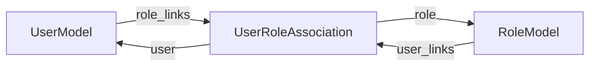
```mermaid
flowchart LR
    U[UserModel] -->|role_links| URA[UserRoleAssociation]
    R[RoleModel] -->|user_links| URA
    URA -->|user| U
    URA -->|role| R
```

#### Relationship Sources and Adaptation Notes

- Relationship examples in this section are adapted from SQLAlchemy 2.0 official relationship and cascade patterns, then constrained to this template's architecture policy.
- Official references describe both `secondary=` many-to-many and Association Object options; this template standardizes write paths on Association Object for consistency and extensibility.

#### SQLAlchemy Relationship References

- Basic relationship patterns: <https://docs.sqlalchemy.org/en/latest/orm/basic_relationships.html>
- Association Object pattern: <https://docs.sqlalchemy.org/en/latest/orm/basic_relationships.html#association-object>
- Cascades and delete behavior: <https://docs.sqlalchemy.org/en/latest/orm/cascades.html>
- Declarative with typed mappings: <https://docs.sqlalchemy.org/en/latest/orm/declarative_tables.html>

---

### 3.7 Core Layer

**Location**: `app/core/`

#### Responsibility

The core layer contains **cross-cutting concerns**: configuration management, exception definitions, database connection setup, and shared utilities. This layer has no dependencies on other application layers.

#### ✅ What Belongs Here

- Application settings (`Settings` class)
- Exception hierarchy
- Database engine and session factory
- Security utilities
- Logging configuration
- Constants and enums used across layers

#### ❌ What Does NOT Belong Here

- Business logic
- API endpoints
- Domain-specific code
- External service integrations (use services)

#### Full Code Example

```python
# =============================================================================
# app/core/config.py - Configuration Management
# =============================================================================

from pydantic import Field, computed_field
from pydantic_settings import BaseSettings, SettingsConfigDict
from yarl import URL


class Settings(BaseSettings):
    """Application settings loaded from environment variables."""

    model_config = SettingsConfigDict(
        env_file=".env",
        env_file_encoding="utf-8",
        case_sensitive=False,
        extra="ignore",
    )

    # Application
    app_name: str = "FastAPI Application"
    debug: bool = False
    current_environment: str = "local"

    # Database
    postgres_host: str = "localhost"
    postgres_port: int = 5432
    postgres_user: str = "postgres"
    postgres_password: str = "postgres"
    postgres_db: str = "app_db"

    # Connection pool
    sqlalchemy_pool_size: int = Field(default=15, ge=1, le=100)
    sqlalchemy_max_overflow: int = Field(default=35, ge=0, le=100)
    sqlalchemy_pool_timeout: int = Field(default=30, ge=1)
    sqlalchemy_pool_recycle: int = Field(default=3600, ge=60)
    sqlalchemy_pool_pre_ping: bool = True

    # Security
    secret_key: str = "change-me-in-production"
    access_token_expire_seconds: int = 3600
    refresh_token_expire_seconds: int = 86400

    # CORS
    cors_origins: str = "http://localhost:3000"

    @computed_field
    @property
    def cors_origins_list(self) -> list[str]:
        """Parse CORS origins from comma-separated string."""
        return [origin.strip() for origin in self.cors_origins.split(",")]

    @computed_field
    @property
    def db_url(self) -> URL:
        """Construct PostgreSQL connection URL using yarl.URL."""
        return URL.build(
            scheme="postgresql+asyncpg",
            host=self.postgres_host,
            port=self.postgres_port,
            user=self.postgres_user,
            password=self.postgres_password,
            path=f"/{self.postgres_db}",
        )


settings = Settings()  # type: ignore


# =============================================================================
# app/core/exceptions.py - Exception Structure
# =============================================================================
# Core contains HTTP exceptions only.
# Domain/service exceptions should not be defined in app/core/exceptions.py.
# app/core/exceptions.py ← Single file containing HTTPException base + HTTP exception classes


# --- app/core/exceptions.py ---

from fastapi.exceptions import HTTPException as FastAPIHTTPException
from fastapi import status

from typing import Any


class HTTPException(FastAPIHTTPException):
    """Base HTTP exception with standard interface."""

    def __init__(
        self,
        status_code: int,
        detail: Any = None,
        headers: dict[str, str] | None = None,
    ):
        super().__init__(status_code=status_code, detail=detail, headers=headers)


class BadRequestException(HTTPException):
    """400 Bad Request."""

    def __init__(self, detail: Any = None, headers: dict[str, str] | None = None):
        super().__init__(
            status_code=status.HTTP_400_BAD_REQUEST,
            detail=detail,
            headers=headers,
        )


class NotFoundException(HTTPException):
    """404 Not Found."""

    def __init__(self, detail: Any = None, headers: dict[str, str] | None = None):
        super().__init__(
            status_code=status.HTTP_404_NOT_FOUND,
            detail=detail,
            headers=headers,
        )


class UnauthorizedException(HTTPException):
    """401 Unauthorized."""

    def __init__(self, detail: Any = "Not authenticated", headers: dict[str, str] | None = None):
        super().__init__(
            status_code=status.HTTP_401_UNAUTHORIZED,
            detail=detail,
            headers=headers or {"WWW-Authenticate": "Bearer"},
        )


class ForbiddenException(HTTPException):
    """403 Forbidden."""

    def __init__(self, detail: Any = "Not authorized", headers: dict[str, str] | None = None):
        super().__init__(
            status_code=status.HTTP_403_FORBIDDEN,
            detail=detail,
            headers=headers,
        )


# --- app/core/responses.py ---

from pydantic import BaseModel


class BadRequestResponse(BaseModel):
    detail: str = "Bad request"


class InternalServerErrorResponse(BaseModel):
    detail: str = "Response details"


# =============================================================================
# app/core/db.py - Database Setup
# =============================================================================

from yarl import URL
from sqlalchemy.ext.asyncio import AsyncSession, async_sessionmaker, create_async_engine

from app.core.config import settings

# Create async engine
engine = create_async_engine(
    settings.db_url.human_repr(),  # yarl URL → string
    echo=settings.debug,
    pool_pre_ping=True,
)

# Session factory
SessionLocal = async_sessionmaker(
    engine,
    class_=AsyncSession,
    expire_on_commit=False,
    autoflush=False,
)


async def get_session() -> AsyncSession:
    """
    Dependency for getting database session.
    Use with FastAPI's Depends().
    """
    async with SessionLocal() as session:
        try:
            yield session
        except Exception:
            await session.rollback()
            raise
```

#### Key Characteristics

- **Settings**: Use `pydantic-settings` for type-safe configuration; instantiate directly with `settings = Settings()`
- **Computed properties**: Derive values from base settings (e.g., `db_url` returns `yarl.URL`)
- **Exception package**: Core holds HTTP exceptions only, imported via `app/core/exceptions.py`
- **Response package**: Router/OpenAPI responses start from centralized `app/core/responses.py` defaults and extend with endpoint-specific responses
- **Database factory**: Async session with `yarl.URL.human_repr()` for URL construction
- **No business logic**: Pure infrastructure code

#### Lifespan Hooks (Startup/Shutdown)

Use application lifespan to orchestrate infrastructure readiness and cleanup.

- **Startup checks**: verify health for required infrastructure dependencies before serving traffic
- **Graceful local behavior**: local development may skip strict infrastructure checks when explicitly configured
- **Shutdown cleanup**: close shared clients/pools (for example Redis-backed services) to prevent leaked connections

When adding a new shared infrastructure service, add both:

1. A startup health check
2. A shutdown close/dispose step

---

### 3.8 Middleware Layer

**Location**: `app/middleware/`

#### Responsibility

The middleware layer adds **cross-cutting HTTP concerns** that run on every request/response. Middleware executes before and after route handlers, providing security, logging, and observability without modifying endpoint code.

#### Middleware Components

| Middleware | File | Purpose |
|-----------|------|---------|
| **CSRF Protection** | `csrf.py` | Double-submit cookie pattern with `X-CSRF-Token` header validation |
| **Request Logging** | `logging.py` | Logs request/response details with sanitized bodies; redacts sensitive fields |
| **Security Headers** | `security_headers.py` | Adds OWASP-recommended headers (HSTS, CSP, X-Frame-Options, etc.) |
| **Rate Limit Headers** | `rate_limit.py` | Injects `X-RateLimit-*` headers from rate limit dependency state |

#### Key Characteristics

- **Starlette `BaseHTTPMiddleware`**: All middleware extends this base class
- **Environment-aware**: CSRF skips validation in `LOCAL` environment for easier development
- **Sensitive data redaction**: Logging middleware sanitizes passwords, tokens, keys before logging
- **Exempt paths**: CSRF exempts auth endpoints and docs paths
- **Constant-time comparison**: CSRF uses `secrets.compare_digest` to prevent timing attacks
- **Header-only**: Middleware adds/validates headers — no business logic or database access

#### Registration Order

Middleware is registered in `app/main.py`. Order matters — outermost middleware runs first:

```python
# app/main.py
app.add_middleware(CORSMiddleware, ...)
app.add_middleware(SecurityHeadersMiddleware)
app.add_middleware(CSRFMiddleware)
app.add_middleware(RateLimitHeaderMiddleware)
app.add_middleware(LoggingMiddleware)
```

---

## 🔄 Data Flow

### Request Lifecycle

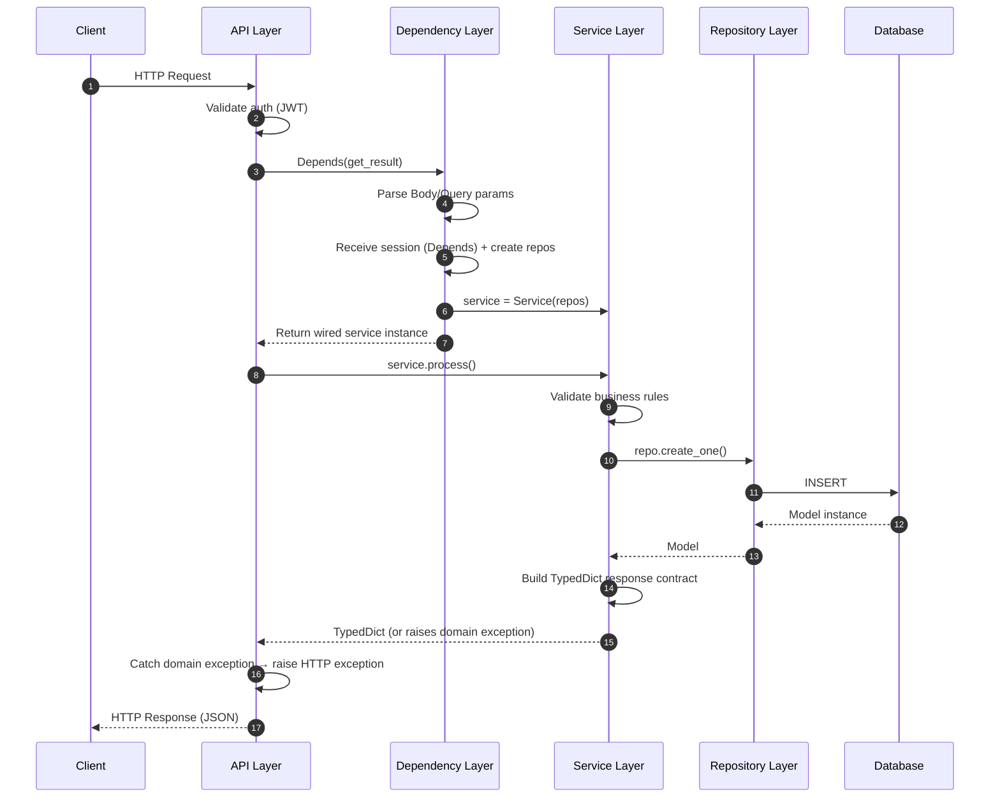
```mermaid
sequenceDiagram
    autonumber
    participant Client
    participant API as API Layer
    participant Deps as Dependency Layer
    participant Service as Service Layer
    participant Repo as Repository Layer
    participant DB as Database

    Client->>API: HTTP Request
    API->>API: Validate auth (JWT)
    API->>Deps: Depends(get_result)
    Deps->>Deps: Parse Body/Query params
    Deps->>Deps: Receive session (Depends) + create repos
    Deps->>Service: service = Service(repos)
    Deps-->>API: Return wired service instance
    API->>Service: service.process()
    Service->>Service: Validate business rules
    Service->>Repo: repo.create_one()
    Repo->>DB: INSERT
    DB-->>Repo: Model instance
    Repo-->>Service: Model
    Service->>Service: Build TypedDict response contract
    Service-->>API: TypedDict (or raises domain exception)
    API->>API: Catch domain exception → raise HTTP exception
    API-->>Client: HTTP Response (JSON)
```

### Type Contracts Between Layers

| From | To | Type |
|------|-----|------|
| Client → API | Request body | Pydantic schema (validated automatically) |
| API → Deps | Depends result | Wired service instance + context |
| Deps → Service | Constructor | Repository instances (injected) |
| Deps → Service | Method params | Schemas + primitives |
| Service → Repo | CRUD operations | Create/Update schemas |
| Repo → Service | Query results | SQLAlchemy Models |
| Service → API | Return value | `TypedDict` response contracts (`app/services/types`) |
| Service → API | Error path | Domain exceptions (`app/services/exceptions/...`) |
| API → Client | Response body | Pydantic response schema or serialized `TypedDict` |

### Error Propagation Flow

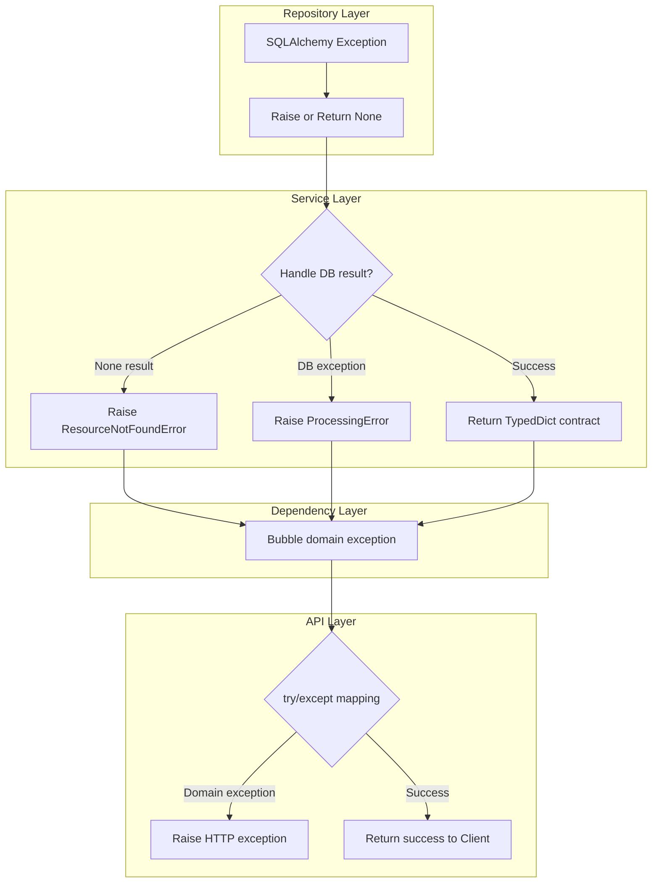
```mermaid
flowchart TD
    subgraph "Repository Layer"
        A[SQLAlchemy Exception] --> B[Raise or Return None]
    end

    subgraph "Service Layer"
        B --> C{Handle DB result?}
        C -->|None result| D[Raise ResourceNotFoundError]
        C -->|DB exception| E[Raise ProcessingError]
        C -->|Success| F[Return TypedDict contract]
    end

    subgraph "Dependency Layer"
        D --> I[Bubble domain exception]
        E --> I
        F --> I
    end

    subgraph "API Layer"
        I --> L{try/except mapping}
        L -->|Domain exception| J[Raise HTTP exception]
        L -->|Success| K[Return success to Client]
    end
```

**Error Handling Rules**:

1. **Repository**: Raises SQLAlchemy exceptions or returns `None`
2. **Service**: Raises domain exceptions (`ValidationError`, `ResourceNotFoundError`, `ProcessingError`) and returns `TypedDict` contracts
3. **Dependency**: Owns session, repository wiring, and atomic transaction boundaries (`commit`/`rollback`)
4. **API**: Uses `try/except` to map domain exceptions to HTTP exceptions and has final `except Exception` + `logger.exception(...)`

---

## 📡 Observability Baseline

This section defines the minimum production observability requirements for this architecture.

### Logging Contract (Mandatory)

- All request lifecycle logs MUST include: `timestamp`, `level`, `message`, `request_id`, `path`, `method`, `status_code`, and `latency_ms`.
- Sensitive values (passwords, tokens, API keys, secrets) MUST be redacted before logs are emitted.
- API fallback handlers (`except Exception`) MUST call `logger.exception(...)` to preserve traceback context.
- Middleware and endpoint logs SHOULD share the same `request_id` so one request can be reconstructed end-to-end.

### Metrics Contract (Mandatory)

Expose and track at least the following metrics:

| Metric | Type | Why it matters |
|-------|------|----------------|
| `http_requests_total` | Counter | Throughput and traffic shape |
| `http_request_duration_ms` | Histogram | Latency SLI/SLO tracking |
| `http_errors_total` (4xx/5xx) | Counter | Error budget monitoring |
| `db_query_duration_ms` | Histogram | Database bottleneck visibility |
| `cache_hit_ratio` | Gauge | Cache effectiveness |

### Tracing Policy (Optional by Default)

- Distributed tracing MAY be enabled when incident analysis needs cross-service timing.
- If enabled, propagate trace headers (`traceparent`) through outgoing HTTP calls.
- Keep tracing optional until operational complexity justifies mandatory instrumentation.

---

## 🧭 API Governance

This section standardizes external API behavior so clients see predictable contracts.

### Version Deprecation Lifecycle (Case-by-Case)

- Version deprecation decisions are approved by the service owner for the affected API surface.
- Every deprecation decision MUST include: impacted routes, migration path, client notice plan, and target sunset date.
- Backward-compatible changes SHOULD be preferred over new major versions when feasible.

### Pagination Standard (Support Both with Explicit Criteria)

| Pattern | Use when | Strengths | Trade-offs |
|--------|----------|-----------|-----------|
| Offset (`limit`, `offset`) | Small/mostly static datasets, admin panels | Simple for humans and SQL tooling | Drift/duplicate risk under frequent writes |
| Cursor (`limit`, `cursor`) | Large or rapidly changing datasets | Stable paging and better scale behavior | More complex client implementation |

Rules:

- Endpoints MUST document which pagination mode they use.
- Endpoints MUST enforce explicit maximum `limit` values.
- Cursor pagination SHOULD sort on stable indexed keys (for example `created_at`, `id`).

### Filtering and Sorting Conventions

- Filtering parameters SHOULD use explicit names (for example `status`, `created_before`, `created_after`).
- Sorting SHOULD use `sort_by` and `sort_order` (`asc`/`desc`) with documented defaults.
- Invalid filters/sorts MUST return `400` with a deterministic validation message.

### Error Envelope and Mapping

Keep the canonical exception mapping table as the source of truth and ensure every endpoint `responses` block documents expected errors.

Recommended envelope for machine-consumable errors:

```json
{
    "error": {
        "code": "VALIDATION_ERROR",
        "message": "Validation failed",
        "details": [{"field": "email", "issue": "Invalid format"}]
    },
    "requestId": "req_123"
}
```

### Idempotency and Concurrency Contract (Writes)

- Write endpoints SHOULD accept `Idempotency-Key` for retry safety.
- Services SHOULD apply optimistic concurrency (`version` field or ETag) for conflicting updates.
- If idempotency is implemented in deps/service, endpoint docs MUST clearly describe the contract and replay behavior.

---

## 🔐 Authorization Model (Owner Checks First)

This repository starts with owner-based authorization and scales to richer models as needed.

### Owner-Check Default

- Access is granted when the authenticated principal owns the target resource.
- Ownership rules MUST be explicit per resource type (no hidden assumptions).
- Authorization checks MUST execute before mutation operations.

### Resource-Specific Policy Map

```python
OWNER_POLICY_MAP: dict[str, str] = {
        "user_profile": "user_id",
        "session": "user_id",
        "organization_membership": "tenant_id",
}
```

Guidance:

- Keep policy keys close to domain language (`order`, `invoice`, `project`).
- Validate both ownership field presence and principal match.
- Return `403` for authorization failures, not `404`, unless concealment is an explicit security policy.

### Evolution Path

Move from owner checks to RBAC/ABAC when at least one of these is true:

- Shared resources require role-based collaboration.
- Cross-tenant administrative actions are introduced.
- Policy conditions depend on attributes beyond ownership (region, tier, environment).

---

## 📐 Dependency Direction Rules

### Import Rules Diagram

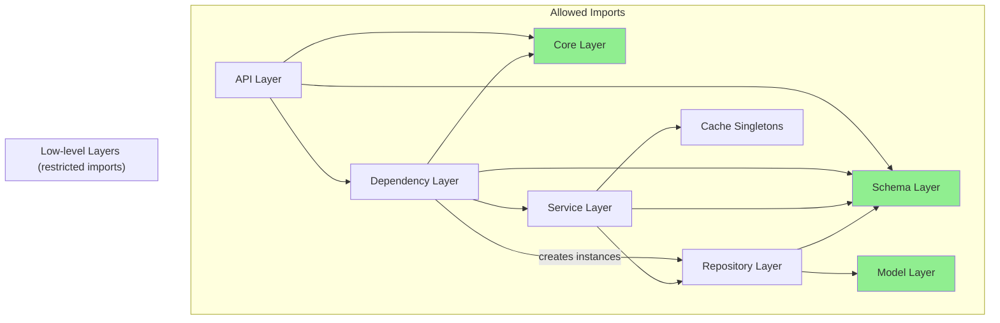
```mermaid
flowchart TD
    subgraph "Allowed Imports"
        API[API Layer] --> Deps[Dependency Layer]
        API --> Schemas
        API --> Core
        Deps --> Services[Service Layer]
        Deps -->|creates instances| Repos[Repository Layer]
        Deps --> Core
        Deps --> Schemas
        Services --> Repos
        Services --> Schemas
        Services --> Cache[Cache Singletons]
        Repos --> Models[Model Layer]
        Repos --> Schemas
    end

    subgraph "Low-level Layers (restricted imports)"
        Core[Core Layer]
        Schemas[Schema Layer]
        Models
    end

    style Core fill:#90EE90
    style Schemas fill:#90EE90
    style Models fill:#90EE90
```

### Import Rules Table

| Layer | Can Import | Cannot Import |
|-------|------------|---------------|
| **API** | Deps, Schemas, Core | Services, Repos, Models |
| **Deps** | Services, Repos, Schemas, Core | API, Models |
| **Service** | Repos, Schemas, Core, Cache | API, Deps, Models |
| **Repository** | Models, Schemas | API, Deps, Services |
| **Schema** | Core (enums only) | All other layers |
| **Model** | Core (Base only) | All other layers |
| **Core** | None | All other layers |

### Avoiding Circular Dependencies

**Rule**: Lower layers MUST NOT import from higher layers.

```python
# ❌ WRONG: Repository importing from Service
# app/repos/resource_repo.py
from app.services.resource_service import ResourceService  # Circular!

# ✅ CORRECT: Service imports from Repository
# app/services/resource_service.py
from app.repos.resource_repo import ResourceRepository  # OK
```

**Solution for shared types**: Move to Schema layer (low-level shared contracts)

```python
# ✅ CORRECT: Shared types in schemas
# app/schemas/common.py
class ResourceStatus(StrEnum):
    ACTIVE = "active"
    INACTIVE = "inactive"

# Both service and repo can import from schemas
from app.schemas.common import ResourceStatus
```

---

## 🧪 Testing Strategy

### Definition-of-Done Checklists

Use these checklists before merging architecture changes.

#### API Endpoint Checklist

- [ ] Uses explicit request/response schemas and `response_model`
- [ ] Delegates use-case logic to injected service
- [ ] Maps documented domain exceptions to HTTP exceptions
- [ ] Includes final `except Exception` with `logger.exception(...)`
- [ ] Documents error responses in OpenAPI `responses`

#### Dependency Function Checklist

- [ ] Owns request-scoped session via `Depends(get_session)`
- [ ] Wires repositories/services only (no domain rule execution)
- [ ] Uses explicit commit/rollback when coordinating atomic operations
- [ ] Does not leak raw session into service interfaces

#### Service Method Checklist

- [ ] Uses TypedDict-first service contracts from `app/services/types/`
- [ ] Enforces business rule validation in service layer
- [ ] Raises domain exceptions (never HTTP exceptions)
- [ ] Uses typed argument docstring format: `arg_name (Type): description`
- [ ] Includes Google-style docstring with `Raises` contract

#### Repository Method Checklist

- [ ] Keeps persistence-only responsibilities (no business rules)
- [ ] Exposes `auto_commit` behavior for mutation methods
- [ ] Uses parameterized SQL/ORM expressions
- [ ] Has integration tests for custom query behavior

### Test Pyramid

```
          ╱╲
         ╱  ╲       E2E Tests (TestClient)
        ╱────╲      - Full request lifecycle
       ╱      ╲     - Few, slow, high confidence
      ╱────────╲
     ╱          ╲   Integration Tests (Real DB)
    ╱────────────╲  - Repository + Database
   ╱              ╲ - Service + Repository
  ╱────────────────╲
 ╱                  ╲  Unit Tests (Mocked)
╱────────────────────╲ - Service logic (mock repos)
                        - Schema validation
                        - Many, fast, focused
```

### Testing by Layer

#### Unit Testing Services (Mock Repositories)

> With repository injection, testing is straightforward: create mock repos, inject them into the service constructor. No internal patching needed — all dependencies are explicit.

```python
import pytest
from unittest.mock import AsyncMock

from app.services.exceptions.resource import ValidationError, ResourceNotFoundError
from app.services.resource_service import ResourceService
from app.schemas.resource import ResourceItem, ProcessingOption


@pytest.fixture
def mock_resource_repo():
    """Mock resource repository."""
    return AsyncMock()


@pytest.fixture
def mock_audit_repo():
    """Mock audit repository."""
    return AsyncMock()


@pytest.fixture
def service(mock_resource_repo, mock_audit_repo):
    """Service with injected mock repositories."""
    return ResourceService(mock_resource_repo, mock_audit_repo)


@pytest.mark.asyncio
async def test_process_resource_success(service, mock_resource_repo):
    """Test successful resource processing."""
    # Arrange
    item = ResourceItem(id="1", name="test", value=100, category="valid")

    # Mock repo return value — set BEFORE calling service (clean injection)
    mock_resource_repo.create_one.return_value = ResourceModel(
        id=1, name="TEST", value=100
    )

    # Act
    result = await service.process(item, ProcessingOption.DEFAULT)

    # Assert
    assert result.id == 1
    mock_resource_repo.create_one.assert_called_once()


@pytest.mark.asyncio
async def test_process_resource_validation_error(service):
    """Test validation failure raises domain exception."""
    # Arrange
    item = ResourceItem(id="1", name="test", value=100, category="invalid")

    # Act & Assert — domain exception, not error result
    with pytest.raises(ValidationError, match="Unknown category"):
        await service.process(item, ProcessingOption.DEFAULT)


@pytest.mark.asyncio
async def test_get_resource_not_found(service, mock_resource_repo):
    """Test missing resource raises ResourceNotFoundError."""
    # Arrange
    mock_resource_repo.get_by_id.return_value = None

    # Act & Assert
    with pytest.raises(ResourceNotFoundError, match="not found"):
        await service.get_resource(resource_id=999)
```

#### Integration Testing Repositories (Test Database)

```python
import pytest
from sqlalchemy.ext.asyncio import AsyncSession

from app.repos.resource_repository import ResourceRepository
from app.schemas.resource import CreateResourceSchema


@pytest.fixture
async def repo(async_session: AsyncSession):
    """Repository with real test database session."""
    return ResourceRepository(async_session)


@pytest.mark.asyncio
async def test_create_and_retrieve(repo):
    """Test creating and retrieving a resource."""
    # Arrange
    create_schema = CreateResourceSchema(
        name="test-resource",
        value=100.0,
        category="testing",
    )

    # Act
    created = await repo.create_one(create_schema)
    retrieved = await repo.get_by_id(created.id)

    # Assert
    assert retrieved is not None
    assert retrieved.name == "test-resource"
    assert retrieved.value == 100.0


@pytest.mark.asyncio
async def test_get_by_category(repo):
    """Test filtering by category."""
    # Arrange - create test data
    for i in range(5):
        await repo.create_one(
            CreateResourceSchema(name=f"test-{i}", value=i, category="cat-a")
        )
    await repo.create_one(
        CreateResourceSchema(name="other", value=99, category="cat-b")
    )

    # Act
    results = await repo.get_by_category("cat-a")

    # Assert
    assert len(results) == 5
    assert all(r.category == "cat-a" for r in results)
```

#### E2E Testing Endpoints (TestClient)

```python
import pytest
from httpx import AsyncClient
from fastapi import FastAPI

from app.main import app


@pytest.fixture
async def client():
    """Async test client."""
    async with AsyncClient(app=app, base_url="http://test") as ac:
        yield ac


@pytest.mark.asyncio
async def test_process_resource_endpoint(client: AsyncClient):
    """Test full request lifecycle."""
    # Arrange
    payload = {
        "name": "test-resource",
        "value": 100,
        "category": "testing",
    }

    # Act
    response = await client.post("/v1/resources/process", json=payload)

    # Assert
    assert response.status_code == 200
    data = response.json()
    assert "id" in data
    assert data["name"] == "test-resource"


@pytest.mark.asyncio
async def test_process_resource_validation_error(client: AsyncClient):
    """Test validation error returns 422."""
    # Arrange - missing required field
    payload = {"name": "test"}

    # Act
    response = await client.post("/v1/resources/process", json=payload)

    # Assert
    assert response.status_code == 422
```

#### Dependency Override Pattern

```python
from fastapi.testclient import TestClient
from app.main import app
from app.api.v1.deps.resource import get_resource_service


def override_get_resource_service():
    """Return mock service for testing."""
    mock_service = MagicMock()
    mock_service.process = AsyncMock(return_value=ResourceResponse(...))
    return mock_service


# Override dependency
app.dependency_overrides[get_resource_service] = override_get_resource_service

# Run tests
client = TestClient(app)
response = client.post("/v1/resources/process", json={...})

# Clean up
app.dependency_overrides.clear()
```

#### Session Override Pattern (Integration Tests)

```python
from sqlalchemy.ext.asyncio import AsyncSession, async_sessionmaker, create_async_engine
from app.core.db import get_session
from app.main import app

# Test database engine
test_engine = create_async_engine("sqlite+aiosqlite:///./test.db")
TestSessionLocal = async_sessionmaker(
    test_engine, class_=AsyncSession, expire_on_commit=False,
)


async def override_get_session():
    """Provide test database session."""
    async with TestSessionLocal() as session:
        try:
            yield session
        except Exception:
            await session.rollback()
            raise


# Override get_session for all tests
app.dependency_overrides[get_session] = override_get_session
v1_app.dependency_overrides[get_session] = override_get_session
v2_app.dependency_overrides[get_session] = override_get_session
```

> **Note**: Override `get_session` (not `SessionLocal`) because deps receive sessions via `Depends(get_session)`. In mounted-version apps, apply the same override to `app`, `v1_app`, and `v2_app`.

---

## ⚠️ Anti-patterns Catalog

### 1. Business Logic in Endpoints

```python
# ❌ WRONG: Complex logic in endpoint
@router.post("/process")
async def process_resource(
    request: ResourceRequest,
    session: AsyncSession = Depends(get_session),
):
    # Validation logic in endpoint
    if request.value < 0 or request.value > 1000:
        raise HTTPException(400, "Invalid value")

    # Business calculation in endpoint
    adjusted_value = request.value * 1.5 if request.priority == "high" else request.value

    # Database query in endpoint
    stmt = insert(ResourceModel).values(name=request.name, value=adjusted_value)
    await session.execute(stmt)
    await session.commit()

    return {"status": "created"}


# ✅ CORRECT: Thin endpoint, logic in service
@router.post("/process")
async def process_resource(
    request: ResourceRequest,
    service: ResourceService = Depends(get_resource_service),
) -> ResourceResponse:
    try:
        return await service.process(request)
    except ValidationError as ex:
        raise exceptions.BadRequestException(detail=str(ex))
    except Exception:
        logger.exception("Unhandled error in process_resource")
        raise
```

### 2. Database Calls from Services (Skipping Repository)

```python
# ❌ WRONG: Service directly uses session
class ResourceService:
    def __init__(self, session: AsyncSession):
        self.session = session  # Holds session — violation!

    async def process(self, item: ResourceItem):
        # Direct SQL in service — bypasses repository
        stmt = select(ResourceModel).where(ResourceModel.id == item.id)
        result = await self.session.execute(stmt)
        return result.scalar_one_or_none()


# ✅ CORRECT: Service receives repository, never sees session
class ResourceService:
    def __init__(self, resource_repo: ResourceRepository):
        self.resource_repo = resource_repo  # Repo injected by deps

    async def process(self, item: ResourceItem):
        # Uses repository abstraction
        return await self.resource_repo.get_by_id(item.id)
```

### 3. Mixing Exception Layers

```python
# ❌ WRONG: Service raises HTTP exception directly
class ResourceService:
    async def get_resource(self, resource_id: int):
        model = await self.resource_repo.get_by_id(resource_id)
        if model is None:
            raise HTTPException(404, "Not found")  # HTTP concern in service!
        return model


# ❌ WRONG: Deps ignores domain exceptions (lets them crash)
async def get_resource_result(
    resource_id: int,
    session: AsyncSession = Depends(get_session),
):
    repo = ResourceRepository(session)
    service = ResourceService(repo)
    return await service.get_resource(resource_id)
    # If service raises ResourceNotFoundError, it crashes with 500!


# ✅ CORRECT: Service raises domain exception → API maps to HTTP exception
class ResourceService:
    async def get_resource(self, resource_id: int) -> ResourceOutput:
        model = await self.resource_repo.get_by_id(resource_id)
        if model is None:
            raise ResourceNotFoundError(f"Resource {resource_id} not found")
        return ResourceOutput(id=model.id, name=model.name)


@router.get("/{resource_id}")
async def get_resource(
    resource_id: int,
    service: ResourceService = Depends(get_resource_service),
) -> ResourceResponse:
    try:
        return await service.get_resource(resource_id)
    except ResourceNotFoundError as e:
        raise NotFoundException(detail=str(e))
    except AppException as e:
        raise BadRequestException(detail=e.message)
    except Exception:
        logger.exception("Unhandled error in get_resource")
        raise
```

### 4. Tight Coupling Between Layers

```python
# ❌ WRONG: Service returns SQLAlchemy model to API
class ResourceService:
    async def get_resource(self, id: int) -> ResourceModel:  # Returns ORM model
        return await self.repo.get_by_id(id)

# API must know about ORM model - coupling!
@router.get("/{id}")
async def get_resource(resource: ResourceModel = Depends(get_resource)):
    return {"id": resource.id, "name": resource.name}


# ✅ CORRECT: Service returns TypedDict contract
class ResourceService:
    async def get_resource(self, id: int) -> ResourceOutput | None:
        model = await self.repo.get_by_id(id)
        if model is None:
            return None
        return ResourceOutput(id=model.id, name=model.name)

@router.get("/{id}", response_model=ResourceResponse)
async def get_resource(resource: ResourceOutput = Depends(get_resource)):
    return ResourceResponse.model_validate(resource)  # Convert at API boundary
```

### 5. Circular Imports

```python
# ❌ WRONG: Service imports from API layer
# app/services/resource_service.py
from app.api.v1.deps.resource import get_session  # Circular!


# ✅ CORRECT: Service receives repos as constructor parameter
# app/services/resource_service.py
class ResourceService:
    def __init__(self, resource_repo: ResourceRepository):  # Injected by deps
        self.resource_repo = resource_repo
```

### 6. Missing Input Validation

```python
# ❌ WRONG: No validation, trusting raw input
@router.post("/process")
async def process_resource(request: dict):  # Raw dict, no validation
    name = request.get("name", "")
    value = request.get("value", 0)
    # No type checking, no constraints...


# ✅ CORRECT: Pydantic schema validates automatically
@router.post("/process")
async def process_resource(request: ResourceRequest):  # Pydantic validates
    # request.name is guaranteed to be str, non-empty
    # request.value is guaranteed to be float, within range
    pass
```

### 7. Creating Repositories Inside Services

```python
# ❌ WRONG: Service creates its own repos — hides dependencies, hard to test
class ResourceService:
    def __init__(self, session: AsyncSession):
        self.session = session
        self.resource_repo = ResourceRepository(session)  # Created internally
        self.audit_repo = AuditRepository(session)        # Created internally

    async def process(self, item: ResourceItem):
        return await self.resource_repo.get_by_id(item.id)


# ✅ CORRECT: Repos injected by deps layer — explicit, testable
class ResourceService:
    def __init__(
        self,
        resource_repo: ResourceRepository,
        audit_repo: AuditRepository,
    ):
        self.resource_repo = resource_repo  # Injected
        self.audit_repo = audit_repo        # Injected

    async def process(self, item: ResourceItem):
        return await self.resource_repo.get_by_id(item.id)
```

### 8. Injecting Too Many Repositories

> **Threshold**: If a service constructor takes **>5 repositories**, it's doing too much — split into smaller, focused services.

```python
# ❌ WRONG: God service with too many dependencies
class OrderService:
    def __init__(
        self,
        order_repo: OrderRepository,
        product_repo: ProductRepository,
        user_repo: UserRepository,
        payment_repo: PaymentRepository,
        shipping_repo: ShippingRepository,
        notification_repo: NotificationRepository,  # 6th repo — red flag!
        audit_repo: AuditRepository,                # 7th — split this service
    ):
        pass  # This service is doing too much


# ✅ CORRECT: Split into focused services
class OrderService:
    def __init__(
        self,
        order_repo: OrderRepository,
        product_repo: ProductRepository,
    ):
        pass  # Handles order creation and queries


class PaymentService:
    def __init__(
        self,
        payment_repo: PaymentRepository,
        order_repo: OrderRepository,
    ):
        pass  # Handles payment processing


class ShippingService:
    def __init__(
        self,
        shipping_repo: ShippingRepository,
        order_repo: OrderRepository,
    ):
        pass  # Handles shipping logistics
```

### 9. Forgetting to Commit with `auto_commit=False`

```python
# ❌ WRONG: auto_commit=False but no commit — SILENT DATA LOSS
async def create_order_with_audit(
    request: OrderRequest,
    session: AsyncSession = Depends(get_session),
):
    order_repo = OrderRepository(session)
    audit_repo = AuditRepository(session)
    service = OrderService(order_repo, audit_repo)

    await service.create_order(request, auto_commit=False)
    await service.log_audit("ORDER_CREATED", auto_commit=False)
    # ⚠️ No commit! Data is lost when session closes!
    return {"status": "created"}  # Lies — nothing was saved


# ✅ CORRECT: Explicit commit after all operations
async def create_order_with_audit(
    request: OrderRequest,
    session: AsyncSession = Depends(get_session),
):
    order_repo = OrderRepository(session)
    audit_repo = AuditRepository(session)
    service = OrderService(order_repo, audit_repo)

    try:
        await service.create_order(request, auto_commit=False)
        await service.log_audit("ORDER_CREATED", auto_commit=False)
        await session.commit()  # ✅ Atomic commit for both operations
    except Exception:
        await session.rollback()
        raise
```

### 10. Inconsistent Exception Translation Strategy

```python
# ❌ WRONG: Endpoint ignores documented service exception contracts
@router.get("/{id}")
async def get_resource(resource_id: int, session: AsyncSession = Depends(get_session)):
    repo = ResourceRepository(session)
    service = ResourceService(repo)
    return await service.get_resource(resource_id)  # uncaught domain exception => 500


# ✅ CORRECT: API maps domain exceptions to HTTP consistently
@router.get("/{id}", response_model=ResourceResponse)
async def get_resource(
    resource_id: int,
    service: ResourceService = Depends(get_resource_service),
) -> ResourceResponse:
    try:
        return await service.get_resource(resource_id)
    except ResourceNotFoundError as e:
        raise NotFoundException(detail=str(e))
    except ValidationError as ex:
        raise exceptions.BadRequestException(detail=str(ex))
    except Exception:
        logger.exception("Unhandled error in get_resource")
        raise
```

### 11. Missing Idempotency and Concurrency Controls on Write APIs

```python
# ❌ WRONG: Write endpoint can produce duplicate writes on retries
@router.post("/orders")
async def create_order(request: CreateOrderRequest, service: OrderService = Depends(get_order_service)):
    return await service.create(request)


# ✅ CORRECT: Idempotency + optimistic concurrency for safe retries
@router.post("/orders")
async def create_order(
    request: CreateOrderRequest,
    idempotency_key: str = Header(..., alias="Idempotency-Key"),
    service: OrderService = Depends(get_order_service),
) -> OrderResponse:
    return await service.create_with_idempotency(request, idempotency_key=idempotency_key)
```

### 12. Inconsistent SQLAlchemy Relationship Modeling

```python
# ❌ WRONG: Non-typed relationship, missing reverse mapping, and implicit nullability
class ParentModel(Base):
    children = relationship("ChildModel")


class ChildModel(Base):
    parent_id = mapped_column(ForeignKey("parent_model.id"))


# ❌ WRONG: Writable secondary path mixed with writable association object path
class UserModel(Base):
    groups = relationship("GroupModel", secondary="user_group_association")
    group_links = relationship("UserGroupAssociation")


# ❌ WRONG: Nullable mismatch between typing and column constraint.
class InvoiceModel(Base):
    reviewer_id: Mapped[int] = mapped_column(ForeignKey("user_model.id"), nullable=True)


# ❌ WRONG: Bidirectional delete cascade can wipe connected graph unexpectedly.
class ParentModel(Base):
    children: Mapped[list["ChildModel"]] = relationship(
        "ChildModel",
        back_populates="parents",
        cascade="all, delete",
    )


class ChildModel(Base):
    parents: Mapped[list["ParentModel"]] = relationship(
        "ParentModel",
        back_populates="children",
        cascade="all, delete",
    )


# ❌ WRONG: Hidden N+1 from implicit lazy loading in loops.
for parent in parents:
    for child in parent.children:
        process(child)


# ✅ CORRECT: Declarative typed relationships + explicit back_populates
class UserModel(Base):
    group_links: Mapped[list["UserGroupAssociation"]] = relationship(
        "UserGroupAssociation",
        back_populates="user",
        cascade="all, delete-orphan",
    )


class UserGroupAssociation(Base):
    user_id: Mapped[int] = mapped_column(ForeignKey("user_model.id", ondelete="CASCADE"), primary_key=True)
    group_id: Mapped[int] = mapped_column(ForeignKey("group_model.id", ondelete="CASCADE"), primary_key=True)
    user: Mapped["UserModel"] = relationship("UserModel", back_populates="group_links")


# ✅ CORRECT: Keep nullable typing aligned and avoid broad bidirectional delete cascades.
class InvoiceModel(Base):
    reviewer_id: Mapped[int | None] = mapped_column(
        ForeignKey("user_model.id", ondelete="SET NULL"),
        nullable=True,
    )


class ParentModel(Base):
    children: Mapped[list["ChildModel"]] = relationship(
        "ChildModel",
        back_populates="parent",
        cascade="all, delete-orphan",
    )


class ChildModel(Base):
    parent_id: Mapped[int] = mapped_column(
        ForeignKey("parent_model.id", ondelete="CASCADE"),
        nullable=False,
    )
    parent: Mapped["ParentModel"] = relationship("ParentModel", back_populates="children")


# ✅ CORRECT: Preload relationship graph intentionally.
stmt = select(ParentModel).options(selectinload(ParentModel.children))
parents = (await session.scalars(stmt)).all()
```

Rules this avoids violating:

- Mixed writable mapping paths for one many-to-many relationship
- Missing `back_populates` pairs
- Ambiguous nullability and relationship ownership
- Unbounded bidirectional delete cascades
- Hidden N+1 query behavior in hot paths

Common failure-mode checklist for PR review:

- Did each bidirectional relationship declare matching `back_populates` names?
- Does `Mapped[T | None]` always match `nullable=True` (and vice versa)?
- Are delete cascades limited to the true ownership side?
- Are many-to-many write paths using Association Object instead of writable `secondary=`?
- Are high-traffic list queries explicitly loading relationship graphs?

---

## 🌳 Decision Trees

### Where Does This Code Belong?

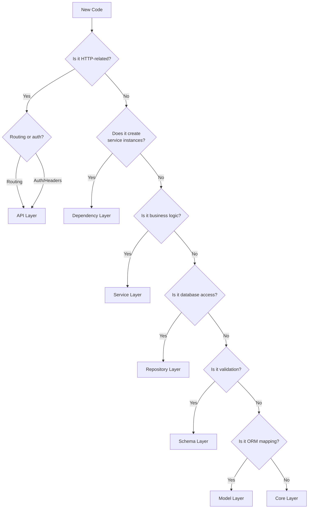
```mermaid
flowchart TD
    A[New Code] --> B{Is it HTTP-related?}
    B -->|Yes| C{Routing or auth?}
    C -->|Routing| D[API Layer]
    C -->|Auth/Headers| D

    B -->|No| E{Does it create<br/>service instances?}
    E -->|Yes| F[Dependency Layer]

    E -->|No| G{Is it business logic?}
    G -->|Yes| H[Service Layer]

    G -->|No| I{Is it database access?}
    I -->|Yes| J[Repository Layer]

    I -->|No| K{Is it validation?}
    K -->|Yes| L[Schema Layer]

    K -->|No| M{Is it ORM mapping?}
    M -->|Yes| N[Model Layer]

    M -->|No| O[Core Layer]
```

### When to Create a New Service?

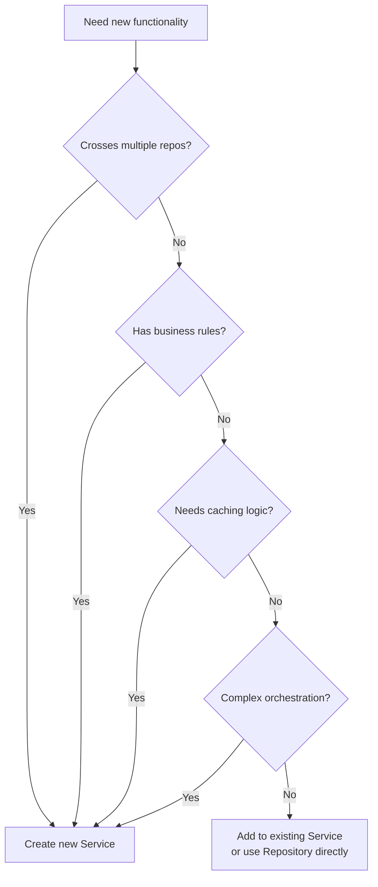
```mermaid
flowchart TD
    A[Need new functionality] --> B{Crosses multiple repos?}
    B -->|Yes| C[Create new Service]

    B -->|No| D{Has business rules?}
    D -->|Yes| C

    D -->|No| E{Needs caching logic?}
    E -->|Yes| C

    E -->|No| F{Complex orchestration?}
    F -->|Yes| C

    F -->|No| G[Add to existing Service<br/>or use Repository directly]
```

### Repository Method vs Custom Query?

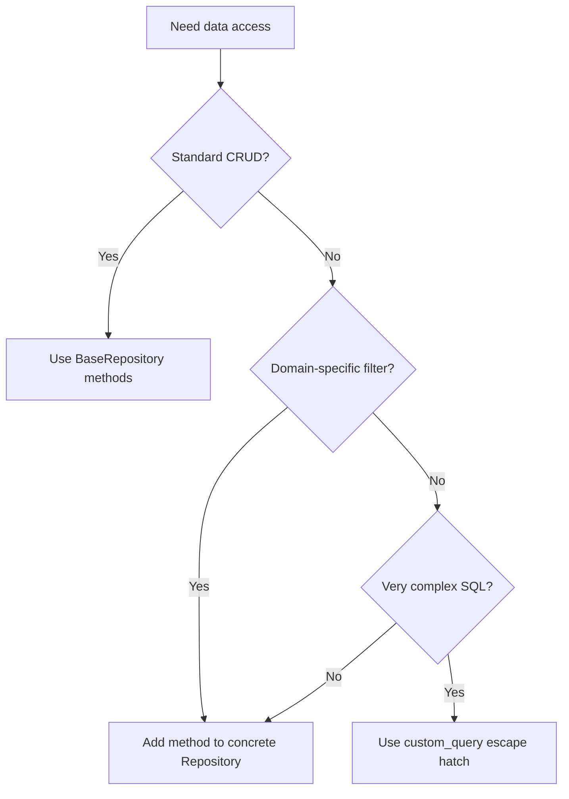
```mermaid
flowchart TD
    A[Need data access] --> B{Standard CRUD?}
    B -->|Yes| C[Use BaseRepository methods]

    B -->|No| D{Domain-specific filter?}
    D -->|Yes| E[Add method to concrete Repository]

    D -->|No| F{Very complex SQL?}
    F -->|Yes| G[Use custom_query escape hatch]

    F -->|No| E
```

---

## 🧩 Patterns Catalog

### Association Object Pattern (Many-to-Many Standard)

Model many-to-many with an explicit association class so relationship metadata and lifecycle are first-class.

```python
from datetime import datetime

from sqlalchemy import ForeignKey, String, func
from sqlalchemy.orm import Mapped, mapped_column, relationship


class UserRoleAssociation(Base):
    user_id: Mapped[int] = mapped_column(
        ForeignKey("user_model.id", ondelete="CASCADE"),
        primary_key=True,
    )
    role_id: Mapped[int] = mapped_column(
        ForeignKey("role_model.id", ondelete="CASCADE"),
        primary_key=True,
    )
    assigned_by: Mapped[str] = mapped_column(String(100), nullable=False)
    assigned_at: Mapped[datetime] = mapped_column(server_default=func.now())

    user: Mapped["UserModel"] = relationship("UserModel", back_populates="role_links")
    role: Mapped["RoleModel"] = relationship("RoleModel", back_populates="user_links")


class UserModel(Base):
    role_links: Mapped[list["UserRoleAssociation"]] = relationship(
        "UserRoleAssociation",
        back_populates="user",
        cascade="all, delete-orphan",
        lazy="selectin",
    )


class RoleModel(Base):
    user_links: Mapped[list["UserRoleAssociation"]] = relationship(
        "UserRoleAssociation",
        back_populates="role",
        cascade="all, delete-orphan",
        lazy="selectin",
    )
```

Repository query example:

```python
from sqlalchemy import select
from sqlalchemy.orm import selectinload


stmt = select(UserModel).options(
    selectinload(UserModel.role_links).selectinload(UserRoleAssociation.role)
)
```

Lifecycle example (create, traverse, remove):

```python
# Create user-role assignment with metadata.
user = UserModel(name="sam")
admin_role = RoleModel(name="admin")
link = UserRoleAssociation(user=user, role=admin_role, assigned_by="system")
user.role_links.append(link)

# Traverse roles through association object.
for role_link in user.role_links:
    print(role_link.role.name, role_link.assigned_by)

# Remove association link; delete-orphan removes link row on flush.
user.role_links.remove(link)
```

Deletion responsibility flow:

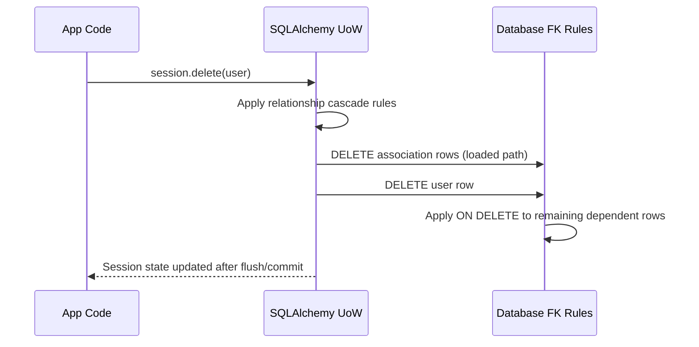
```mermaid
sequenceDiagram
    participant App as App Code
    participant ORM as SQLAlchemy UoW
    participant DB as Database FK Rules

    App->>ORM: session.delete(user)
    ORM->>ORM: Apply relationship cascade rules
    ORM->>DB: DELETE association rows (loaded path)
    ORM->>DB: DELETE user row
    DB->>DB: Apply ON DELETE to remaining dependent rows
    ORM-->>App: Session state updated after flush/commit
```

Use this pattern consistently instead of writable `secondary=` mappings in this template.

### Factory Pattern (Aggregate Factories)

Create instances based on runtime parameters:

```python
# app/services/factories/processor_factory.py
from enum import StrEnum

class ProcessorType(StrEnum):
    FAST = "fast"
    THOROUGH = "thorough"
    BALANCED = "balanced"


class ProcessorFactory:
    """Factory for creating processor instances based on type."""

    _processors: dict[ProcessorType, type] = {
        ProcessorType.FAST: FastProcessor,
        ProcessorType.THOROUGH: ThoroughProcessor,
        ProcessorType.BALANCED: BalancedProcessor,
    }

    @classmethod
    def create(cls, processor_type: ProcessorType, config: ProcessorConfig) -> BaseProcessor:
        """Create processor instance for the given type."""
        processor_class = cls._processors.get(processor_type)
        if processor_class is None:
            raise ValueError(f"Unknown processor type: {processor_type}")
        return processor_class(config)


# Usage in service
class ResourceService:
    async def process(self, item: ResourceItem, processor_type: ProcessorType):
        processor = ProcessorFactory.create(processor_type, self.config)
        return await processor.process(item)
```

### Singleton Cache Pattern

Thread-safe singleton caches initialized at startup:

```python
# app/services/cache/base.py
from threading import RLock
from typing import Generic, TypeVar

K = TypeVar("K")
V = TypeVar("V")


class BaseSafeCache(Generic[K, V]):
    """Thread-safe singleton cache with lazy initialization."""

    _instance: "BaseSafeCache | None" = None
    _lock = RLock()

    def __new__(cls):
        with cls._lock:
            if cls._instance is None:
                cls._instance = super().__new__(cls)
                cls._instance._data = {}
                cls._instance._initialized = False
            return cls._instance

    def initialize(self, data: dict[K, V]) -> None:
        """Initialize cache with data. Call once at startup."""
        with self._lock:
            self._data = data.copy()
            self._initialized = True

    def get(self, key: K) -> V | None:
        """Thread-safe get."""
        with self._lock:
            return self._data.get(key)

    def set(self, key: K, value: V) -> None:
        """Thread-safe set."""
        with self._lock:
            self._data[key] = value

    @property
    def is_initialized(self) -> bool:
        return self._initialized


# app/services/cache/resource_cache.py
class ResourceCache(BaseSafeCache[str, ResourceMetadata]):
    """Singleton cache for resource metadata."""
    pass


# Global instance
resource_cache = ResourceCache()


# app/main.py - Initialize at startup
@asynccontextmanager
async def lifespan(app: FastAPI):
    # Lifespan runs outside request context — use SessionLocal() directly
    async with SessionLocal() as session:
        repo = MetadataRepository(session)
        metadata = await repo.get_all()
        resource_cache.initialize({m.key: m for m in metadata})

    yield  # Application runs

    # Cleanup on shutdown
    pass
```

### Builder Pattern (Complex Query/SQL Building)

Build complex objects step-by-step:

```python
# app/services/query_builder.py
class QueryBuilder:
    """Builder for constructing complex SQL queries."""

    def __init__(self, base_table: str):
        self._select_columns: list[str] = []
        self._where_clauses: list[str] = []
        self._joins: list[str] = []
        self._order_by: list[str] = []
        self._base_table = base_table
        self._params: dict[str, Any] = {}

    def select(self, *columns: str) -> "QueryBuilder":
        """Add columns to SELECT clause."""
        self._select_columns.extend(columns)
        return self

    def where(self, clause: str, **params: Any) -> "QueryBuilder":
        """Add WHERE condition with parameters."""
        self._where_clauses.append(clause)
        self._params.update(params)
        return self

    def join(self, table: str, on: str) -> "QueryBuilder":
        """Add JOIN clause."""
        self._joins.append(f"JOIN {table} ON {on}")
        return self

    def order_by(self, *columns: str) -> "QueryBuilder":
        """Add ORDER BY clause."""
        self._order_by.extend(columns)
        return self

    def build(self) -> tuple[str, dict[str, Any]]:
        """Build final SQL query and parameters."""
        columns = ", ".join(self._select_columns) or "*"
        sql = f"SELECT {columns} FROM {self._base_table}"

        if self._joins:
            sql += " " + " ".join(self._joins)

        if self._where_clauses:
            sql += " WHERE " + " AND ".join(self._where_clauses)

        if self._order_by:
            sql += " ORDER BY " + ", ".join(self._order_by)

        return sql, self._params


# Usage
query, params = (
    QueryBuilder("resources")
    .select("id", "name", "value")
    .where("category = :category", category="testing")
    .where("value > :min_value", min_value=100)
    .order_by("created_at DESC")
    .build()
)
```

### Strategy Pattern (Interchangeable Algorithms)

Define a family of algorithms and make them interchangeable:

```python
# app/services/strategies/aggregation.py
from abc import ABC, abstractmethod
from enum import StrEnum


class AggregationType(StrEnum):
    SUM = "sum"
    AVG = "avg"
    MIN = "min"
    MAX = "max"


class AggregationStrategy(ABC):
    """Abstract base for aggregation strategies."""

    @abstractmethod
    def aggregate(self, values: list[float]) -> float:
        """Aggregate a list of values into a single result."""
        pass

    @abstractmethod
    def get_sql_function(self) -> str:
        """Return SQL aggregate function name."""
        pass


class SumStrategy(AggregationStrategy):
    def aggregate(self, values: list[float]) -> float:
        return sum(values)

    def get_sql_function(self) -> str:
        return "SUM"


class AvgStrategy(AggregationStrategy):
    def aggregate(self, values: list[float]) -> float:
        return sum(values) / len(values) if values else 0

    def get_sql_function(self) -> str:
        return "AVG"


class MinStrategy(AggregationStrategy):
    def aggregate(self, values: list[float]) -> float:
        return min(values) if values else 0

    def get_sql_function(self) -> str:
        return "MIN"


class MaxStrategy(AggregationStrategy):
    def aggregate(self, values: list[float]) -> float:
        return max(values) if values else 0

    def get_sql_function(self) -> str:
        return "MAX"


# Strategy registry
STRATEGIES: dict[AggregationType, AggregationStrategy] = {
    AggregationType.SUM: SumStrategy(),
    AggregationType.AVG: AvgStrategy(),
    AggregationType.MIN: MinStrategy(),
    AggregationType.MAX: MaxStrategy(),
}


# Usage in service
class AggregationService:
    def aggregate_values(
        self,
        values: list[float],
        agg_type: AggregationType,
    ) -> float:
        strategy = STRATEGIES.get(agg_type)
        if strategy is None:
            raise ValueError(f"Unknown aggregation type: {agg_type}")
        return strategy.aggregate(values)

    def build_aggregate_sql(
        self,
        column: str,
        agg_type: AggregationType,
    ) -> str:
        strategy = STRATEGIES.get(agg_type)
        return f"{strategy.get_sql_function()}({column})"
```

### Outbox Pattern (Reliable Side Effects)

Use an outbox table for critical side effects (events, emails, webhooks) that must be committed atomically with state changes.

```python
# Service pseudo-flow using outbox for reliable publish-after-commit
async def create_order(self, request: CreateOrderSchema, auto_commit: bool = True) -> OrderOutput:
    order = await self.order_repo.create_one(request, auto_commit=False)
    await self.outbox_repo.add_event(
        topic="order.created",
        payload={"order_id": order.id},
        auto_commit=False,
    )
    if auto_commit:
        await self.order_repo.session.commit()
    return OrderOutput(id=order.id, status=order.status)
```

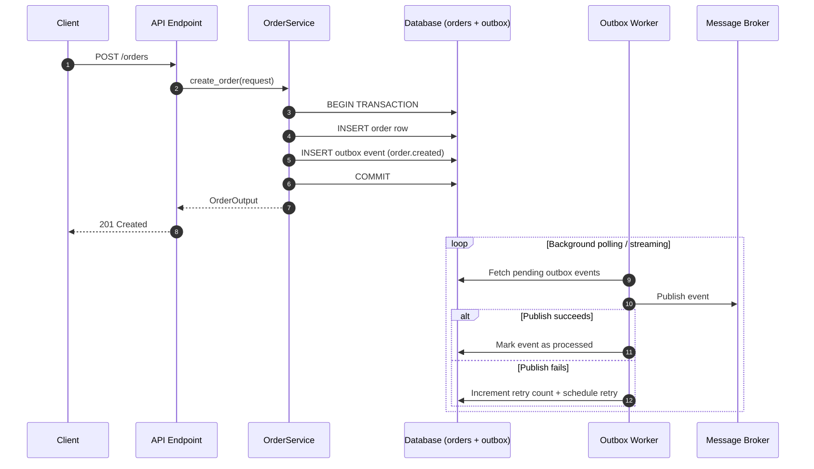
```mermaid
sequenceDiagram
    autonumber
    participant C as Client
    participant API as API Endpoint
    participant S as OrderService
    participant DB as Database (orders + outbox)
    participant W as Outbox Worker
    participant B as Message Broker

    C->>API: POST /orders
    API->>S: create_order(request)
    S->>DB: BEGIN TRANSACTION
    S->>DB: INSERT order row
    S->>DB: INSERT outbox event (order.created)
    S->>DB: COMMIT
    S-->>API: OrderOutput
    API-->>C: 201 Created

    loop Background polling / streaming
        W->>DB: Fetch pending outbox events
        W->>B: Publish event
        alt Publish succeeds
            W->>DB: Mark event as processed
        else Publish fails
            W->>DB: Increment retry count + schedule retry
        end
    end
```

Outbox workers then read pending events and publish them to message brokers with retry and dead-letter handling.

---

## 📊 Scalability Limits & When to Outgrow

This architecture is designed as a **stepping stone**, not a permanent destination for large projects. Use the thresholds below to gauge when it's time to evolve.

### Traffic Light Thresholds

| Metric | 🟢 Green (This Architecture) | 🟡 Yellow (Refactor Soon) | 🔴 Red (New Architecture) |
|--------|------------------------------|--------------------------|--------------------------|
| **Team size** | 1–8 developers | 9–15 developers | 15+ developers |
| **Endpoints** | 10–80 | 80–150 | 150+ |
| **Services** | 3–15 | 15–30 | 30+ |
| **Repositories** | 5–20 | 20–40 | 40+ |
| **Models** | 5–30 | 30–60 | 60+ |
| **Repos per service** | 1–3 | 4–5 | >5 |
| **Single service file** | <200 LOC | 200–400 LOC | >400 LOC |
| **Deps function length** | <30 LOC | 30–50 LOC | >50 LOC |
| **Response time (p95)** | <200ms | 200–500ms | >500ms |
| **DB connections** | <50 | 50–100 | 100+ |
| **Test suite runtime** | <5 min | 5–15 min | >15 min |
| **Deploy frequency** | Weekly+ | Monthly | Quarterly |

### Warning Signs You're Outgrowing This Architecture

- **Daily merge conflicts** in the same service file across team members
- **3+ services** need the exact same combination of repositories — consider a shared Unit of Work
- **A single service file** exceeds ~300 lines — split into sub-services
- **Deps layer functions** exceed ~50 lines — extract orchestration logic to a service
- **Test setup** requires mocking >5 repositories — the service is too large
- **New developers** take more than 1 week to understand the codebase structure
- **Cross-domain calls** are happening (e.g., `OrderService` calling `NotificationService` calling `UserService` in a chain)

### What Comes Next

| Signal | Next Architecture | Key Change |
|--------|------------------|------------|
| 15+ developers with merge conflicts | **Domain-driven modules** | `app/services/` → `app/domains/user/service.py`, `app/domains/billing/service.py` |
| 150+ endpoints across unrelated domains | **API gateway + microservices** | Split into independent deployable services |
| Multiple teams owning separate databases | **Microservices** with independent data stores | Each team owns their entire stack |
| Complex multi-step transactions across services | **Unit of Work pattern** | Coordinate commits across multiple repos in a single wrapper |
| Event-heavy workflows (notifications, queues) | **Event-driven architecture** | Add message bus (Celery, Redis Streams, Kafka) |

### Migration Path: Layer-First → Domain-First

If you hit the Yellow/Red thresholds, follow this incremental migration:

**Step 1: Group by domain** (can be done file-by-file, no big-bang refactor)

```
# Before (layer-first):
app/services/user_service.py
app/services/billing_service.py
app/repos/user_repo.py
app/repos/billing_repo.py

# After (domain-first):
app/domains/user/service.py
app/domains/user/repo.py
app/domains/user/schemas.py
app/domains/billing/service.py
app/domains/billing/repo.py
app/domains/billing/schemas.py
```

**Step 2: Introduce abstract repository interfaces** (optional, for very large projects)

```python
# app/domains/user/interfaces.py
from abc import ABC, abstractmethod

class IUserRepository(ABC):
    @abstractmethod
    async def get_by_id(self, user_id: int) -> UserModel | None: ...

# app/domains/user/service.py
class UserService:
    def __init__(self, user_repo: IUserRepository):  # Depends on interface
        self.user_repo = user_repo
```

**Step 3: Add module-level dependency containers** (for 15+ developers)

```python
# app/domains/user/container.py
class UserContainer:
    """Wires up all dependencies for the user domain."""

    def __init__(self, session: AsyncSession):
        self.user_repo = UserRepository(session)
        self.audit_repo = AuditRepository(session)
        self.user_service = UserService(self.user_repo, self.audit_repo)
```

### Decision Tree: Is It Time to Evolve?

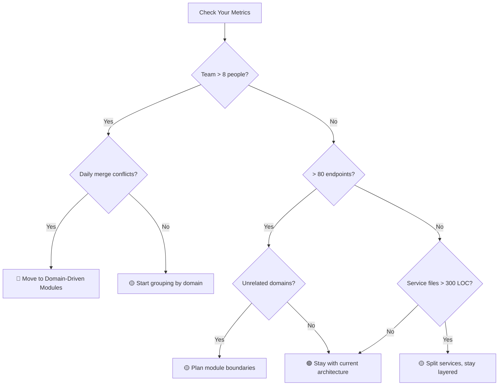
```mermaid
flowchart TD
    A[Check Your Metrics] --> B{Team > 8 people?}
    B -->|Yes| C{Daily merge conflicts?}
    C -->|Yes| D[🔴 Move to Domain-Driven Modules]
    C -->|No| E[🟡 Start grouping by domain]

    B -->|No| F{> 80 endpoints?}
    F -->|Yes| G{Unrelated domains?}
    G -->|Yes| H[🟡 Plan module boundaries]
    G -->|No| I[🟢 Stay with current architecture]

    F -->|No| J{Service files > 300 LOC?}
    J -->|Yes| K[🟡 Split services, stay layered]
    J -->|No| I
```

---

## 📎 Repository Profile Appendix (FastAPI Template)

This appendix binds the generic guidance above to this repository's concrete implementation.

### API and Docs Mounting

- Root app keeps docs disabled globally (`openapi_url=None`, `docs_url=None`, `redoc_url=None`).
- Versioned apps (`/v1`, `/v2`) own their docs/OpenAPI endpoints.

### Middleware Stack (Current)

Current registration order in `app/main.py`:

1. `CORSMiddleware`
2. `SecurityHeadersMiddleware`
3. `CSRFMiddleware`
4. `RateLimitHeaderMiddleware`
5. `LoggingMiddleware`

### Exception Translation in Practice

- Canonical policy remains API-level translation.
- Reusable auth adapters in deps may translate domain exceptions to HTTP exceptions to avoid duplication across endpoints.
- Keep endpoint `responses` documentation aligned with both endpoint and deps-level translation behavior.

### Exception Layout Compatibility Note

- Domain-specific exceptions live under `app/services/exceptions/`.
- Transport HTTP exceptions live in `app/core/exceptions/http_exceptions.py`.
- `AppException` currently exists in `app/core/exceptions/base.py` as a compatibility shim.

### Infrastructure Service Injection Rule

- Stateless SDK wrappers MAY be module singletons.
- Stateful or request-scoped integrations SHOULD be created through deps factories.

### Testing Override Rule for Mounted Apps

When overriding request-scoped dependencies in tests, apply overrides to all mounted apps (`app`, `v1_app`, and `v2_app`) to avoid split behavior across API versions.

### Endpoint Docstring Compatibility Note

Some existing endpoints still include short function docstrings. Treat router metadata as authoritative documentation and normalize endpoint docstrings gradually.

---

## 📝 Summary

This guide provides a complete reference for building maintainable FastAPI applications using layered architecture. Key takeaways:

1. **Each layer has ONE responsibility** — don't mix concerns
2. **Dependencies flow DOWN** — higher layers import from lower layers, never the reverse
3. **Thin controllers** — Endpoints delegate to dependencies/services
4. **Services receive repos** — Repositories are injected via constructor; sessions stay in the deps layer
5. **TypedDict-first contracts** — Define service input/output in `app/services/types/`; use Pydantic only when needed
6. **Minimal service dependencies** — Keep services lightweight to ease migration across Python/runtime changes
7. **Domain exceptions flow up** — Services raise domain exceptions; API maps them to HTTP via `try/except` and final `logger.exception(...)`
8. **Atomic workflows in Deps** — Multi-step operations commit/rollback in the dependency layer
9. **Centralize service factories** — Keep all `get_*_service()` dependencies in `deps/services.py`
10. **Isolate API versions** — Each version owns its own `deps/` package, even if implementations are initially identical
11. **Stabilize imports with re-exports** — Use `deps/__init__.py` to expose common dependencies
12. **Repositories abstract data** — All database access goes through repositories with `auto_commit` support
13. **Schemas validate shape, services validate business rules** — Keep format/type checks in Pydantic and domain invariants in services
14. **Use explicit schema naming** — `*Create`, `*Update`, `*Read/*Response`, and action-specific contracts
15. **Choose service style intentionally** — Standalone by default; abstract base only for multiple implementations
16. **Standardize cache keys** — Use `{service}:{entity}:{identifier}` naming
17. **Lifespan owns infra readiness** — Perform startup checks and deterministic shutdown cleanup for shared clients
18. **Test files use suffix naming only** — Enforce `*_test.py` with pytest `python_files`
19. **Fixture names communicate role** — `mock_*`, `*_factory`, and real-instance fixture names should be explicit
20. **Mounted apps require explicit overrides** — Apply dependency overrides to root and each mounted versioned app
21. **Test each layer appropriately** — Unit tests for services (mock repos), integration for repos (real DB), E2E for endpoints
22. **Observe production behavior** — Adopt structured logs, request IDs, and core metrics as mandatory baseline
23. **Govern API contracts explicitly** — Standardize pagination/filtering/sorting, error contracts, and case-by-case deprecation ownership
24. **Start authorization with ownership** — Use resource-specific owner policies and evolve to RBAC/ABAC when collaboration complexity grows
25. **Protect writes** — Use idempotency keys and optimistic concurrency controls for retry-safe APIs
26. **Guarantee side effects** — Use outbox pattern when DB state and external publishing must stay consistent
27. **ORM stays Declarative and typed** — Use `DeclarativeBase`, `Mapped[...]`, `mapped_column`, and typed `relationship(...)`
28. **Association Object is the many-to-many standard** — Prefer mapped association classes over writable `secondary` paths
29. **Relationship integrity is explicit** — Pair `back_populates`, nullability typing, and database constraints intentionally
30. **Advanced relationship patterns are supported** — Self-referential, composite FKs, and polymorphic inheritance are documented with guardrails
31. **Know your limits** — This architecture serves 1–15 developers and up to ~150 endpoints; beyond that, evolve to domain-driven modules

Copy this document to any FastAPI project as a foundation for consistent, maintainable architecture.

---

## 🧪 Pytest Implementation Appendix (Unit, Integration, End-to-End)

This section defines a pytest testing strategy for projects where application code lives in `app/` and tests live in a sibling `tests/` directory.

References (official pytest docs):

- Good Integration Practices: <https://docs.pytest.org/en/stable/explanation/goodpractices.html>
- How to use fixtures: <https://docs.pytest.org/en/stable/how-to/fixtures.html>
- How to parametrize tests: <https://docs.pytest.org/en/stable/how-to/parametrize.html>
- How to use temporary directories and files (`tmp_path`): <https://docs.pytest.org/en/stable/how-to/tmp_path.html>
- How to mark test functions: <https://docs.pytest.org/en/stable/how-to/mark.html>
- Configuration reference: <https://docs.pytest.org/en/stable/reference/customize.html>

### Recommended Test Layout

Use a top-level `tests/` folder as a sibling to `app/`, then split test suites by intent:

```text
.
├── app/
│   ├── api/
│   ├── services/
│   ├── repos/
│   └── ...
├── tests/
│   ├── unit/
│   │   └── *_test.py
│   ├── integration/
│   │   └── *_test.py
│   ├── e2e/
│   │   └── *_test.py
│   └── conftest.py
└── pyproject.toml
```

Why this split helps:

- `unit/` stays fast and deterministic; ideal for frequent local runs.
- `integration/` can use real infrastructure boundaries (DB/files/network substitutes) and typically runs slower.
- `e2e/` validates full-system behavior and should run separately in CI because it is the slowest and most environment-dependent.

### File Naming Convention (Required)

All test files MUST use the `*_test.py` suffix.

- Allowed: `auth_service_test.py`, `user_repo_test.py`
- Prohibited: `test_auth_service.py`, `test_user_repo.py`

Enforce this with `python_files = ["*_test.py"]` in `[tool.pytest.ini_options]`.

### Fixture Naming Convention

Use fixture names that communicate role immediately:

- `mock_<thing>`: mock or fake dependency
- `<thing>_factory`: fixture that returns a callable for generating data
- `<thing>`: real instance fixture (typically integration scope)

```python
from collections.abc import Callable
from unittest.mock import AsyncMock

import pytest


@pytest.fixture
def mock_user_repo() -> AsyncMock:
    return AsyncMock()


@pytest.fixture
def user_factory() -> Callable[..., dict[str, str]]:
    def _create(**overrides: str) -> dict[str, str]:
        base = {"email": "test@example.com", "name": "Test User"}
        return {**base, **overrides}

    return _create
```

### Unit Tests (`tests/unit/`)

Follow pytest-first patterns:

- Prefer plain test functions with clear arrange/act/assert flow.
- Use `@pytest.mark.parametrize` to cover input/output matrices without duplicating test logic.
- Use fixtures for reusable setup.
- Mock external dependencies (network, third-party SDKs, filesystem side effects) with `unittest.mock`.

```python
from unittest.mock import AsyncMock

import pytest


@pytest.mark.parametrize(
    ("left", "right", "expected"),
    [(1, 2, 3), (10, -2, 8), (0, 0, 0)],
)
def test_add(left: int, right: int, expected: int) -> None:
    assert left + right == expected


@pytest.fixture
def mock_repo() -> AsyncMock:
    return AsyncMock()
```

### Integration Tests (`tests/integration/`)

Use integration tests to verify collaboration across components (for example, service + repository + real test DB).

- Use fixture scopes intentionally: `function` for isolation, `module`/`session` for expensive shared setup.
- Prefer `yield` fixtures for setup/teardown lifecycle.
- Use built-in `tmp_path` for filesystem interactions.
- Keep external resource configuration separate (for example, dedicated test env vars, test database URLs, isolated credentials) so integration tests never rely on production settings.

```python
import pytest


@pytest.fixture(scope="session")
def integration_base_url() -> str:
    return "http://127.0.0.1:8000"


def test_writes_report_file(tmp_path):
    report = tmp_path / "report.txt"
    report.write_text("ok", encoding="utf-8")
    assert report.read_text(encoding="utf-8") == "ok"
```

### Dependency Overrides for Mounted Sub-Apps

For mounted FastAPI applications, apply dependency overrides to each mounted app explicitly.

```python
from app.main import app, v1_app, v2_app
from app.core.db import get_session


def override_get_session():
    ...


app.dependency_overrides[get_session] = override_get_session
v1_app.dependency_overrides[get_session] = override_get_session
v2_app.dependency_overrides[get_session] = override_get_session
```

Do not assume root app overrides propagate into mounted sub-apps.

### End-to-End Tests (`tests/e2e/`)

Use E2E tests for user-visible, full-stack flows.

- Mark E2E tests explicitly with `@pytest.mark.e2e`.
- Use appropriate tooling per surface:
  - Playwright for browser/UI flows.
- For full API journey validation, use `requests` or `httpx`.
- For async API test cases, prefer `httpx.AsyncClient` to keep I/O non-blocking and prioritize runtime performance in CI.
- Run E2E separately from fast test suites in CI.

```python
import pytest


@pytest.mark.e2e
def test_user_signup_journey() -> None:
    # Exercise complete user flow against a running environment.
    assert True
```

### Pytest Configuration for `app/` + `tests/`

Use `pyproject.toml` as the default and preferred home for all pytest configuration in this project.
Only use `pytest.ini` when a legacy toolchain or external constraint makes it strictly necessary.

#### `pyproject.toml` (Preferred)

```toml
[tool.pytest.ini_options]
testpaths = ["tests"]
python_files = ["*_test.py"]
addopts = "--import-mode=importlib -ra"
markers = [
  "e2e: end-to-end tests that require full environment",
]
```

Notes:

- `--import-mode=importlib` is recommended in pytest good integration practices for new projects to avoid `sys.path`-mutation surprises.
- Registering markers avoids unknown-marker warnings and improves `pytest --markers` output.
- `addopts` is optional; keep it minimal and predictable.

### Command-Line Usage

Run only unit tests:

```bash
uv run pytest tests/unit
```

Run integration tests:

```bash
uv run pytest tests/integration
```

Run E2E tests (marker-based selection):

```bash
uv run pytest -m e2e
```

Run all tests:

```bash
uv run pytest
```

### CI Execution Model (Recommended)

- Stage 1: run `tests/unit` on every push for fastest feedback.
- Stage 2: run `tests/integration` after unit tests pass.
- Stage 3: run `-m e2e` in a dedicated job/environment (often with stricter timeouts/retries and full service dependencies).

This layered execution model aligns with pytest collection and marker selection capabilities while keeping feedback loops fast and deterministic.
