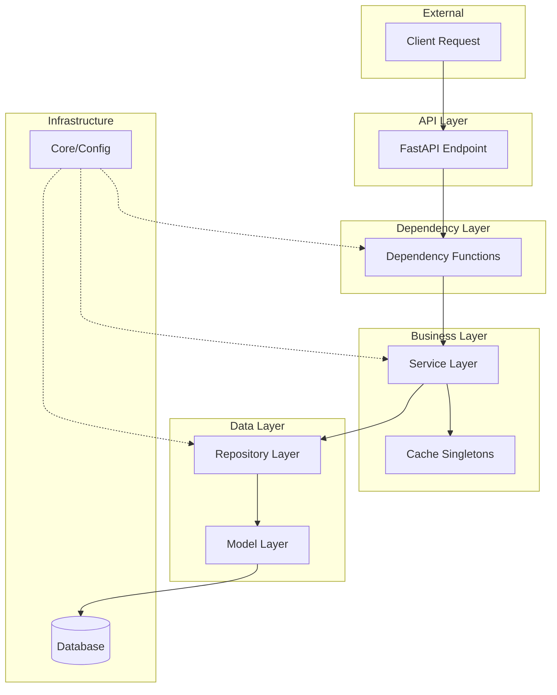
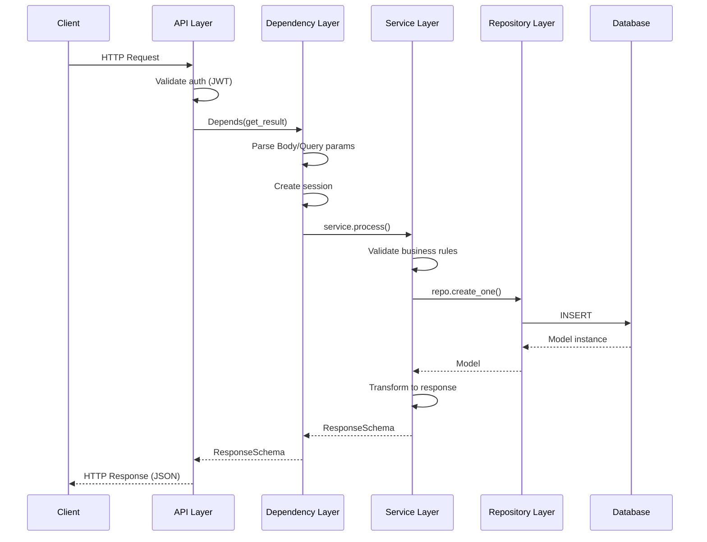
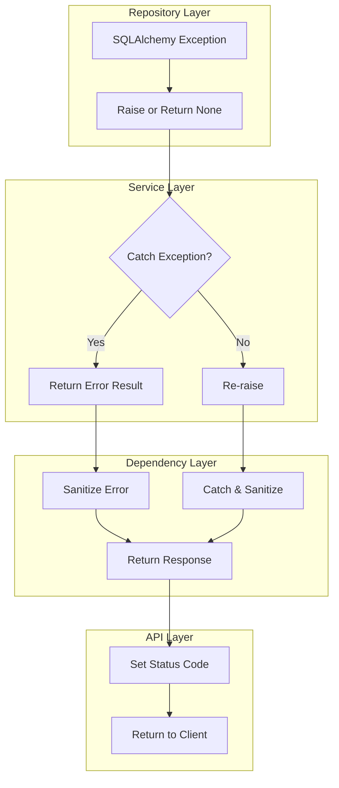
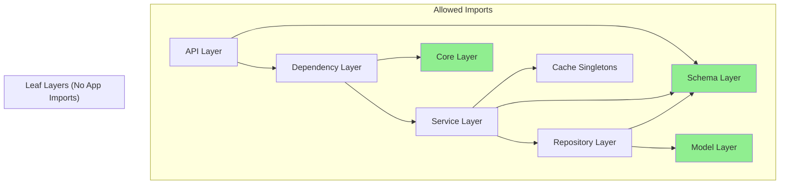

# 🏗️ FastAPI Layered Architecture Guide

A comprehensive, reusable guide for building maintainable FastAPI applications using layered architecture patterns. This document is **framework-specific** (FastAPI, SQLAlchemy, Pydantic) but **domain-agnostic** — copy it to any FastAPI project.

---

## 📋 Table of Contents

1. [Overview](#-overview)
2. [Layer Reference](#-layer-reference)
   - [API Layer](#21-api-layer-endpoints)
   - [Dependency Layer](#22-dependency-layer-deps)
   - [Service Layer](#23-service-layer)
   - [Repository Layer](#24-repository-layer)
   - [Schema Layer](#25-schema-layer)
   - [Model Layer](#26-model-layer)
   - [Core Layer](#27-core-layer)
3. [Data Flow](#-data-flow)
4. [Dependency Direction Rules](#-dependency-direction-rules)
5. [Testing Strategy](#-testing-strategy)
6. [Anti-patterns Catalog](#-anti-patterns-catalog)
7. [Decision Trees](#-decision-trees)
8. [Patterns Catalog](#-patterns-catalog)

---

## 🎯 Overview

### Architecture Diagram



### Core Principles

| Principle | Description |
|-----------|-------------|
| **Separation of Concerns** | Each layer has a single, well-defined responsibility |
| **Dependency Inversion** | Higher layers depend on abstractions, not implementations |
| **Unidirectional Flow** | Data flows down through layers; responses bubble up |
| **Testability** | Each layer can be tested in isolation with mocks |
| **Reusability** | Lower layers are reusable across multiple higher-layer consumers |

### Quick Reference Table

| Layer | Location | Responsibility | Depends On |
|-------|----------|----------------|------------|
| **API** | `app/api/` | HTTP routing, authentication, response codes | Deps, Schemas |
| **Deps** | `app/api/*/deps/` | Dependency injection, session management, orchestration | Services, Core |
| **Service** | `app/services/` | Business logic, domain rules, validation | Repos, Schemas, Cache |
| **Repository** | `app/repos/` | Data access, CRUD operations | Models, Schemas |
| **Schema** | `app/schemas/` | Validation, serialization, API contracts | None (leaf) |
| **Model** | `app/models/` | Database table mapping (ORM) | None (leaf) |
| **Core** | `app/core/` | Configuration, exceptions, database setup | None (leaf) |

---

## 📚 Layer Reference

### 2.1 API Layer (Endpoints)

**Location**: `app/api/`

#### Responsibility

The API layer handles **HTTP concerns only**: routing, authentication, status codes, and response formatting. It should be a **thin controller** that delegates all business logic to dependencies or services.

#### ✅ What Belongs Here

- Route definitions (`@router.get`, `@router.post`, etc.)
- Authentication/authorization decorators
- Response status code manipulation
- OpenAPI documentation (summary, description, responses)
- Request/response type hints

#### ❌ What Does NOT Belong Here

- Business logic or validation rules
- Database queries or session management
- Data transformation logic
- Error handling beyond HTTP status codes
- Direct repository or service instantiation

#### Full Code Example

```python
from typing import Annotated

from fastapi import APIRouter, Depends, Response, status

from app.api.v1.deps.resource import get_resource_result
from app.schemas.resource import (
    ResourceRequest,
    ResourceResponse,
    ResourceErrorResponse,
)

router = APIRouter(tags=["Resources"], prefix="/resources")


@router.post(
    "/process",
    response_model=ResourceResponse,
    summary="Process a resource",
    description="""
    Processes the given resource with the specified parameters.
    
    Returns 206 Partial Content if some items failed processing.
    """,
    responses={
        status.HTTP_400_BAD_REQUEST: {"model": ResourceErrorResponse},
        status.HTTP_206_PARTIAL_CONTENT: {"model": ResourceResponse},
    },
)
async def process_resource(
    response: Response,
    result: Annotated[ResourceResponse, Depends(get_resource_result)],
) -> ResourceResponse:
    """
    Thin controller - all logic lives in the dependency.
    Only handles HTTP response code manipulation.
    """
    if result.has_errors:
        response.status_code = status.HTTP_206_PARTIAL_CONTENT
    return result
```

#### Key Characteristics

- Endpoints are **thin controllers** (1-5 lines of logic)
- Business logic is **delegated** to dependency functions
- Response models are **explicitly declared** for OpenAPI
- Error responses are **documented** in the `responses` parameter
- Status code manipulation is the **only logic** allowed

---

### 2.2 Dependency Layer (Deps)

**Location**: `app/api/*/deps/`

#### Responsibility

The dependency layer is a **factory and orchestration layer**. It creates service instances, manages database sessions, handles error sanitization, and coordinates multiple service calls. It acts as the **glue** between HTTP and business logic.

#### ✅ What Belongs Here

- Creating service/repository instances
- Database session management (session-per-request or session-per-operation)
- Orchestrating multiple service calls
- Error sanitization (removing internal details before returning to client)
- Query/body parameter extraction with validation

#### ❌ What Does NOT Belong Here

- Complex business logic (move to services)
- Direct database queries (use repositories)
- Data transformation beyond basic mapping
- Validation rules (use schemas)

#### Full Code Example

```python
from typing import Annotated

from fastapi import Body, Depends, Query
from sqlalchemy.ext.asyncio import AsyncSession

from app.core.db import SessionLocal
from app.schemas.resource import (
    ResourceRequest,
    ResourceResponse,
    ResourceItemResult,
    ProcessingOption,
)
from app.services.resource_service import ResourceService


async def get_resource_result(
    request: Annotated[ResourceRequest, Body(...)],
    option: Annotated[
        ProcessingOption,
        Query(default=ProcessingOption.DEFAULT, description="Processing mode"),
    ],
) -> ResourceResponse:
    """
    Dependency function that orchestrates service calls.
    Each operation gets its own session for isolation.
    """
    results: list[ResourceItemResult] = []

    for item in request.items:
        result = await _process_item_with_session(item, option)
        results.append(result)

    return ResourceResponse(
        items=results,
        has_errors=any(r.error for r in results),
    )


async def _process_item_with_session(
    item: ResourceItem,
    option: ProcessingOption,
) -> ResourceItemResult:
    """
    Session-per-operation pattern for isolation.
    Errors are caught and sanitized before returning.
    """
    async with SessionLocal() as session:
        try:
            service = ResourceService(session)
            return await service.process(item, option)
        except Exception as e:
            # Sanitize error - remove internal details
            error_msg = _sanitize_error(str(e))
            return ResourceItemResult(item_id=item.id, error=error_msg)


def _sanitize_error(error: str) -> str:
    """Remove internal implementation details from error messages."""
    if "postgresql" in error.lower() or "sqlalchemy" in error.lower():
        return "Database error occurred. Please check your request."
    return error
```

#### Key Characteristics

- **Factory pattern**: Creates service instances with proper dependencies
- **Session management**: Controls database session lifecycle
- **Error sanitization**: Strips internal details before returning to client
- **Orchestration**: Coordinates multiple operations/services
- **Thin logic**: Complex rules go in services

---

### 2.3 Service Layer

**Location**: `app/services/`

#### Responsibility

The service layer contains **all business logic and domain rules**. It orchestrates repository calls, performs validation, transforms data, and implements the core functionality of your application. Services receive dependencies (session, config) as constructor or method parameters.

#### ✅ What Belongs Here

- Business logic and domain rules
- Orchestrating multiple repository calls
- Data validation and transformation
- Cache integration and lookups
- Complex calculations and algorithms
- Transaction coordination

#### ❌ What Does NOT Belong Here

- HTTP concerns (status codes, headers)
- Creating database sessions (receive as parameter)
- Direct SQL queries (use repositories)
- Request/response formatting (use schemas)

#### Full Code Example

```python
from sqlalchemy.ext.asyncio import AsyncSession

from app.repos.resource_repository import ResourceRepository
from app.repos.audit_repository import AuditRepository
from app.schemas.resource import (
    ResourceItem,
    ResourceItemResult,
    ProcessingOption,
    CreateResourceSchema,
)
from app.services.cache.resource_cache import resource_cache


class ResourceService:
    """
    Service layer: contains all business logic.
    Receives session as constructor parameter.
    """

    def __init__(self, session: AsyncSession):
        self.session = session
        self.resource_repo = ResourceRepository(session)
        self.audit_repo = AuditRepository(session)

    async def process(
        self,
        item: ResourceItem,
        option: ProcessingOption,
    ) -> ResourceItemResult:
        """
        Process a resource item with full business logic.
        Returns result type - never raises exceptions to caller.
        """
        try:
            # Step 1: Validate against cache
            validation = self._validate_item(item)
            if validation.error:
                return ResourceItemResult(item_id=item.id, error=validation.error)

            # Step 2: Apply business rules
            processed = self._apply_rules(item, option)

            # Step 3: Persist via repository
            create_schema = CreateResourceSchema(
                name=processed.name,
                value=processed.value,
                metadata=processed.metadata,
            )
            created = await self.resource_repo.create_one(create_schema)

            # Step 4: Record audit trail
            await self.audit_repo.log_action(
                action="PROCESS",
                resource_id=created.id,
                details={"option": option.value},
            )

            # Step 5: Return success result
            return ResourceItemResult(
                item_id=item.id,
                resource_id=created.id,
                status="completed",
            )

        except Exception as e:
            return ResourceItemResult(item_id=item.id, error=str(e))

    def _validate_item(self, item: ResourceItem) -> ValidationResult:
        """Pure validation logic using cache lookup."""
        cached = resource_cache.get(item.category)
        if not cached:
            return ValidationResult(error=f"Unknown category: {item.category}")
        if item.value < cached.min_value or item.value > cached.max_value:
            return ValidationResult(error="Value out of allowed range")
        return ValidationResult(success=True)

    def _apply_rules(
        self, item: ResourceItem, option: ProcessingOption
    ) -> ProcessedItem:
        """Pure function: applies business rules to transform data."""
        multiplier = 1.0 if option == ProcessingOption.DEFAULT else 1.5
        return ProcessedItem(
            name=item.name.upper(),
            value=item.value * multiplier,
            metadata={"original_value": item.value, "option": option.value},
        )
```

#### Key Characteristics

- **Receives dependencies**: Session, config passed in (not created)
- **Returns result types**: Never raises exceptions to callers
- **Pure functions**: For validation and transformation logic
- **Clear steps**: Processing flows are explicit and documented
- **Repository integration**: Uses repos for all data access
- **Cache integration**: Uses singleton caches for metadata lookups

---

### 2.4 Repository Layer

**Location**: `app/repos/`

#### Responsibility

The repository layer provides a **clean abstraction over database access**. It handles all CRUD operations, query building, and result mapping. Repositories work with SQLAlchemy models and Pydantic schemas for type safety.

#### ✅ What Belongs Here

- CRUD operations (create, read, update, delete)
- Query building with SQLAlchemy
- Pagination, filtering, sorting
- Complex queries specific to the domain
- Transaction commit/rollback
- Raw SQL for complex queries (escape hatch)

#### ❌ What Does NOT Belong Here

- Business logic or validation rules
- HTTP concerns
- Schema validation (handled by Pydantic)
- Cross-entity orchestration (use services)

#### Full Code Example

```python
import uuid
from typing import Any, Generic, Sequence, Type, TypeVar

from pydantic import BaseModel
from sqlalchemy import delete, insert, select, text, update
from sqlalchemy.engine import Result
from sqlalchemy.ext.asyncio import AsyncSession

from app.models.base import Base

Model = TypeVar("Model", bound=Base)
CreateSchema = TypeVar("CreateSchema", bound=BaseModel)
UpdateSchema = TypeVar("UpdateSchema", bound=BaseModel)


class BaseRepository(Generic[Model, CreateSchema, UpdateSchema]):
    """
    Generic repository providing standard CRUD operations.
    Extend this class for domain-specific query methods.
    """

    def __init__(self, session: AsyncSession, model: Type[Model]):
        self.session = session
        self.model = model

    def _validate_column_exists(self, column_name: str) -> None:
        """Validate that a column exists on the model."""
        if not hasattr(self.model, column_name):
            raise ValueError(
                f"Column '{column_name}' does not exist on model '{self.model.__name__}'"
            )

    async def create_one(self, schema: CreateSchema) -> Model:
        """Create a single record and return the created model."""
        stmt = (
            insert(self.model)
            .values(**schema.model_dump(exclude_none=True))
            .returning(self.model)
        )
        result = await self.session.execute(stmt)
        await self.session.commit()
        return result.scalar_one()

    async def create_bulk(self, schemas: Sequence[CreateSchema]) -> list[Model]:
        """Create multiple records in a single transaction."""
        if not schemas:
            return []
        values = [schema.model_dump(exclude_none=True) for schema in schemas]
        stmt = insert(self.model).values(values).returning(self.model)
        result = await self.session.execute(stmt)
        await self.session.commit()
        return list(result.scalars().all())

    async def get_by_id(
        self,
        obj_id: int | uuid.UUID,
        id_column_name: str = "id",
    ) -> Model | None:
        """Retrieve a single record by ID."""
        self._validate_column_exists(id_column_name)
        stmt = select(self.model).where(
            getattr(self.model, id_column_name) == obj_id
        )
        result = await self.session.execute(stmt)
        return result.scalar_one_or_none()

    async def get_multi(
        self,
        skip: int = 0,
        limit: int = 100,
    ) -> list[Model]:
        """Retrieve multiple records with pagination."""
        stmt = select(self.model).offset(skip).limit(limit)
        result = await self.session.execute(stmt)
        return list(result.scalars().all())

    async def update_by_id(
        self,
        obj_id: int | uuid.UUID,
        schema: UpdateSchema,
        id_column_name: str = "id",
    ) -> Model | None:
        """Update a record by ID and return the updated model."""
        self._validate_column_exists(id_column_name)
        stmt = (
            update(self.model)
            .where(getattr(self.model, id_column_name) == obj_id)
            .values(**schema.model_dump(exclude_none=True))
            .returning(self.model)
        )
        result = await self.session.execute(stmt)
        await self.session.commit()
        return result.scalar_one_or_none()

    async def delete_by_id(
        self,
        obj_id: int | uuid.UUID,
        id_column_name: str = "id",
    ) -> bool:
        """Delete a record by ID. Returns True if deleted."""
        self._validate_column_exists(id_column_name)
        stmt = delete(self.model).where(
            getattr(self.model, id_column_name) == obj_id
        )
        result = await self.session.execute(stmt)
        await self.session.commit()
        return result.rowcount > 0

    async def custom_query(self, query: str) -> Result[Any]:
        """Execute raw SQL for complex queries."""
        return await self.session.execute(text(query))


# Example: Domain-specific repository extending base
class ResourceRepository(BaseRepository[ResourceModel, CreateResourceSchema, UpdateResourceSchema]):
    """Domain-specific repository with custom query methods."""

    def __init__(self, session: AsyncSession):
        super().__init__(session, ResourceModel)

    async def get_by_category(
        self,
        category: str,
        skip: int = 0,
        limit: int = 100,
    ) -> list[ResourceModel]:
        """Get resources filtered by category."""
        stmt = (
            select(self.model)
            .where(self.model.category == category)
            .offset(skip)
            .limit(limit)
            .order_by(self.model.created_at.desc())
        )
        result = await self.session.execute(stmt)
        return list(result.scalars().all())

    async def get_by_time_range(
        self,
        start_time: int,
        end_time: int,
    ) -> list[ResourceModel]:
        """Get resources within a time range."""
        stmt = (
            select(self.model)
            .where(self.model.timestamp.between(start_time, end_time))
            .order_by(self.model.timestamp.asc())
        )
        result = await self.session.execute(stmt)
        return list(result.scalars().all())
```

#### Key Characteristics

- **Generic base class**: Reusable CRUD with type parameters
- **Column validation**: Prevents runtime errors on dynamic queries
- **Domain-specific extensions**: Custom methods in concrete repositories
- **Explicit transactions**: `commit()` calls after mutations
- **Escape hatch**: `custom_query()` for complex SQL when needed

---

### 2.5 Schema Layer

**Location**: `app/schemas/`

#### Responsibility

The schema layer defines **API contracts, validation rules, and serialization logic**. Using Pydantic v2, schemas validate incoming requests, serialize outgoing responses, and document the API through OpenAPI generation.

#### ✅ What Belongs Here

- Request/response model definitions
- Field validation with constraints
- Custom validators (`@field_validator`, `@model_validator`)
- Discriminated unions for polymorphic types
- Enum definitions for constrained values
- Serialization configuration (`model_config`)

#### ❌ What Does NOT Belong Here

- Business logic
- Database queries
- External API calls
- Side effects of any kind

#### Full Code Example

```python
from datetime import datetime
from enum import StrEnum
from typing import Annotated, Literal, Union

from pydantic import (
    BaseModel,
    ConfigDict,
    Field,
    field_validator,
    model_validator,
)


# =============================================================================
# Base Schemas with Common Configuration
# =============================================================================

class BaseSchema(BaseModel):
    """Base schema with standard configuration."""

    model_config = ConfigDict(
        from_attributes=True,  # Enable ORM mode
        extra="forbid",  # Reject unknown fields
        str_strip_whitespace=True,  # Strip whitespace from strings
    )


class BaseCreateSchema(BaseModel):
    """Base schema for create operations."""

    model_config = ConfigDict(
        validate_assignment=True,
        use_enum_values=True,
    )


class BaseUpdateSchema(BaseModel):
    """Base schema for update operations (all fields optional)."""

    model_config = ConfigDict(
        validate_assignment=True,
        use_enum_values=True,
    )


# =============================================================================
# Enums for Constrained Values
# =============================================================================

class StatusEnum(StrEnum):
    """Status values for resources."""

    PENDING = "pending"
    ACTIVE = "active"
    COMPLETED = "completed"
    FAILED = "failed"


class ProcessingOption(StrEnum):
    """Processing mode options."""

    DEFAULT = "default"
    FAST = "fast"
    THOROUGH = "thorough"


# =============================================================================
# Discriminated Unions for Polymorphic Types
# =============================================================================

class FilterTypeA(BaseSchema):
    """Filter by exact value match."""

    type: Literal["exact"] = "exact"
    value: str = Field(..., min_length=1)


class FilterTypeB(BaseSchema):
    """Filter by range."""

    type: Literal["range"] = "range"
    min_value: float | None = None
    max_value: float | None = None

    @model_validator(mode="after")
    def validate_range(self):
        """At least one bound must be specified."""
        if self.min_value is None and self.max_value is None:
            raise ValueError("At least one of min_value or max_value is required")
        if (
            self.min_value is not None
            and self.max_value is not None
            and self.min_value > self.max_value
        ):
            raise ValueError("min_value must be less than or equal to max_value")
        return self


# Pydantic v2 discriminated union - REQUIRED: Field(discriminator="type")
FilterType = Annotated[
    Union[FilterTypeA, FilterTypeB],
    Field(discriminator="type"),
]


# =============================================================================
# Request/Response Schemas with Validation
# =============================================================================

class ResourceRequest(BaseSchema):
    """Request schema for resource processing."""

    name: str = Field(
        ...,
        min_length=1,
        max_length=255,
        description="Resource name",
        json_schema_extra={"example": "my-resource"},
    )
    value: float = Field(..., ge=0, le=1000000, description="Resource value")
    category: str = Field(..., min_length=1, max_length=50)
    tags: list[str] = Field(default_factory=list, max_length=10)
    filter: FilterType | None = Field(default=None, description="Optional filter")

    # Alias for camelCase API convention
    created_at: datetime | None = Field(default=None, alias="createdAt")

    @field_validator("tags")
    @classmethod
    def validate_tags(cls, v: list[str]) -> list[str]:
        """Ensure tags are unique and lowercase."""
        return list(set(tag.lower().strip() for tag in v if tag.strip()))

    @field_validator("name")
    @classmethod
    def validate_name(cls, v: str) -> str:
        """Ensure name contains only valid characters."""
        if not v.replace("-", "").replace("_", "").isalnum():
            raise ValueError("Name must contain only alphanumeric characters, hyphens, and underscores")
        return v.lower()


class ResourceResponse(BaseSchema):
    """Response schema for resource operations."""

    id: int
    name: str
    value: float
    status: StatusEnum
    created_at: datetime = Field(alias="createdAt")
    updated_at: datetime | None = Field(default=None, alias="updatedAt")


# =============================================================================
# Mutual Exclusivity Pattern
# =============================================================================

class InputSource(BaseSchema):
    """
    Input source with mutually exclusive options.
    Either provide a reference OR direct data, not both.
    """

    reference_id: str | None = Field(default=None, alias="referenceId")
    direct_data: list[float] | None = Field(default=None, alias="directData")

    @model_validator(mode="after")
    def validate_mutual_exclusivity(self):
        """Exactly one of reference_id or direct_data must be provided."""
        has_reference = self.reference_id is not None
        has_direct = self.direct_data is not None

        if has_reference and has_direct:
            raise ValueError("Cannot specify both referenceId and directData")
        if not has_reference and not has_direct:
            raise ValueError("Must specify either referenceId or directData")
        return self
```

#### Key Characteristics

- **Base schemas**: Inherit common configuration
- **Field constraints**: Use `Field()` for validation (min, max, pattern)
- **`@field_validator`**: For single-field validation
- **`@model_validator`**: For cross-field validation
- **Discriminated unions**: Use `Field(discriminator="type")` for polymorphism
- **Aliases**: Use `alias` for camelCase API convention
- **StrEnum**: For type-safe string enumerations

---

### 2.6 Model Layer

**Location**: `app/models/`

#### Responsibility

The model layer defines **SQLAlchemy ORM models** that map to database tables. Models define table structure, relationships, and provide utility methods for serialization.

#### ✅ What Belongs Here

- SQLAlchemy table definitions
- Column definitions with types and constraints
- Relationships between tables
- Indexes and unique constraints
- Utility methods (`to_dict()`, `__repr__`)

#### ❌ What Does NOT Belong Here

- Business logic
- Validation rules (use schemas)
- Query methods (use repositories)
- API concerns

#### Full Code Example

```python
from datetime import datetime
from typing import Any

from sqlalchemy import (
    BigInteger,
    DateTime,
    Float,
    Index,
    Integer,
    MetaData,
    String,
    Text,
    inspect,
)
from sqlalchemy.orm import DeclarativeBase, Mapped, mapped_column, relationship


class Base(DeclarativeBase):
    """Base class for all SQLAlchemy models."""

    metadata = MetaData()

    def to_dict(
        self,
        exclude_keys: list[str] | None = None,
        exclude_none: bool = False,
    ) -> dict[str, Any]:
        """
        Convert model to dictionary for serialization.

        Args:
            exclude_keys: List of column names to exclude
            exclude_none: If True, exclude columns with None values

        Returns:
            Dictionary representation of the model
        """
        exclude_keys = exclude_keys or []
        result = {}

        for column in inspect(self).mapper.column_attrs:
            if column.key in exclude_keys:
                continue
            value = getattr(self, column.key)
            if exclude_none and value is None:
                continue
            result[column.key] = value

        return result

    def __repr__(self) -> str:
        """String representation for debugging."""
        class_name = self.__class__.__name__
        attrs = ", ".join(
            f"{k}={v!r}"
            for k, v in self.to_dict(exclude_none=True).items()
        )
        return f"{class_name}({attrs})"


class ResourceModel(Base):
    """Resource entity model."""

    __tablename__ = "resources"
    __table_args__ = (
        Index("ix_resources_category", "category"),
        Index("ix_resources_created_at", "created_at"),
        {"schema": "app_data"},  # Optional: specify schema
    )

    id: Mapped[int] = mapped_column(BigInteger, primary_key=True, autoincrement=True)
    name: Mapped[str] = mapped_column(String(255), nullable=False, unique=True)
    value: Mapped[float] = mapped_column(Float, nullable=False)
    category: Mapped[str] = mapped_column(String(50), nullable=False)
    description: Mapped[str | None] = mapped_column(Text, nullable=True)
    status: Mapped[str] = mapped_column(String(20), nullable=False, default="pending")
    created_at: Mapped[datetime] = mapped_column(
        DateTime(timezone=True),
        nullable=False,
        default=datetime.utcnow,
    )
    updated_at: Mapped[datetime | None] = mapped_column(
        DateTime(timezone=True),
        nullable=True,
        onupdate=datetime.utcnow,
    )

    # Relationship example
    audit_logs: Mapped[list["AuditLogModel"]] = relationship(
        "AuditLogModel",
        back_populates="resource",
        lazy="selectin",
    )


class AuditLogModel(Base):
    """Audit log for tracking resource changes."""

    __tablename__ = "audit_logs"
    __table_args__ = {"schema": "app_data"}

    id: Mapped[int] = mapped_column(BigInteger, primary_key=True, autoincrement=True)
    resource_id: Mapped[int] = mapped_column(
        BigInteger,
        ForeignKey("app_data.resources.id"),
        nullable=False,
    )
    action: Mapped[str] = mapped_column(String(50), nullable=False)
    details: Mapped[dict | None] = mapped_column(JSON, nullable=True)
    created_at: Mapped[datetime] = mapped_column(
        DateTime(timezone=True),
        nullable=False,
        default=datetime.utcnow,
    )

    # Back-reference
    resource: Mapped["ResourceModel"] = relationship(
        "ResourceModel",
        back_populates="audit_logs",
    )
```

#### Key Characteristics

- **Declarative base**: All models inherit from `Base`
- **Type annotations**: Use `Mapped[T]` for all columns
- **Indexes**: Define in `__table_args__` for query performance
- **Relationships**: Define with `relationship()` for ORM navigation
- **Utility methods**: `to_dict()` for serialization, `__repr__` for debugging
- **Schema support**: Use `__table_args__ = {"schema": "..."}` for multi-schema databases

---

### 2.7 Core Layer

**Location**: `app/core/`

#### Responsibility

The core layer contains **cross-cutting concerns**: configuration management, exception definitions, database connection setup, and shared utilities. This layer has no dependencies on other application layers.

#### ✅ What Belongs Here

- Application settings (`Settings` class)
- Exception hierarchy
- Database engine and session factory
- Security utilities
- Logging configuration
- Constants and enums used across layers

#### ❌ What Does NOT Belong Here

- Business logic
- API endpoints
- Domain-specific code
- External service integrations (use services)

#### Full Code Example

```python
# =============================================================================
# app/core/config.py - Configuration Management
# =============================================================================

from functools import lru_cache

from pydantic import Field, computed_field
from pydantic_settings import BaseSettings, SettingsConfigDict


class Settings(BaseSettings):
    """Application settings loaded from environment variables."""

    model_config = SettingsConfigDict(
        env_file=".env",
        env_file_encoding="utf-8",
        case_sensitive=False,
        extra="ignore",
    )

    # Application
    app_name: str = "FastAPI Application"
    debug: bool = False
    current_environment: str = "local"

    # Database
    postgres_host: str = "localhost"
    postgres_port: int = 5432
    postgres_user: str = "postgres"
    postgres_password: str = "postgres"
    postgres_db: str = "app_db"

    # Connection pool
    sqlalchemy_pool_size: int = Field(default=15, ge=1, le=100)
    sqlalchemy_max_overflow: int = Field(default=35, ge=0, le=100)
    sqlalchemy_pool_timeout: int = Field(default=30, ge=1)
    sqlalchemy_pool_recycle: int = Field(default=3600, ge=60)
    sqlalchemy_pool_pre_ping: bool = True

    # Security
    secret_key: str = "change-me-in-production"
    access_token_expire_minutes: int = 30

    # CORS
    cors_origins: str = "http://localhost:3000"

    @computed_field
    @property
    def db_url(self) -> str:
        """Construct PostgreSQL connection URL."""
        return (
            f"postgresql+asyncpg://{self.postgres_user}:{self.postgres_password}"
            f"@{self.postgres_host}:{self.postgres_port}/{self.postgres_db}"
        )

    @computed_field
    @property
    def cors_origins_list(self) -> list[str]:
        """Parse CORS origins from comma-separated string."""
        return [origin.strip() for origin in self.cors_origins.split(",")]


@lru_cache
def get_settings() -> Settings:
    """Cached settings instance."""
    return Settings()


settings = get_settings()


# =============================================================================
# app/core/exceptions.py - Exception Hierarchy
# =============================================================================

from typing import Any

from fastapi import status
from fastapi.exceptions import HTTPException as FastAPIHTTPException


class AppException(Exception):
    """Base exception for application errors."""

    def __init__(self, message: str, details: Any = None):
        self.message = message
        self.details = details
        super().__init__(message)


class HTTPException(FastAPIHTTPException):
    """Base HTTP exception with standard interface."""

    def __init__(
        self,
        status_code: int,
        detail: Any = None,
        headers: dict[str, str] | None = None,
    ):
        super().__init__(status_code=status_code, detail=detail, headers=headers)


class BadRequestException(HTTPException):
    """400 Bad Request."""

    def __init__(self, detail: Any = None, headers: dict[str, str] | None = None):
        super().__init__(
            status_code=status.HTTP_400_BAD_REQUEST,
            detail=detail,
            headers=headers,
        )


class NotFoundException(HTTPException):
    """404 Not Found."""

    def __init__(self, detail: Any = None, headers: dict[str, str] | None = None):
        super().__init__(
            status_code=status.HTTP_404_NOT_FOUND,
            detail=detail,
            headers=headers,
        )


class UnauthorizedException(HTTPException):
    """401 Unauthorized."""

    def __init__(self, detail: Any = "Not authenticated", headers: dict[str, str] | None = None):
        super().__init__(
            status_code=status.HTTP_401_UNAUTHORIZED,
            detail=detail,
            headers=headers or {"WWW-Authenticate": "Bearer"},
        )


class ForbiddenException(HTTPException):
    """403 Forbidden."""

    def __init__(self, detail: Any = "Not authorized", headers: dict[str, str] | None = None):
        super().__init__(
            status_code=status.HTTP_403_FORBIDDEN,
            detail=detail,
            headers=headers,
        )


# =============================================================================
# app/core/db.py - Database Setup
# =============================================================================

from sqlalchemy.ext.asyncio import AsyncSession, async_sessionmaker, create_async_engine

from app.core.config import settings

# Create async engine with connection pooling
engine = create_async_engine(
    settings.db_url,
    pool_size=settings.sqlalchemy_pool_size,
    max_overflow=settings.sqlalchemy_max_overflow,
    pool_timeout=settings.sqlalchemy_pool_timeout,
    pool_recycle=settings.sqlalchemy_pool_recycle,
    pool_pre_ping=settings.sqlalchemy_pool_pre_ping,
    echo=settings.debug,  # Log SQL in debug mode
)

# Session factory
SessionLocal = async_sessionmaker(
    engine,
    class_=AsyncSession,
    expire_on_commit=False,
    autoflush=False,
)


async def get_db() -> AsyncSession:
    """
    Dependency for getting database session.
    Use with FastAPI's Depends().
    """
    async with SessionLocal() as session:
        try:
            yield session
        except Exception:
            await session.rollback()
            raise
```

#### Key Characteristics

- **Settings**: Use `pydantic-settings` for type-safe configuration
- **Computed properties**: Derive values from base settings
- **Exception hierarchy**: Typed exceptions for different HTTP codes
- **Database factory**: Async session with proper pool settings
- **Caching**: Use `@lru_cache` for singleton settings
- **No business logic**: Pure infrastructure code

---

## 🔄 Data Flow

### Request Lifecycle



### Type Contracts Between Layers

| From | To | Type |
|------|-----|------|
| Client → API | Request body | Pydantic schema (validated automatically) |
| API → Deps | Depends result | Response schema or service result |
| Deps → Service | Method params | Schemas + primitives + session |
| Service → Repo | CRUD operations | Create/Update schemas |
| Repo → Service | Query results | SQLAlchemy Models |
| Service → Deps | Return value | Response schemas or result types |
| API → Client | Response body | Pydantic schema (serialized automatically) |

### Error Propagation Flow



**Error Handling Rules**:

1. **Repository**: Raises SQLAlchemy exceptions or returns `None`
2. **Service**: Catches exceptions, returns result types with error field
3. **Dependency**: Sanitizes errors (removes internal details)
4. **API**: Sets appropriate HTTP status code

---

## 📐 Dependency Direction Rules

### Import Rules Diagram



### Import Rules Table

| Layer | Can Import | Cannot Import |
|-------|------------|---------------|
| **API** | Deps, Schemas | Services, Repos, Models, Core |
| **Deps** | Services, Schemas, Core | API, Repos, Models |
| **Service** | Repos, Schemas, Core, Cache | API, Deps, Models |
| **Repository** | Models, Schemas | API, Deps, Services |
| **Schema** | Core (enums only) | All other layers |
| **Model** | Core (Base only) | All other layers |
| **Core** | None | All other layers |

### Avoiding Circular Dependencies

**Rule**: Lower layers MUST NOT import from higher layers.

```python
# ❌ WRONG: Repository importing from Service
# app/repos/resource_repo.py
from app.services.resource_service import ResourceService  # Circular!

# ✅ CORRECT: Service imports from Repository
# app/services/resource_service.py
from app.repos.resource_repo import ResourceRepository  # OK
```

**Solution for shared types**: Move to Schema layer (leaf layer)

```python
# ✅ CORRECT: Shared types in schemas
# app/schemas/common.py
class ResourceStatus(StrEnum):
    ACTIVE = "active"
    INACTIVE = "inactive"

# Both service and repo can import from schemas
from app.schemas.common import ResourceStatus
```

---

## 🧪 Testing Strategy

### Test Pyramid

```
          ╱╲
         ╱  ╲       E2E Tests (TestClient)
        ╱────╲      - Full request lifecycle
       ╱      ╲     - Few, slow, high confidence
      ╱────────╲
     ╱          ╲   Integration Tests (Real DB)
    ╱────────────╲  - Repository + Database
   ╱              ╲ - Service + Repository
  ╱────────────────╲
 ╱                  ╲  Unit Tests (Mocked)
╱────────────────────╲ - Service logic (mock repos)
                        - Schema validation
                        - Many, fast, focused
```

### Testing by Layer

#### Unit Testing Services (Mock Repositories)

```python
import pytest
from unittest.mock import AsyncMock, MagicMock

from app.services.resource_service import ResourceService
from app.schemas.resource import CreateResourceSchema, ResourceResponse


@pytest.fixture
def mock_session():
    """Mock database session."""
    return MagicMock()


@pytest.fixture
def service(mock_session):
    """Service instance with mocked session."""
    return ResourceService(mock_session)


@pytest.mark.asyncio
async def test_process_resource_success(service):
    """Test successful resource processing."""
    # Arrange
    item = ResourceItem(id="1", name="test", value=100, category="valid")
    
    # Mock repository response
    service.resource_repo.create_one = AsyncMock(
        return_value=ResourceModel(id=1, name="test", value=100)
    )
    service.audit_repo.log_action = AsyncMock()

    # Act
    result = await service.process(item, ProcessingOption.DEFAULT)

    # Assert
    assert result.resource_id == 1
    assert result.error is None
    service.resource_repo.create_one.assert_called_once()


@pytest.mark.asyncio
async def test_process_resource_validation_error(service):
    """Test validation failure returns error result."""
    # Arrange
    item = ResourceItem(id="1", name="test", value=100, category="invalid")

    # Act
    result = await service.process(item, ProcessingOption.DEFAULT)

    # Assert
    assert result.error is not None
    assert "Unknown category" in result.error
```

#### Integration Testing Repositories (Test Database)

```python
import pytest
from sqlalchemy.ext.asyncio import AsyncSession

from app.repos.resource_repository import ResourceRepository
from app.schemas.resource import CreateResourceSchema


@pytest.fixture
async def repo(async_session: AsyncSession):
    """Repository with real test database session."""
    return ResourceRepository(async_session)


@pytest.mark.asyncio
async def test_create_and_retrieve(repo):
    """Test creating and retrieving a resource."""
    # Arrange
    create_schema = CreateResourceSchema(
        name="test-resource",
        value=100.0,
        category="testing",
    )

    # Act
    created = await repo.create_one(create_schema)
    retrieved = await repo.get_by_id(created.id)

    # Assert
    assert retrieved is not None
    assert retrieved.name == "test-resource"
    assert retrieved.value == 100.0


@pytest.mark.asyncio
async def test_get_by_category(repo):
    """Test filtering by category."""
    # Arrange - create test data
    for i in range(5):
        await repo.create_one(
            CreateResourceSchema(name=f"test-{i}", value=i, category="cat-a")
        )
    await repo.create_one(
        CreateResourceSchema(name="other", value=99, category="cat-b")
    )

    # Act
    results = await repo.get_by_category("cat-a")

    # Assert
    assert len(results) == 5
    assert all(r.category == "cat-a" for r in results)
```

#### E2E Testing Endpoints (TestClient)

```python
import pytest
from httpx import AsyncClient
from fastapi import FastAPI

from app.main import app


@pytest.fixture
async def client():
    """Async test client."""
    async with AsyncClient(app=app, base_url="http://test") as ac:
        yield ac


@pytest.mark.asyncio
async def test_process_resource_endpoint(client: AsyncClient):
    """Test full request lifecycle."""
    # Arrange
    payload = {
        "name": "test-resource",
        "value": 100,
        "category": "testing",
    }

    # Act
    response = await client.post("/api/v1/resources/process", json=payload)

    # Assert
    assert response.status_code == 200
    data = response.json()
    assert "id" in data
    assert data["name"] == "test-resource"


@pytest.mark.asyncio
async def test_process_resource_validation_error(client: AsyncClient):
    """Test validation error returns 422."""
    # Arrange - missing required field
    payload = {"name": "test"}

    # Act
    response = await client.post("/api/v1/resources/process", json=payload)

    # Assert
    assert response.status_code == 422
```

#### Dependency Override Pattern

```python
from fastapi.testclient import TestClient
from app.main import app
from app.api.v1.deps.resource import get_resource_service


def override_get_resource_service():
    """Return mock service for testing."""
    mock_service = MagicMock()
    mock_service.process = AsyncMock(return_value=ResourceResponse(...))
    return mock_service


# Override dependency
app.dependency_overrides[get_resource_service] = override_get_resource_service

# Run tests
client = TestClient(app)
response = client.post("/api/v1/resources/process", json={...})

# Clean up
app.dependency_overrides.clear()
```

---

## ⚠️ Anti-patterns Catalog

### 1. Business Logic in Endpoints

```python
# ❌ WRONG: Complex logic in endpoint
@router.post("/process")
async def process_resource(
    request: ResourceRequest,
    session: AsyncSession = Depends(get_db),
):
    # Validation logic in endpoint
    if request.value < 0 or request.value > 1000:
        raise HTTPException(400, "Invalid value")
    
    # Business calculation in endpoint
    adjusted_value = request.value * 1.5 if request.priority == "high" else request.value
    
    # Database query in endpoint
    stmt = insert(ResourceModel).values(name=request.name, value=adjusted_value)
    await session.execute(stmt)
    await session.commit()
    
    return {"status": "created"}


# ✅ CORRECT: Thin endpoint, logic in service
@router.post("/process")
async def process_resource(
    result: ResourceResponse = Depends(get_resource_result),
):
    return result  # All logic in dependency/service
```

### 2. Database Calls from Services (Skipping Repository)

```python
# ❌ WRONG: Service directly uses session
class ResourceService:
    def __init__(self, session: AsyncSession):
        self.session = session  # Holds session

    async def process(self, item: ResourceItem):
        # Direct SQL in service - bypasses repository
        stmt = select(ResourceModel).where(ResourceModel.id == item.id)
        result = await self.session.execute(stmt)
        return result.scalar_one_or_none()


# ✅ CORRECT: Service uses repository
class ResourceService:
    def __init__(self, session: AsyncSession):
        self.resource_repo = ResourceRepository(session)

    async def process(self, item: ResourceItem):
        # Uses repository abstraction
        return await self.resource_repo.get_by_id(item.id)
```

### 3. Raising Exceptions in Dependencies (Instead of Error Results)

```python
# ❌ WRONG: Raising exceptions that bypass error handling
async def get_resource_result(request: ResourceRequest):
    for item in request.items:
        async with SessionLocal() as session:
            service = ResourceService(session)
            result = await service.process(item)
            if result is None:
                # Exception escapes to FastAPI default handler
                raise HTTPException(404, "Not found")
    return results


# ✅ CORRECT: Return error results, let API layer set status
async def get_resource_result(request: ResourceRequest):
    results = []
    for item in request.items:
        async with SessionLocal() as session:
            service = ResourceService(session)
            result = await service.process(item)
            if result is None:
                results.append(ResourceItemResult(id=item.id, error="Not found"))
            else:
                results.append(result)
    return ResourceResponse(items=results, has_errors=any(r.error for r in results))
```

### 4. Tight Coupling Between Layers

```python
# ❌ WRONG: Service returns SQLAlchemy model to API
class ResourceService:
    async def get_resource(self, id: int) -> ResourceModel:  # Returns ORM model
        return await self.repo.get_by_id(id)

# API must know about ORM model - coupling!
@router.get("/{id}")
async def get_resource(resource: ResourceModel = Depends(get_resource)):
    return {"id": resource.id, "name": resource.name}


# ✅ CORRECT: Service returns schema
class ResourceService:
    async def get_resource(self, id: int) -> ResourceResponse | None:
        model = await self.repo.get_by_id(id)
        if model is None:
            return None
        return ResourceResponse.model_validate(model)  # Convert to schema

@router.get("/{id}", response_model=ResourceResponse)
async def get_resource(resource: ResourceResponse = Depends(get_resource)):
    return resource  # Already a schema
```

### 5. Circular Imports

```python
# ❌ WRONG: Service imports from API layer
# app/services/resource_service.py
from app.api.v1.deps.resource import get_db  # Circular!


# ✅ CORRECT: Service receives session as parameter
# app/services/resource_service.py
class ResourceService:
    def __init__(self, session: AsyncSession):  # Injected
        self.session = session
```

### 6. Missing Input Validation

```python
# ❌ WRONG: No validation, trusting raw input
@router.post("/process")
async def process_resource(request: dict):  # Raw dict, no validation
    name = request.get("name", "")
    value = request.get("value", 0)
    # No type checking, no constraints...


# ✅ CORRECT: Pydantic schema validates automatically
@router.post("/process")
async def process_resource(request: ResourceRequest):  # Pydantic validates
    # request.name is guaranteed to be str, non-empty
    # request.value is guaranteed to be float, within range
    pass
```

---

## 🌳 Decision Trees

### Where Does This Code Belong?


### When to Create a New Service?


### Repository Method vs Custom Query?


---

## 🧩 Patterns Catalog

### Factory Pattern (Aggregate Factories)

Create instances based on runtime parameters:

```python
# app/services/factories/processor_factory.py
from enum import StrEnum

class ProcessorType(StrEnum):
    FAST = "fast"
    THOROUGH = "thorough"
    BALANCED = "balanced"


class ProcessorFactory:
    """Factory for creating processor instances based on type."""

    _processors: dict[ProcessorType, type] = {
        ProcessorType.FAST: FastProcessor,
        ProcessorType.THOROUGH: ThoroughProcessor,
        ProcessorType.BALANCED: BalancedProcessor,
    }

    @classmethod
    def create(cls, processor_type: ProcessorType, config: ProcessorConfig) -> BaseProcessor:
        """Create processor instance for the given type."""
        processor_class = cls._processors.get(processor_type)
        if processor_class is None:
            raise ValueError(f"Unknown processor type: {processor_type}")
        return processor_class(config)


# Usage in service
class ResourceService:
    async def process(self, item: ResourceItem, processor_type: ProcessorType):
        processor = ProcessorFactory.create(processor_type, self.config)
        return await processor.process(item)
```

### Singleton Cache Pattern

Thread-safe singleton caches initialized at startup:

```python
# app/services/cache/base.py
from threading import RLock
from typing import Generic, TypeVar

K = TypeVar("K")
V = TypeVar("V")


class BaseSafeCache(Generic[K, V]):
    """Thread-safe singleton cache with lazy initialization."""

    _instance: "BaseSafeCache | None" = None
    _lock = RLock()

    def __new__(cls):
        with cls._lock:
            if cls._instance is None:
                cls._instance = super().__new__(cls)
                cls._instance._data = {}
                cls._instance._initialized = False
            return cls._instance

    def initialize(self, data: dict[K, V]) -> None:
        """Initialize cache with data. Call once at startup."""
        with self._lock:
            self._data = data.copy()
            self._initialized = True

    def get(self, key: K) -> V | None:
        """Thread-safe get."""
        with self._lock:
            return self._data.get(key)

    def set(self, key: K, value: V) -> None:
        """Thread-safe set."""
        with self._lock:
            self._data[key] = value

    @property
    def is_initialized(self) -> bool:
        return self._initialized


# app/services/cache/resource_cache.py
class ResourceCache(BaseSafeCache[str, ResourceMetadata]):
    """Singleton cache for resource metadata."""
    pass


# Global instance
resource_cache = ResourceCache()


# app/main.py - Initialize at startup
@asynccontextmanager
async def lifespan(app: FastAPI):
    # Initialize caches before accepting requests
    async with SessionLocal() as session:
        repo = MetadataRepository(session)
        metadata = await repo.get_all()
        resource_cache.initialize({m.key: m for m in metadata})
    
    yield  # Application runs
    
    # Cleanup on shutdown
    pass
```

### Builder Pattern (Complex Query/SQL Building)

Build complex objects step-by-step:

```python
# app/services/query_builder.py
class QueryBuilder:
    """Builder for constructing complex SQL queries."""

    def __init__(self, base_table: str):
        self._select_columns: list[str] = []
        self._where_clauses: list[str] = []
        self._joins: list[str] = []
        self._order_by: list[str] = []
        self._base_table = base_table
        self._params: dict[str, Any] = {}

    def select(self, *columns: str) -> "QueryBuilder":
        """Add columns to SELECT clause."""
        self._select_columns.extend(columns)
        return self

    def where(self, clause: str, **params: Any) -> "QueryBuilder":
        """Add WHERE condition with parameters."""
        self._where_clauses.append(clause)
        self._params.update(params)
        return self

    def join(self, table: str, on: str) -> "QueryBuilder":
        """Add JOIN clause."""
        self._joins.append(f"JOIN {table} ON {on}")
        return self

    def order_by(self, *columns: str) -> "QueryBuilder":
        """Add ORDER BY clause."""
        self._order_by.extend(columns)
        return self

    def build(self) -> tuple[str, dict[str, Any]]:
        """Build final SQL query and parameters."""
        columns = ", ".join(self._select_columns) or "*"
        sql = f"SELECT {columns} FROM {self._base_table}"

        if self._joins:
            sql += " " + " ".join(self._joins)

        if self._where_clauses:
            sql += " WHERE " + " AND ".join(self._where_clauses)

        if self._order_by:
            sql += " ORDER BY " + ", ".join(self._order_by)

        return sql, self._params


# Usage
query, params = (
    QueryBuilder("resources")
    .select("id", "name", "value")
    .where("category = :category", category="testing")
    .where("value > :min_value", min_value=100)
    .order_by("created_at DESC")
    .build()
)
```

### Strategy Pattern (Interchangeable Algorithms)

Define a family of algorithms and make them interchangeable:

```python
# app/services/strategies/aggregation.py
from abc import ABC, abstractmethod
from enum import StrEnum


class AggregationType(StrEnum):
    SUM = "sum"
    AVG = "avg"
    MIN = "min"
    MAX = "max"


class AggregationStrategy(ABC):
    """Abstract base for aggregation strategies."""

    @abstractmethod
    def aggregate(self, values: list[float]) -> float:
        """Aggregate a list of values into a single result."""
        pass

    @abstractmethod
    def get_sql_function(self) -> str:
        """Return SQL aggregate function name."""
        pass


class SumStrategy(AggregationStrategy):
    def aggregate(self, values: list[float]) -> float:
        return sum(values)

    def get_sql_function(self) -> str:
        return "SUM"


class AvgStrategy(AggregationStrategy):
    def aggregate(self, values: list[float]) -> float:
        return sum(values) / len(values) if values else 0

    def get_sql_function(self) -> str:
        return "AVG"


class MinStrategy(AggregationStrategy):
    def aggregate(self, values: list[float]) -> float:
        return min(values) if values else 0

    def get_sql_function(self) -> str:
        return "MIN"


class MaxStrategy(AggregationStrategy):
    def aggregate(self, values: list[float]) -> float:
        return max(values) if values else 0

    def get_sql_function(self) -> str:
        return "MAX"


# Strategy registry
STRATEGIES: dict[AggregationType, AggregationStrategy] = {
    AggregationType.SUM: SumStrategy(),
    AggregationType.AVG: AvgStrategy(),
    AggregationType.MIN: MinStrategy(),
    AggregationType.MAX: MaxStrategy(),
}


# Usage in service
class AggregationService:
    def aggregate_values(
        self,
        values: list[float],
        agg_type: AggregationType,
    ) -> float:
        strategy = STRATEGIES.get(agg_type)
        if strategy is None:
            raise ValueError(f"Unknown aggregation type: {agg_type}")
        return strategy.aggregate(values)

    def build_aggregate_sql(
        self,
        column: str,
        agg_type: AggregationType,
    ) -> str:
        strategy = STRATEGIES.get(agg_type)
        return f"{strategy.get_sql_function()}({column})"
```

---

## 📝 Summary

This guide provides a complete reference for building maintainable FastAPI applications using layered architecture. Key takeaways:

1. **Each layer has ONE responsibility** — don't mix concerns
2. **Dependencies flow DOWN** — higher layers import from lower layers, never the reverse
3. **Thin controllers** — Endpoints delegate to dependencies/services
4. **Services orchestrate** — Business logic lives in services, not endpoints
5. **Repositories abstract data** — All database access goes through repositories
6. **Schemas validate** — Pydantic handles all input/output validation
7. **Test each layer appropriately** — Unit tests for services, integration for repos, E2E for endpoints

Copy this document to any FastAPI project as a foundation for consistent, maintainable architecture.
